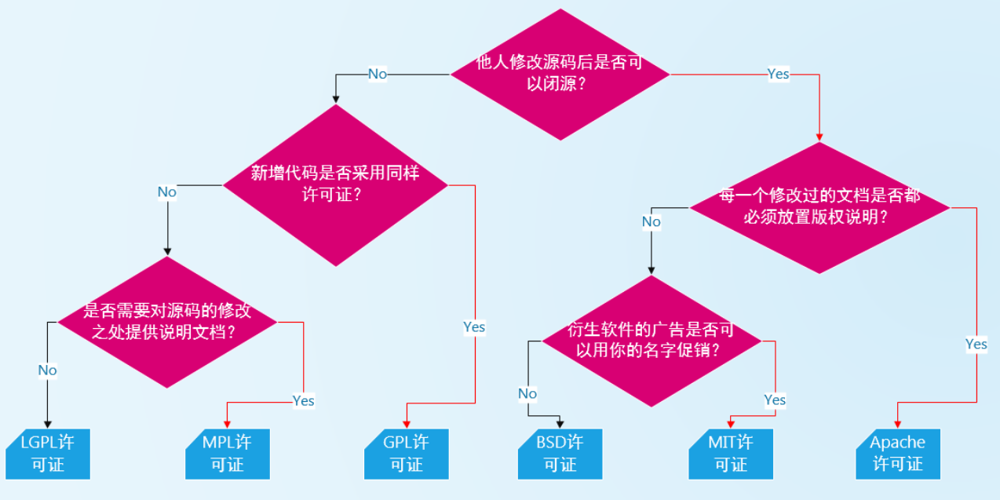
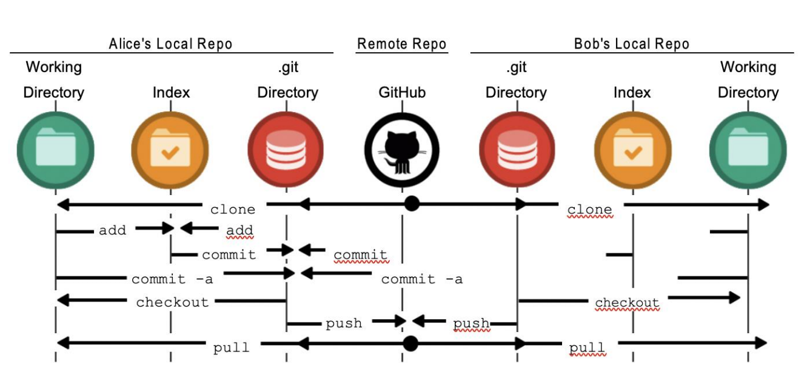
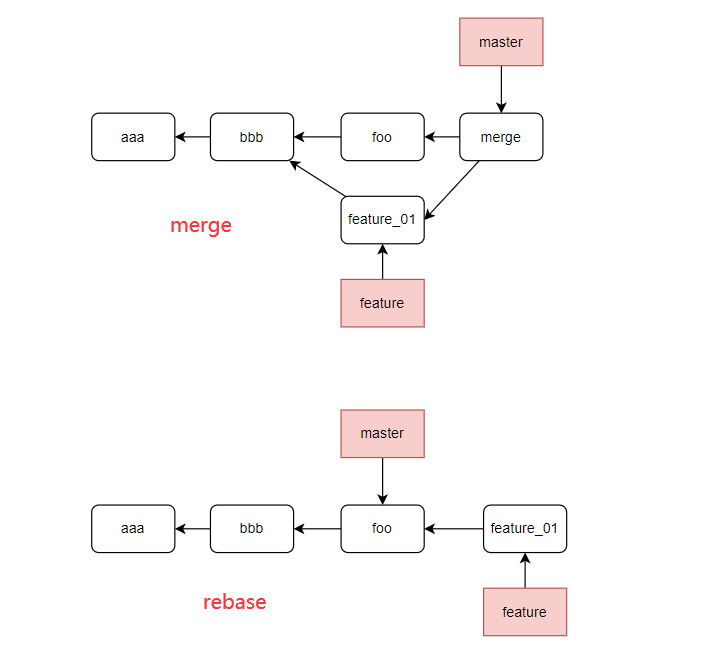

开源协议

###  Git原理

查看object目录下文件内容

- git cat-file -p xxxx(.git/object/xx/xx) 

- commitId也存在object文件目录下

vscode配置

Terminal › Integrated › Profiles: Windows

"Git-Bash": {"path": "D:\\Git\\Git\\bin\\bash.exe" }

三者区别

* Bash
  * Unix shell 的一种，Linux 与 Mac OS X 都将它作为默认 shell
  * Git Bash基于 CMD 的，在 CMD 的基础上增添一些新的命令与功能
* CMD
  * 命令行提示符（CMD）是 Windows 操作系统上的命令行解释程序
* GUI
  * 提供了一个图形用户界面来运行 git 命令

SSH

公钥放入远程服务器

* ssh-keygen -t ed25519(为加密类型) -C "your email"
* ssh-keygen -t rsa -b 2048 -C  "your email"

检测文件状态-git status  (-s)

* Untracked
  * 默认情况下，文件没有添加到Git仓库管理中，我们需要通过add命令来操作
* tracked
  * staged：暂缓区中的文件状态
  * Unmodified：使用commit命令，可以将staged中文件提交到Git仓库
  * Modified：修改了某个文件后，会处于Modified状态

cat .git/config 查看当前仓库的git配置

git commit -a -m "description"

git clone后本地的master分支默认跟踪了远程的origin/master

将代码push到远程仓库：将本地仓库的代码推送到远程仓库中

- git push (origin master:main )默认情况下是将当前分支（比如master）push到origin远程仓库的

从远程仓库fetch代码：从远程仓库获取最新的代码

- git fetch (origin) 默认情况下是从origin中获取代码
- git merge  获取到代码后默认并没有合并到本地仓库，我们需要通过merge来合并

git pull = git fetch + git merge(rebase)

git remote (--verbose)  查看远程地址

git remote add <shotrname\> <url\> 添加远程地址

master与main的冲突

* (通过https添加)直接git pull 报错
  * 只是连接了远程仓库，未指定分支间的连接
  * git branch --set-upstream-to=origin/master(main) 给本地的分支设置上游分支(跟踪分支) --解决git fetch
  * git merge --allow-unrelated-histories (因为没有本地仓库的origin/main和当前分支没有共同祖先)
  * 解决git pull后，git push仍报错(与默认行为有关)

git push的默认行为 

- 进行配置 git config push.default xxx

* 默认值simple：pushes the current branch with the same name on the remote
* upstream：push the current branch back to the branch whose changes are usually integrated into the current branch
* current：push the current branch to update a branch with the same name on the receiving end
* ......

#### 打印记录信息

* git log(按q退出  space往下查找)
  * 按时间顺序 新->旧
  * --pretty=oneline  (--graph(图结构))
* git reflog
  * 也保存了reset后的信息

#### 版本回退

git reset --hard HEAD\^

* HEAD 当前分支的指针，记录该分支上最后一次提交
  * 上个版本HEAD\^，上上个版本HEAD^^，上num版本HEAD~num
* 也可也指定commit id

#### tag

git tag 查看标签

git show <tagname\> 标签具体信息

git tag <tagname\>   (轻量标签)

git tag -a <tagname\> -m '附注标签'    (附注标签)

将tag放到服务器

- git push origin <tagname\>

- git push origin --tags

删除tag

- git  tag -d <tagname\>

- 删除远程tag。 git push <remote\>(即origin)  -d <tagname\>

检出tag

- git checkout <tagname\>
- 如果想修改，创建一个新分支

#### 分支

查看分支

- git branch
- git branch --(no-)merger 查看所有(没)合并到当前分支的分支

git branch  <branchname\> 在本地创建一个name分支

在本地创建一个新分支并切换到该分支

- git checkout -b <branchname\>
- git switch -c <branchname\>

在本地创建一个main分支并跟踪origin/main

- git checkout --track origin/main
  - 简写 git checkout main

删除本地分支(移除分支的指针，提交历史不会移除)

- git branch -d <branchname\>

合并分支

- git merge <branchname\>

检查服务器是否有origin/test分支、创建一个本地的test分支、让本地的test分支自动跟踪origin/test

- git checkout test

##### 远程分支

远程分支名 <remote\>/<branch\>

git branch --set-upstream-to=origin/main 给本地的当前分支设置上游分支，本地的origin/main与远程仓库建立了连接

git push origin <branchname\> 把当前分支推送到远程分支(如果没有就会创建一个同名分支)

删除远程分支

git push origin -d <branch\>

#### rebase

git merge会将两个分支合并形成一个新的commit对象

在feature中使用rebase
