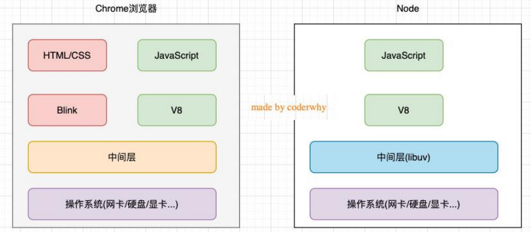
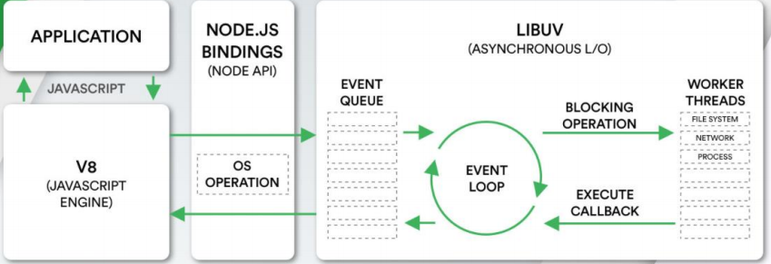

https://nodejs.org/en/docs/


**浏览器和Node.js架构区别**






- js代码会经过V8引擎，再通过Node.js的Bindings，将任务放到Libuv的事件循环中；
- libuv（Unicorn Velociraptor—独角伶盗龙）是使用C语言编写的库；
- libuv提供了事件循环、文件系统读写、网络IO、线程池等等内容；


性能优化点

- 创建Buffer时并不会频繁向操作系统申请内存，默认申请一个8*1024字节大小的内存


### fs模块

**文件描述符（File descriptors）**

在常见的操作系统上，对于每个进程，内核都维护着一张当前打开着的文件和资源的表格。

每个打开的文件都分配了一个称为文件描述符的简单的数字标识符。

在系统层，所有文件系统操作都使用这些文件描述符来标识和跟踪每个特定的文件。

Windows 系统使用了一个虽然不同但概念上类似的机制来跟踪资源。

为了简化用户的工作，Node.js抽象出操作系统之间的特定差异，并为所有打开的文件分配一个**数字型的文件描述符**。

```js
const fs = require('fs')

// 打开一个文件
fs.open('./test.txt', (err, fd) => {
  if (err) {
    console.log("打开文件错误:", err)
    return
  }

  // 1.获取文件描述符
  console.log(fd)

  // 2.读取到文件的信息
  fs.fstat(fd, (err, stats) => {
    if (err) return
    console.log(stats)

    // 3.手动关闭文件
    fs.close(fd)
  })
})

// 递归的读取文件夹中所有的文件
function readDirectory(path) {
  // withFileTypes 给出文件类型
  fs.readdir(path, { withFileTypes: true }, (err, files) => {
    files.forEach(item => {
      // isDirectory() 是否为文件夹
      if (item.isDirectory()) {
        readDirectory(`${path}/${item.name}`)
      } else {
        console.log("获取到文件:", item.name)
      }
    })
  })
}
readDirectory('./test')
```

flag

- w 打开文件写入，默认值
- w+打开文件进行读写（可读可写），如果不存在则创建文件
- r打开文件读取，读取时的默认值
- r+ 打开文件进行读写，如果不存在那么抛出异常
- a打开要写入的文件，将流放在文件末尾。如果不存在则创建文件
- a+打开文件以进行读写（可读可写），将流放在文件末尾。如果不存在则创建文件


### events模块

```js
const EventEmitter = require('events')

const emitter = new EventEmitter()
emitter.on(eventName, listener) // 监听事件
emitter.off(eventName, listener) // 移除事件监听
emitter.emit(eventName[, ...args]) // 发射事件
emitter.eventNames() // 返回当前EventEmitter对象注册的事件字符串数组；
emitter.getMaxListeners() // 返回当前EventEmitter对象的最大监听器数量，可以通过setMaxListeners()来修改，默认是10；
emitter.listenerCount(eventName) // 返回当前 EventEmitter对象某一个事件名称，监听器的个数；
emitter.listeners(eventName) // 返回当前EventEmitter对象某个事件监听器上所有的监听器数组；
emitter.once(eventName, listener) // 事件监听一次
emitter.prependListener() // 将监听事件添加到最前面
emitter.prependOnceListener() // 将监听事件添加到最前面，但是只监听一次
emitter.removeAllListeners([eventName]) // 移除所有的监听器
```


### Buffer

Buffer中存储的是二进制数据

- 可以将Buffer看成是一个存储二进制的数组，这个数组中的每一项都是保存的8位二进制

创建Buffer时并不会频繁向操作系统申请内存，默认申请一个8*1024字节大小的内存(8kb)

- 如果存放字符串长度大于4kb，直接再向操作系统申请内存空间
- **Buffer.from**->**fromString**->**fromStringFast**
  - 是判断剩余的长度是否还足够填充这个字符串。如果不足够，那么就要通过 createPool 创建新的空间；如果够就直接使用，但是之后要进行 poolOffset的偏移变化；


中文占三个字节


### Stream

所有的流都是基于EventEmitter的实例

**Node.js中有四种基本流类型：**

- Writable：可以向其写入数据的流（例如 fs.createWriteStream()）
- Readable：可以从中读取数据的流（例如 fs.createReadStream()）
- Duplex：同时为Readable和Writable（例如 net.Socket）
- Transform：Duplex可以在写入和读取数据时修改或转换数据的流（例如zlib.createDeflate()）

为什么需要流

- 可以控制从什么位置开始读、读到什么位置、一次性读取多少个字节
- 读到某个位置后，暂停读取，某个时刻恢复继续读取等等


#### 可读流

```js
const fs = require('fs')

const readStream = fs.createReadStream(path, {
  start: 3,
  end: 10,
  highWaterMark: 2 // 一次性读取字节的长度，默认是64kb
})
// 会自动发射open/data/end/close事件
readStream.on('open', (fd) => {
  console.log(fd)
})
readStream.on('data', (data) => {
  console.log(data.toString())
})
readStream.on('end', () => {
  console.log('读取到了end位置')
})
readStream.on('close', () => {
  console.log('文件读取结束，并被关闭')
})
```

#### 可写流

```js
const fs = require('fs')

const writeStream = fs.createWriteStream(path, {
  flags: 'a'
})

writeStream.on('open', (fd) => {
  console.log('文件被打开', fd)
})
writeStream.write('bbbb', (err) => {
  if (!err) console.log("写入完成:", err)
})
writeStream.on('finish', () => {
  console.log('写入完成了')
})
writeStream.on('close', () => {
  console.log('文件被关闭~')
})

// 写入完成时, 需要手动去掉用close方法
// writeStream.close()

// end方法: 
// 操作一: 将最后的内容写入到文件中, 并且关闭文件
// 操作二: 关闭文件
writeStream.end('哈哈哈哈')
```

#### pipe

```js
const readStream = fs.createReadStream('./foo.txt')
const writeStream = fs.createWriteStream('./foo_copy.txt')
// 在可读流和可写流之间建立一个管道
readStream.pipe(writeStream)
```


## web服务器开发和文件上传

状态码：https://developer.mozilla.org/zh-CN/docs/web/http/status


主机host: 通常可以传入localhost、ip地址127.0.0.1、或者ip地址0.0.0.0，默认是0.0.0.0；

- localhost：本质上是一个域名，通常情况下会被解析成127.0.0.1；

- 127.0.0.1：回环地址（Loop Back Address），表达的意思是主机自己发出去的包，直接被自己接收；
  - 正常的数据库包经过应用层 - 传输层 - 网络层 - 数据链路层 - 物理层 ；
  - 而回环地址，是在网络层直接就被获取到了，是不会经过数据链路层和物理层的；
  - 比如我们监听127.0.0.1时，在同一个网段下的主机中，通过ip地址是不能访问的；
- 0.0.0.0：
  - 监听IPV4上所有的地址，再根据端口找到不同的应用程序；
  - 比如我们监听0.0.0.0时，在同一个网段下的主机中，通过ip地址是可以访问的；

### http模块

axios框架

- 在客户端是基于XHR(xmlhttprequest)进行封装的
- 在Node中是基于http模块进行封装的


request是可读流、response是可写流 

- req.url\req.method

http.createServer本质是new Server

#### query参数

```js
const http = require('http')
const url = require('url')
const qs = require('querystring')

const server = http.createServer((req, res) => {
  // 1.参数一: query类型参数
  // 1.1.解析url
  const urlString = req.url //    /home/list?offset=100&size=20
  const urlInfo = url.parse(urlString)

  // 1.2.解析query: offset=100&size=20
  const queryString = urlInfo.query
  const queryInfo = qs.parse(queryString)
  console.log(queryInfo.offset, queryInfo.size)
  
  response.end("Hello World")
})

server.listen(8000, () => {
  console.log('服务器已经开启成功了~')
})
```

#### body参数

```js
const http = require('http')

const server = http.createServer((req, res) => {
  // 获取参数: body参数
  req.setEncoding('utf-8')

  // request对象本质是上一个readable可读流
  let isLogin = false
  req.on('data', (data) => {
    const dataString = data
    const loginInfo = JSON.parse(dataString)
    if (loginInfo.name === 'coder' && loginInfo.password === '123456') {
      isLogin = true
    } else {
      isLogin = false
    }
  })

  req.on('end', () => {
    if (isLogin) {
      res.end('登录成功, 欢迎回来~')
    } else {
      res.end('账号或者密码错误, 请检测登录信息~')
    }
  })
})

server.listen(8000, () => {
  console.log('服务器开启成功~')
})
```


### 文件上传

```js
const http = require("http");
const fs = require('fs')

const server = http.createServer((req, res) => {
  // 设置为二进制数据
  req.setEncoding('binary')

  // --boundary-- 分隔符
  const boundary = req.headers['content-type'].split('; ')[1].replace('boundary=', '')
  console.log(boundary)

  // 客户端传递的数据是表单数据(请求体)
  let formData = ''
  req.on("data", (data) => {
    formData += data
  });

  req.on("end", () => {
    console.log(formData)
    // 1.截取从image/jpeg位置开始后面所有的数据
    const imgType = 'image/jpeg'
    const imageTypePosition = formData.indexOf(imgType) + imgType.length
    let imageData = formData.substring(imageTypePosition)

    // 2.imageData开始位置会有两个空格(\r\n\r\n)
    imageData = imageData.replace(/^\s\s*/, '')

    // 3.替换最后的boundary
    imageData = imageData.substring(0, imageData.indexOf(`--${boundary}--`))

    // 4.将imageData的数据存储到文件中
    fs.writeFile('./test.png', imageData, 'binary', () => {
      console.log('文件存储成功')
      res.end("文件上传成功~");
    })
  });
});

server.listen(8000, () => {
  console.log("服务器开启成功~");
});
```


# express

### 中间件

- 当express接收到客户端发送的网络请求时, 在所有中间中开始进行匹配
- 当匹配到**第一个符合要求**的中间件时, 那么就会执行这个中间件
- 后续的中间件是否会执行，取决于上一个中间件有没有执行next


#### json

- 手动解析需要在req.on('data')/req.on('end')中传入回调函数

- ```js
  const express = require('express')
  const app = express()
  
  app.post('/register', (req, res, next) => {
      // 1.获取本次请求过程中传递过来的json数据
      let isRegister = false
      req.on('data', (data) => {
        const dataString = data.toString()
        const dataInfo = JSON.parse(dataString)
        // 查询数据库中该用户是否已经注册过
        isRegister = false
      })
    
      req.on('end', () => {
        if (isRegister) {
          res.end('注册成功, 开始你的旅程~')
        } else {
          res.end('注册失败, 您输入的用户名被注册~')
        }
      })
  })
  ```


```js
const express = require('express')
const app = express()

// 会对json数据进行解析，放到req.body中
app.use(express.json())

app.post('/login', (req, res, next) => {
  console.log(req.body)
})
```

#### urlencoded

- { extended: true }: 不再使用内置的querystring, 而是使用qs第三方库

```js
const express = require('express')
const app = express()

app.use(express.json()) 
// 解析传递过来urlencoded的时候, 默认使用的node内置querystring模块
// { extended: true }: 不再使用内置的querystring, 而是使用qs第三方库
app.use(express.urlencoded({ extended: true })) // 解析客户端传递过来的urlencoded

app.post('/login', (req, res, next) => {
  console.log(req.body)
  res.end('登录成功, 欢迎回来~')
})
```

#### 请求日志记录

- morgan--官方提供

```js
const fs = require('fs')
const express = require('express')
const morgan = require('morgan')
const app = express()

// 应用第三方中间件
const writeStream = fs.createWriteStream('./logs/access.log')
app.use(morgan('combined', { stream: writeStream }))

app.post('/login', (req, res, next) => {
  res.end('登录成功, 欢迎回来~')
})
```

#### formdata

- multer

```js
const express = require('express')
const multer = require('multer')
const app = express()

// express内置的插件
app.use(express.json())
app.use(express.urlencoded({ extended: true }))

// 编写中间件
const formdata = multer()

app.post('/login', formdata.any(), (req, res, next) => {
  console.log(req.body)
  res.end('登录成功, 欢迎回来~')
})
```


#### query/params

默认解析了queryString和params

req.query 值都是字符串

```js
const express = require('express')
const app = express()
// 1.解析queryString
app.get('/home/list', (req, res, next) => {
  // offset/size
  const queryInfo = req.query
  console.log(queryInfo)

  res.end('data list数据')
})
// 2.解析params参数
app.get('/users/:id', (req, res, next) => {
  const id = req.params.id

  res.end(`获取到${id}的数据~`)
})
```

### 文件上传

- multer

单文件

```js
const express = require('express')
const multer = require('multer')
const app = express()

// 应用一个express编写第三方的中间件
const upload = multer({
  dest: './uploads' //指定目录文件夹
})

// 上传单文件: singer方法
app.post('/avatar', upload.single('avatar') , (req, res, next) => {
  console.log(req.file)
  res.end('文件上传成功~')
})
```


多文件

```js
const express = require('express')
const multer = require('multer')
const app = express()

// 应用一个express编写第三方的中间件
const upload = multer({
  // dest: './uploads'
  storage: multer.diskStorage({
    destination(req, file, cb) {
      cb(null, './uploads') // 第一个参数为err
    },
    filename(req, file, cb) {
      cb(null, Date.now() + '_' + file.originalname)
    }
  })
})

// 上传多文件: 
app.post('/photos', upload.array('photos'), (req, res, next) => {
  console.log(req.files)
  res.end('上传多张照片成功~')
})
```


## 路由

```js
# ./router/useRouter.js
const express = require('express')

// 1.创建路由对象
const userRouter = express.Router()

// 2.定义路由对象中的映射接口
userRouter.get('/', (req, res, next) => {
  res.json('用户列表数据')
})
userRouter.get('/:id', (req, res, next) => {
  const id = req.params.id
  res.json('某一个用户的数据:' + id)
})
userRouter.post('/', (req, res, next) => {
  res.json('创建用户成功')
})
userRouter.delete('/:id', (req, res, next) => {
  const id = req.params.id
  res.json('删除某一个用户的数据:' + id)
})
userRouter.patch('/:id', (req, res, next) => {
  const id = req.params.id
  res.json('修改某一个用户的数据:' + id)
})

// 3.将路由导出
module.exports = userRouter


# app.js
const express = require('express')
const userRouter = require('./router/userRouter')
const app = express()

app.use('/users', userRouter)

app.listen(9000, () => {
  console.log('express服务器启动成功~')
})
```


## 部署静态资源

可以直接通过localhost:port/xxx访问

- 会自动去部署后的目录下寻找

```js
const express = require('express')
const app = express()

// 内置的中间件: 直接将一个文件夹作为静态资源
app.use(express.static('./uploads'))
app.use(express.static('./build'))

// 启动服务器
app.listen(9000, () => {
  console.log('express服务器启动成功~')
})
```

## 错误处理

```js
const express = require('express')
const app = express()

app.use(express.json())

app.post('/login', (req, res, next) => {
  const { username, password } = req.body
  if (!username || !password) {
    next(-1001)
  } else if (username !== 'coderwhy' || password !== '123456') {
    next(-1002)
  } else {
    res.json({
      code: 0,
      message: '登录成功, 欢迎回来~',
      token: '323dfafadfa3222'
    })
  }
})

// 错误处理的中间件
app.use((errCode, req, res, next) => {
  const code = errCode
  let message = '未知的错误信息'
  switch(code) {
    case -1001:
      message = '没有输入用户名和密码'
      break
    case -1002:
      message = '输入用户名或密码错误'
      break
  }
  res.json({ code, message })
})


app.listen(9000, () => {
  console.log('express服务器启动成功~')
})
```


# koa

koa并没有像express一样，将req和res分开，而是将它们作为ctx的属性

## ctx解析

- ctx.request 请求对象: **Koa封装的请求对象**
- ctx.req 请求对象: Node封装的请求对象
- ctx.response 响应对象: **Koa封装的响应对象**

- ctx.res 响应对象: Node封装的响应对象

```js
const Koa = require('koa')
const app = new Koa()

app.use((ctx, next) => {
  // 1.请求对象
  console.log(ctx.request) // 请求对象: Koa封装的请求对象
  console.log(ctx.req) // 请求对象: Node封装的请求对象

  // 2.响应对象
  console.log(ctx.response) // 响应对象: Koa封装的响应对象
  console.log(ctx.res) // 响应对象: Node封装的响应对象

  // 3.其他属性
  console.log(ctx.query)
  // console.log(ctx.params)

  next()
})

app.use((ctx, next) => {
  console.log('second middleware~')
})

app.listen(9000, () => {
  console.log('koa服务器启动成功~')
})
```


## 路由

- @koa/router
- allowedMethods用于判断某一个method是否支持
  - 如果请求未注册的put、delete、patch，那么就自动报错：Method Not Allowed，状态码：405
  - 如果请求未注册的link、copy、lock，那么就自动报错：Not Implemented，状态码：501；

```js
# ./router/useRouter.js
const KoaRouter = require('@koa/router')

// 1.创建路由对象
const userRouter = new KoaRouter({ prefix: '/users' })

// 2.在路由中注册中间件: path/method
userRouter.get('/', (ctx, next) => {
  ctx.body = 'users list data~'
})
userRouter.get('/:id', (ctx, next) => {
  const id = ctx.params.id
  ctx.body = '获取某一个用户' + id
})
userRouter.post('/', (ctx, next) => {
  ctx.body = '创建用户成功~'
})
userRouter.delete('/:id', (ctx, next) => {
  const id = ctx.params.id
  ctx.body = '删除某一个用户' + id
})

module.exports = userRouter


# app.js
const Koa = require('koa')
const userRouter = require('./router/userRouter')

const app = new Koa()

// 3.让路由中的中间件生效
app.use(userRouter.routes())
app.use(userRouter.allowedMethods())

app.listen(9000, () => {
  console.log('koa服务器启动成功~')
})
```

## 参数

- koa-bodyparser
- @koa/multer

```js
const Koa = require('koa')
const KoaRouter = require('@koa/router')
const bodyParser = require('koa-bodyparser')
const multer = require('@koa/multer')

const app = new Koa()

// 使用第三方中间件解析body数据
app.use(bodyParser())

const userRouter = new KoaRouter({ prefix: '/users' })

// 1.get/params
userRouter.get('/:id', (ctx, next) => {
  const id = ctx.params.id
  ctx.body = 'user list data~:' + id
})

// 2.get/query
userRouter.get('/', (ctx, next) => {
  const query = ctx.query
  console.log(query)
  ctx.body = '用户的query信息' + JSON.stringify(query)
})

// 3.post/json(使用最多)
userRouter.post('/json', (ctx, next) => {
  // 注意事项: 不能从ctx.body中获取数据
  console.log(ctx.request.body, ctx.req.body)

  // ctx.body用于向客户端返回数据
  ctx.body = '用户的json信息'
})

// 4.post/urlencoded
userRouter.post('/urlencoded', (ctx, next) => {
  console.log(ctx.request.body)

  ctx.body = '用户的urlencoded信息'
})

app.use(userRouter.routes())
app.use(userRouter.allowedMethods())

// 使用第三方中间件
const formParser = multer()
// 5.post/form-data
userRouter.post('/formdata', formParser.any(), (ctx, next) => {
  console.log(ctx.request.body)
  ctx.body = '用户的formdata信息'
})

app.listen(9000, () => {
  console.log('koa服务器启动成功~')
})
```


### 文件上传

- multer @koa/multer

```js
const Koa = require('koa')
const KoaRouter = require('@koa/router')
const multer = require('@koa/multer')

const app = new Koa()

// const upload = multer({
//   dest: './uploads'
// })

const upload = multer({
  storage: multer.diskStorage({
    destination(req, file, cb) {
      cb(null, './uploads')
    },
    filename(req, file, cb) {
      cb(null, Date.now() + "_" + file.originalname)
    }
  })
})

const uploadRouter = new KoaRouter({ prefix: '/upload' })
// 1.单文件上传
uploadRouter.post('/avatar', upload.single('avatar'), (ctx, next) => {
  console.log(ctx.request.file)
  ctx.body = '文件上传成功~'
})
// 2.多文件上传
uploadRouter.post('/photos', upload.array('photos'), (ctx, next) => {
  console.log(ctx.request.files)
  ctx.body = '文件上传成功~'
})

app.use(uploadRouter.routes())
app.use(uploadRouter.allowedMethods())

app.listen(9000, () => {
  console.log('koa服务器启动成功~')
})
```


## 部署静态资源

- koa-static

```js
const Koa = require('koa')
const static = require('koa-static')

const app = new Koa()

app.use(static('./uploads'))
app.use(static('./build'))

app.listen(9000, () => {
  console.log('koa服务器启动成功~')
})
```

## 响应结果

- string
- Buffer
- Stream
- array/object

```js
const fs = require('fs')
const Koa = require('koa')
const KoaRouter = require('@koa/router')

const app = new Koa()

const userRouter = new KoaRouter({ prefix: '/users' })

userRouter.get('/', (ctx, next) => {
  // 1.body的类型是string
  // ctx.body = 'user list data'

  // 2.body的类型是Buffer
  // ctx.body = Buffer.from('Hello')

  // 3.body的类型是Stream
  // const readStream = fs.createReadStream('./uploads/1668331072032_kobe02.png')
  // ctx.type = 'image/jpeg'
  // ctx.body = readStream

  // 4.body的类型是数据(array/object) => 使用最多
  ctx.status = 201
  ctx.body = {
    code: 0,
    data: [
      { id: 111, name: 'iphone', price: 100 },
      { id: 112, name: 'xiaomi', price: 990 },
    ]
  }

  // 5.body的值是null, 自动设置http status code为204
  // ctx.body = null
})

app.use(userRouter.routes())
app.use(userRouter.allowedMethods())

app.listen(9000, () => {
  console.log('koa服务器启动成功~')
})
```

## 错误处理

```js
# error-handle.js
app.on('error', (code, ctx) => {
  const errCode = code
  let message = ''
  switch (errCode) {
    case -1001:
      message = '账号或者密码错误~'
      break
    case -1002:
      message = '请求参数不正确~'
      break
  }
  
  const body = {
    code: errCode,
    message
  }
  
  ctx.body = body
})
# app.js
const Koa = require('koa')
const KoaRouter = require('@koa/router')

const app = new Koa()

const userRouter = new KoaRouter({ prefix: '/users' })

userRouter.get('/', (ctx, next) => {
  const isAuth = false
  if (isAuth) {
    ctx.body = 'user list data'
  } else {
    // EventEmitter
    ctx.app.emit('error', -1003, ctx)
  }
})

app.use(userRouter.routes())
app.use(userRouter.allowedMethods())

app.listen(9000, () => {
  console.log('koa服务器启动成功~')
})
```


# express和Koa对比

express是完整和强大的，其中帮助我们内置了非常多好用的功能;koa是简洁和自由的，它只包含最核心的功能

- 甚至是在app中连最基本的get、post都没有提供
- 类似于Vue2向Vue3的转变，更加简洁，自己选择所需的集成工具(Vue2中可以把Vue实例当作EventBus来使用)


express中的next返回值是void

koa中的next返回值是promise

- express中间件同步执行是符合洋葱模型的，而异步执行并不会等待next的结果，因为express中的next返回值是void

```js
const express = require('express')
const axios = require('axios')

const app = express()

app.use(async (req, res, next) => {
  console.log('express middleware01')
  req.msg = 'aaa'
  await next()
  // 返回值结果
  // res.json(req.msg) aaabbb
  // 在这返回的话拿不到第三个中间件的拼接结果
})

app.use(async (req, res, next) => {
  console.log('express middleware02')
  req.msg += 'bbb'
  await next()
})

// 执行异步代码
app.use(async (req, res, next) => {
  console.log('express middleware03')
  const resData = await axios.get('http://123.207.32.32:8000/home/multidata')
  req.msg += resData.data.data.banner.list[0].title

  // 只能在这里返回结果
  res.json(req.msg)
})


app.listen(9000, () => {
  console.log('express服务器启动成功~')
})
```


## express源码分析

对http模块进行了函数的封装

创建过程

```js
exports = module.exports = createApplication
// 导入express后，执行express()时，本质是在执行createApplication()
// 函数createApplication中
// 1.封装了一个app函数对象
//    var app = function(req, res, next) {}
// 2.对函数对象进行混入mixin
//   2.1 对EventEmitter混入
//   2.2 对use、listen(本质是调用http模块的server.lisen)进行混入
// 3.创建request和response对象
// 4.init
// 5.返回app对象
```

listen

```js
app.listen = function listen() {
  /*
  http.createServer((req, res) => {})
  */
  // this就是在有网络请求时执行的回调函数
  // this就是app(this的隐式绑定)，执行的就是app函数对象
  var server = http.createServer(this)
  return server.listen.apply(server, arguments)
}
```

use

- 当有一个网络请求时，匹配和执行中间件
  - 第一个中间件的执行是内部主动调用了next()

```js
// use中的函数封装成了layer对象:path/fn
// 然后再把layer放入stack中
/*
var app = function(req, res, next) {
  app.handle(req, res, next)
}
*/
// handle中的过程：router.stack => layer => path/fn
```


## koa源码分析

对http模块进行了类的封装

new Koa 本质就是 new Application

koa原生中是没有路由的

```js
/*
app.emit('err')
app.on('err')
*/
module.exports = class Application extends Emitter {}
// constructor中this.middleware = []
// use()中的fn被放入到了这个数组中
```

listen

```js
listen(...args) {
  /*
  callback() {
    const handleRequest = (req, res) => {
      当有网络请求时真正执行的回调
      const ctx = this.createContext(req, res)
      return this.handleRequest(ctx, fn)
    }
    return handleRequest
  }
  */
  const server = http.createServer(this.callback())
  return server.listen(...args)
}
```


```js
handleRequest(ctx, fnMiddleware) {
  // xxx
  // 这一步执行中间件
  return fnMiddleware(ctx).then(xxx).catch(xxx)
}
```


use

```js
use(fn) {
  this.middleware.push(fn)
}
```


