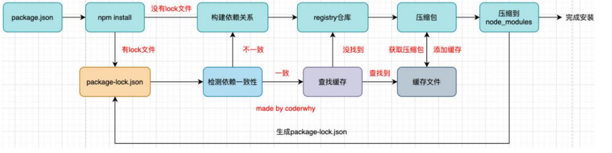
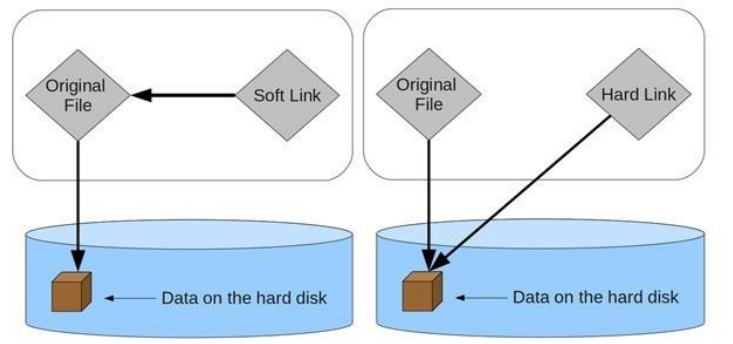
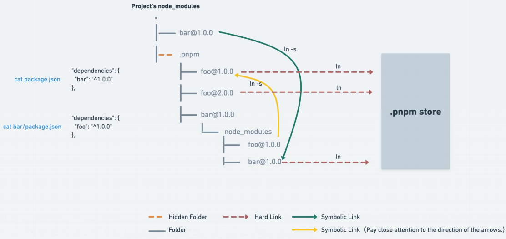
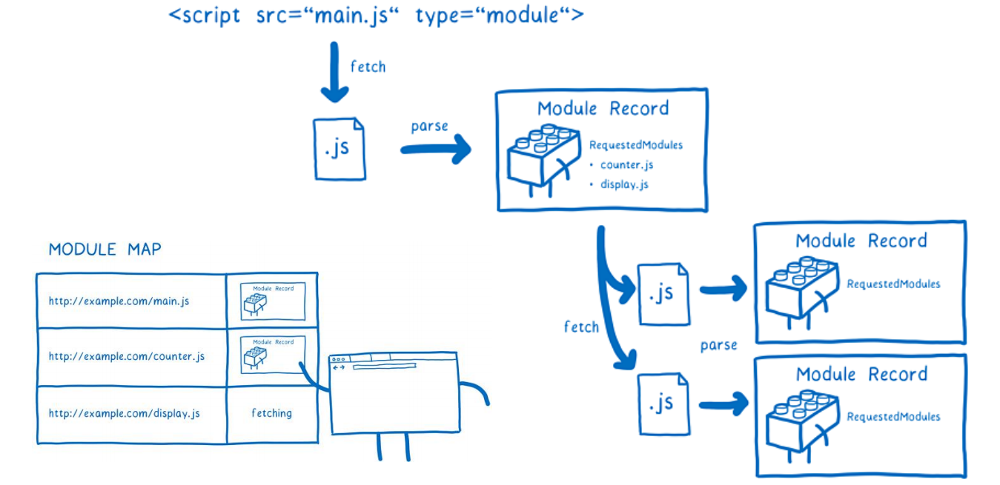
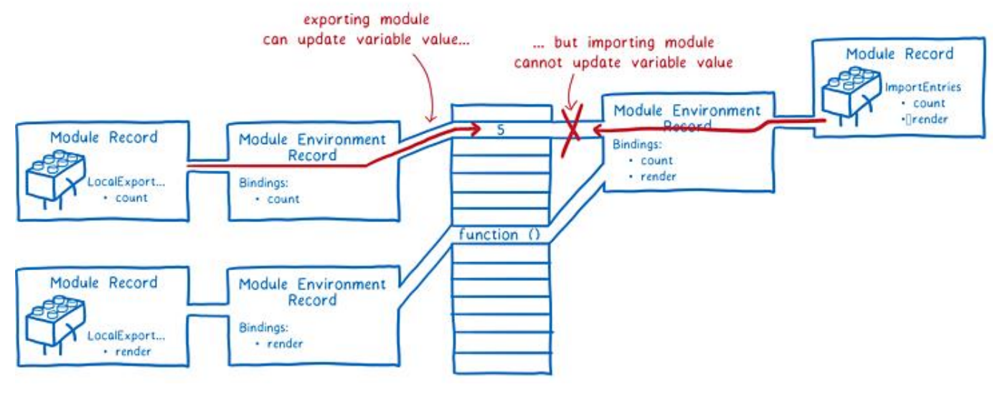

Node程序是用C++/C语言编写的

JavaScript-V8-**中间层(libuv)**-操作系统


### Node版本管理工具

#### n

* npm install -g n
* n 查看所有版本
* n lts 安装最新的lts版本
* n latest 安装最新版本

#### nvm

#### nvm-windows

* https://github.com/coreybutler/nvm-windows
* nvm install latest安装最新Node版本
* nvm list
* nvm use 切换版本


### 特殊全局对象

实际上是模块中的变量，只是每个模块中有

* __filename、\_\_dirname、exports、module、require()
* process.nextTick()、setImmediate


### 包管理工具

#### npm

Node Package Manager

##### package配置文件

* private属性：当值为true时，npm是不能发布它的，这是防止私有项目或模块发布出去的方式
* main属性：程序的入口
* script属性：配置一些脚本命令，以键值对的形式存在
  * npm run 命令的key来执行这个命令
  * npm start和npm run start是等价的
  * 会去./node_modules/.bin找
* dependencies属性：指定无论开发环境还是生产环境都需要依赖的包
* devDependencies属性：一些包在生产环境是不需要的，比如webpack、babel等
  * npm install webpack **--save-dev**，将它安装到devDependencies属性中
* engines属性：指定Node和npm的版本号。在安装的过程中，会先检查对应的引擎版本，如果不符合就报错
* browserslist属性：配置打包后的JavaScript浏览器的兼容情况，参考， 否则我们需要手动的添加polyfills来让支持某些语法
  * 是为webpack等打包工具服务的一个属性

##### install原理



**从npm5开始，npm支持缓存策略,package-lock.json**

package.json -> npm install

* 有lock文件，检测lock中包的版本是否和package.json中一致（会按照semver版本规范检测）

package-lock.json中的属性

* requires属性：使用requires来跟踪模块的依赖关系
* dependencies属性：项目的依赖
  * 当前项目依赖axios，但是axios依赖follow-redireacts
  * axios中的属性如下
    * version表示实际安装的axios的版本
    * resolved用来记录下载的地址，registry仓库中的位置
    * **integrity用来从缓存中获取索引，再通过索引去获取压缩包文件**
    * requires/dependencies记录当前模块的依赖

##### 发布自己包

* 注册npm账号 https://www.npmjs.com/
* npm login
* 修改package.json
* npm publish
* 更新仓库，重新发送
  * npm umpublish 删除
  * npm deprecate 过期

#### yarn/cnpm

#### npx

常见的是使用它来调用项目中的某个模块的指令

假设全局安装的是lessc5.1.3、项目安装的是lessc3.6.0

* 在终端执行 lessc --version，显示结果会是 lessc 5.1.3
* 事实上使用的是全局，在当前目录下找不到lessc时，就会去全局找，并且执行命令

解决方式：

* 在终端中使用如下命令（在项目根目录下）

  * ./node_modules/.bin/lessc --version

* 修改package.json中的scripts

  * "scripts": {

    ​	"lessc": "lessc --version"

    }

* npx lessc --version

  * **它会到当前目录的node_modules/.bin目录下查找对应的命令**

#### pnpm

performant npm  https://pnpm.io

硬链接(hard link)

* 电脑文件系统中多个文件平等地共享同一个文件存储单元
* 删除一个文件名字后，还可以用其它名字继续访问该文件
  * Windows: mklink /H   a_hard.js  a.js
  * macOS:  ln    foo.js   foo_hard.js

软连接(soft link, 符号链接 Symbolic link)

* 包含有一条以绝对路径或者相对路径的形式指向其它文件或者目录的**引用**
  * 电脑的快捷方式
  * window: mklink aa_sorf.js  aa.js
  * macos: ln -s  foo.js  foo_soft.js




##### 原理

* 对同一依赖包使用相同的版本，磁盘上只有这个依赖包的一份文件
* 对同一依赖包需要使用不同的版本，仅有**版本之间不同的文件会被存储起来**
* 所有文件被存放在磁盘上一个统一的位置
  * 安装软件包时，包含的所有文件都会硬链接到此位置，而不占用额外硬盘空间

非扁平的node_modules目录



##### 存储store

* 在pnpm7.0之前，统一存储位置是~/.pnpm-store中

* 在pnpm7.0之后
  * Linux：~/.local/share/pnpm/store
  * Windows：%LOCALAPPDATA%/pnpm/store
  * macOS：~/Library/pnpm/store
  * pnpm store path

* **pnpm store prune** 从store中删除当前未被引用的包来释放store空间


### 模块化

AMD和CMD

* Asynchronous Module Definitnion 异步加载模块
  * AMD实现常用的库requie.js、curl.js
* Common Module Definitnion 异步加载模块
  * MCD实现常用的库SeaJS

#### CommonJS

**CommonJS加载模块是同步的**

* webpack会将我们的代码转成浏览器可以直接执行的代码

最初提出在浏览器以外的地方使用，并且命名为ServerJS

* **Node**是CommonJS在服务器端代表性的实现
* Browserify是CommonJS在浏览器的一种实现
* **webpack**打包工具具备对CommonJS的支持和转换

核心变量

* exports.xxx = xxx
* module.exports = {xxx}
* require

##### 本质

导入的moduleA和导出的exports指向同一个对象

* **本质是找module.exports**

**在规范中没有module.exports的概念**

* **为了实现模块的导出，实现了一个Module的类，每个模块都是一个实例module**
*  所以在Node中真正用于导出的其实根本不是exports，而是module.exports；因为module才是导出的真正实现者

```js
// 需要底层支撑(Node)
// 导出  moduleA.js
//exports.name = "me" 已经没意义了
module.exports = {
  flag:true,
  test(a,b){
    return a + b
  },
  demo(a,b){
    return a * b
  }
}

// 导入  main.js
const moduleA = require('./moduleA.js');
```

##### require查找规则

require(X)

* X是一个Node核心模块，比如path、http,直接返回核心模块
* X是以 ./ 或 ../ 或 /（根目录）开头的
  * 直接查找文件X -> X.js -> X.json -> X.node
    * 未找到，将X作为目录
    *  查找X/index.js -> X/index.json -> X/index.node
* 直接是一个X（没有路径），并且X不是一个核心模块
  * 从当前目录下的node_modules一直往上层找


##### 加载过程

模块被多次引入时，会缓存，最终只运行**一次**

* 每个模块对象module都有一个属性：**loaded**

  * false表示还没有加载，true表示已经加载

循环引入：**深度优先**

##### CJS规范缺点

- 同步的意味着只有等到对应的模块加载完毕，当前模块中的内容才能被运行
  - 浏览器加载js文件需要先从服务器将文件下载下来，之后再加载运行；那么采用同步的就意味着后续的js代码都无法正常运行，即使是一些简单的DOM操作
  - 当然在**webpack**中使用CommonJS是另外一回事；因为**它会将我们的代码转成浏览器可以直接执行的代码**


#### ESModule 

它采用编译期的静态分析，并且也加入了动态引用的方式

**采用ES Module将自动采用严格模式：use strict**


```js
// 导出
// aaa.js
function sum(a, b){
  return a + b
}
let flag = true 
// 导入时候要和导出的同名
export { flag, 	sum }
export let height = 1.88
export let name = 'why'
// 自起名
const address = '长沙'
export default address		// default在同一模块中只有一个
```


```js
// 导入时候要和导出的同名
import { flag , sum } from './aaa.js'
import { height, name } from './aaa.js'
    //全部导入,起别名
		import * as aaa from './aaa.js'
// 自起名 默认导入的是default导出的东西
import addr from './aaa.js'
```


##### import函数

import声明语法只能写在js代码顶层

- ES Module在被JS引擎解析时，就必须知道它的依赖关系

import函数返回的是Promise对象,异步

```js
let flag = true
if (flag) {
  // res为导入的模块
  import("./foo.js").then(res => {
    console.log(res.data)
  })
}
```

ES11新增特性 import.meta

* 包含了这个模块的信息，例如模块的URL


#### 解析过程

https://hacks.mozilla.org/2018/03/es-modules-a-cartoon-deep-dive/

* 阶段一：构建(Construction)  根据地址查找js文件，并且下载，将其解析成模块记录（Module Record）
  * 
* 阶段二：实例化(Instantiation) 对模块记录进行实例化，并且分配内存空间，解析模块的导入和导出语句，把模块指向对应的内存地址
* 阶段三：运行(Evaluation) 运行代码，计算值，并且将值填充到内存地址中
  * 