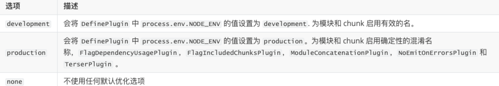
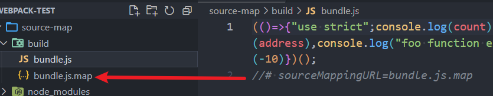
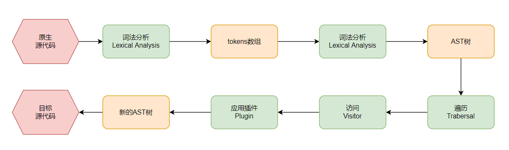

mode：'none' | 'development' | 'production'(默认值)



devtool
 -- sourcemap：使浏览器可以重构原始源并在调试器中显示重建的原始源

```js
/* webpack.config.js */
module.exports = {
  // 常见的值:
  // 1.false
  // 2.none => production模式下的默认值
  // 3.eval => development模式下的默认值 报错结果没有那么准确
  // 4.source-map => production

  // 不常见的值: 
  // 1.eval-source-map: 添加到eval函数的后面
  // 2.inline-source-map: 添加到文件的后面
  // 3.cheap-source-map(dev环境): 低开销, 更加高效--没有生成列映射
  // 4.cheap-module-source-map: 和cheap-source-map相似, 但是对来自loader的source-map处理的更好
  	//		比如空行等信息会保留，源代码中正确的行数
  // 5.hidden-source-map(prod): 会生成sourcemap文件, 但是不会对source-map文件进行引用。
  	//		需要手动添加注释# sourceMappingURLxxx
  // 6.nosources-source-map:生成的sourcemap只有错误信息提示，没有源代码文件
  devtool: 'srouce-map'
}
```

**浏览器会根据注释，查找相应的source-map，并且根据source-map还原代码，方便进行调试**




-  开发阶段：推荐使用 source-map或者cheap-module-source-map
  - 这分别是vue和react使用的值，可以获取调试信息，方便快速开发
- 测试阶段：推荐使用 source-map或者cheap-module-source-map
  - 测试阶段也希望在浏览器下看到正确的错误提示
- 发布阶段：false、缺省值（不写）


# Babel

Babel是一个工具链，主要用于旧浏览器或者缓解中将ECMAScript 2015+代码转换为向后兼容版本的JavaScript（包括：语法转换、源代码转换、Polyfill实现目标环境缺少的功能等）
Babel本身可以作为**一个独立的工具**（和postcss一样），不和webpack等构建工具配置来单独使用
Babel底层原理：
可以将Babel看成就是一个编译器----将我们的源代码，转换成浏览器可以直接识别的另外一段源代码

- 解析阶段
- 转换阶段： AST树 -> 应用plugins -> 新的AST树
- 生成阶段
-  js编写的优秀编译器案例：https://github.com/jamiebuilds/the-super-tiny-compiler




npm i @babel/core @babel/cli -D
npm i @babel/preset-env
npx babel ./src --out-dir ./build --presets=@babel/preset-env
预设会跟 .browserslistrc 中的设置有关
常见预设

- env

* react
* TypeScript

npm i babel-loader -D

```js
/* webpack.config.js */
module.exports = {
  module: {
    rules: [
      {
        test: /\.js$/,
        use: {
          loader: 'babel-loader', // 相当于webpack和Babel间的桥梁
        },
      },
    ],
  },
}

```


```js
/* babel.config.js */
module.exports = {
  presets: [
    ["@babel/preset-env", {
      // 在开发中针对babel的浏览器兼容查询使用browserslist工具, 而不是设置target
      // 因为browserslist工具, 可以在多个前端工具之间进行共享浏览器兼容性(postcss/babel)
      // targets: ">5%"
    }]
  ]
}
```

- **browserslist**是一个在不同的前端工具之间，共享目标浏览器和Node.js版本的配置
  - 条件查询使用的是**caniuse-lite**的工具，这个工具的数据来自于caniuse的网站上


babel提供了**两种配置文件的编写**：

- babel.config.json（或者.js，.cjs，.mjs）文件
  - （babel7）可以直接作用于Monorepos项目的子包，更加推荐
    - Monorepos：把所有项目的代码统一维护在单一的代码版本库中
      这些项目可能是相关的，但通常在逻辑上是独立的
- .babelrc.json（或者.babelrc，.js，.cjs，.mjs）文件
  - 对于配置Monorepos项目是比较麻烦的


### Stage-X

**TC39 遵循的原则是：分阶段加入不同的语言特性，新流程涉及四个不同的 Stage**

**Stage 0：**strawman（稻草人），任何尚未提交作为正式提案的讨论、想法变更或者补充都被认为是第 0 阶段的"稻草人"
**Stage 1：**proposal（提议），提案已经被正式化，并期望解决此问题，还需要观察与其他提案的相互影响
**Stage 2：**draft（草稿），Stage 2 的提案应提供规范初稿、草稿。此时，语言的实现者开始观察 runtime 的具体实现是否合理
**Stage 3：**candidate（候补），Stage 3 提案是建议的候选提案。在这个高级阶段，规范的编辑人员和评审人员必须在最终规范上签字。Stage 3 的提案不会有太大的改变，在对外发布之前只是修正一些问题
**Stage 4：**finished（完成），进入 Stage 4 的提案将包含在 ECMAScript 的下一个修订版中


在babel7之前（比如babel6中），我们会经常看到这种设置方式：

```js
preset: ["stage-0"]
```

它表达的含义是使用对应的 babel-preset-stage-x 预设
但是从babel7开始，已经不建议使用了，建议使用preset-env来设置


## polyfill

某些浏览器不认识一些新的特性，需要打上补丁
babel7.4.0之前，可以使用 @babel/polyfill的包，但是该包现在已经不推荐使用了，使用下列方案

npm i core-js regenerator-runtime -D

```js
/* babel.config.js */
module.exports = {
  presets: [
    ["@babel/preset-env", {
      corejs: 3,
      // 'false': 不使用polyfill进行填充,也不需要设置corejs
      // 'usage': 根据代码所用的API自动引入相关polyfill
      useBuiltIns: "entry", 
      // 假如依赖的某一个库本身使用了某些polyfill的特性就需要使用 'entry'
      // 'entry': 代码中手动import 'core-js/stable' 'regenerator-runtime/runtime'
      // 会根据 browserslist 目标导入所有的polyfill，但是对应的包也会变大
    }],
  ]
}
```


### React的jsx支持

npm i react react-dom => 编写jsx代码
npm i html-webpack-plugin -D => 打包index.html

```js
/* webpack.config.js */
const HtmlWebpackPlugin = require('html-webpack-plugin')

module.exports = {
  resolve: {
    extensions: ['.js', '.json', '.wasm', '.jsx']
  },
  module: {
    rules: [	
      {
        test: /\.jsx?$/,
        use: { loader: "babel-loader" }
      }
    ]
  },
  plugins: [
    new HtmlWebpackPlugin({ template: './index.html' })
  ]
}
```

npm i @babel/preset-react -D

```js
/* babel.config.js */
module.exports = {
  presets: [
    ["@babel/preset-env", {}],
    ["@babel/preset-react"]
  ]
}
```

#### TypeScript

npm i typescript -D
方案一：npm i ts-loader -D   (typescript compiler，不包含poltfill)

```js
/* webpack.config.js */
module.exports = {
  resolve: {
    extensions: ['.js', '.json', '.wasm', '.jsx', 'ts']
  },
  module: {
    rules: [
      {
        test: /\.ts$/,
        use: "ts-loader"
      }
    ]
  }
}
```

tsc --init => 生成tsconfig.json


**方案二**：  使用babel-loader  (可以实现polyfill，但是**不会进行类型检测**(需要tsc))
npm i @babel/preset-typescript -D
{
        test: /\.ts$/,
        use: "babel-loader"
}

```js
/* babel.config.js */
module.exports = {
  presets: [
    ["@babel/preset-env", {}],
    ["@babel/preset-typescript", {
      corejs: 3,
      useBuiltIns: "entry",
    }]
  ]
}
```


**最佳实践**:
scripts中添加脚本命令 "tsc --noEmit --watch"

- --noEmit 进行类型检测，但不输出文件
- --watch 在终端实时监听


# 本地服务器

npm i webpack-dev-server -D
scripts中增加脚本命令 "webpack server"
效率高----bundel文件是保留在内存中

```js
/* webpack.config.js */
module.exports = {
  devServer: {
    open: false, //是否打开浏览器
    comporess: false, //是否为静态文件开启gzip compression  在服务端压缩
    static: ['public', 'content'], // 静态文件夹,默认有public
    historyApiFallback: true,
  }
}
```

**historyApiFallback**：主要的作用是解决SPA页面在路由跳转之后，进行页面刷新时，返回404的错误

- 设置为true，那么在刷新时，返回404错误时，会自动返回 index.html 的内容
- vue等脚手架已经设置好了


## Proxy代理

本质是使用了http-proxy-middleware软件包

```js
/* webpack.config.js */
module.exports = {
  devServer: {
    port: 8888,
    proxy: {
      '/api': {
        target: 'htpp://localhost:9000',
        pathRewrite: {
          '^/api': ''
        },
        changeOrigin: true
      }
    }
  }
}
```

- axios.get('/api/users/list') ->请求的是webpack开启的服务器 'http://localhost:8888/api/users/list'
  变为axios.get('http://localhost:9000/api/users/list')
- pathRewrite后变为axios.get('http://localhost:9000/users/list')
  - 这样请求不会产生跨域（因为资源就部署webpack的服务器上）
    - 等于静态资源和API指向同一个服务器
- **changeOrigin**：假设不开启，target服务器拿到的headers->host还是 **localhost:8888**
  - 开启后，target服务器拿到的headers->host变为了 **localhost:9000**


# 性能优化方案

结果进行优化：
1.分包处理 react/vue路由懒加载
2.代码丑化
3.删除无用代码(Tree Shaking)
4.CDN服务器

打包过程优化：
1.exclue/cache


