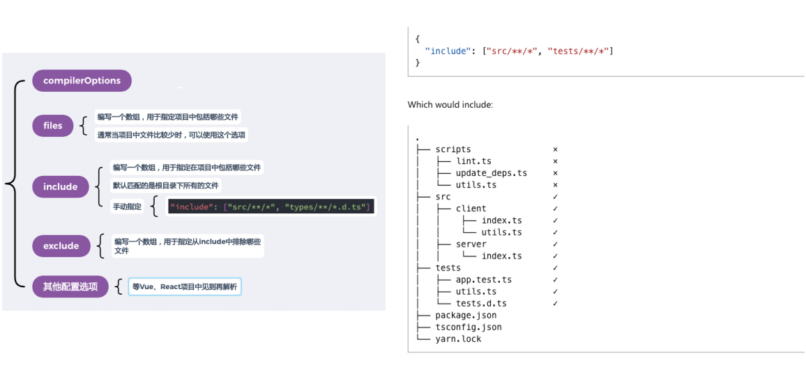

npm i typescript -g

tsc --version


- 使用webpack进行打包
- 使用ts-node
  - npm i ts-node tslib @types/node -g


外部定义类型-第三方库

- 该库查找声明安装方式的地址：


#### string和String

string：TypeScript给我们定义标识符时，提供的**字符串类型**

String：JavaScript中字符串的**包装类**

- const m: String = "Hello" 是指String类

#### 类型推导

- let推导出的是通用类型
- const推导出的是字面量类型

#### Array

```typescript
// 1.  string[]:数组类型，且数组中存放的是字符串类型
let name: string[] = ["abc", "bca", "cba"]
//2.   Array<number>:数组类型，且数组中存放的数字类型
let nums: Array<number> = [1, 2, 3]
```

##### tuple

[string, number, ......]

#### Object

```typescript
//直接 :object 表示是一个通用的对象类型，空对象，取值时不能判断里面有什么类型

// 
```

#### unknown

和any类型类似，any类型上做任何操作都是合法的

但是在unknown类型上做任何操作是不合法的

```typescript
// 要求必须进行类型的校验(缩小)，才能根据缩小后的类型进行对应操作
let foo: unknown = 'aaa'
if (typeof foo === "string") {
  console.log(foo.length)
}
```

#### void

基于上下文类型推导的函数中的返回值如果是void类型，并不强制要求不能返回任何东西

#### never

never表示永远不会发生值的类型

- 如果一个函数中有一个死循环或者抛出一个异常

```typescript
function foo() {
  return []
}//类型推导出foo的返回值类型是never[]
```

一般在封装框架/工具时使用

```typescript
function handleMessage(message: string|number) { //如果联合类型再加一个boolean，传入布尔值时会提示报错
  switch (typeof message) {
    case "string":
      console.log(message.length)
      break
    case "number":
      console.log(message)
      break
    default:
      const check: never = message
  }
}
// handleMessage(true)
```


#### type和interface

```typescript
type PointType = {
  x: number
  y: number
  z?: number
}

// 声明的方式
interface PotinType2 {
  x: number
  y: number
  z?: number
}

//区别一：type使用范围更大
type MyType = number|string
//区别二：interface可以多次声明，需要同时满足条件(x,y,z)
interface PointType3 {
  x: number
  y: number
}
interface PointType3 {
  z: number
}
//区别三：interface支持继承
//区别四：interface可以被类实现
```


#### 函数的类型

```typescript
//方案一：函数类型表达式
//格式： (参数列表) => 返回值类型
const foo: (num1: number) => number = (arg: number): number => {
  return 123
}

type fooType = (num1: number) => number
const foo1: fooType = (arg: number): number => {
  return 123
}


//方案二：函数的调用签名(从对象的角度看待)
//函数拥有自己的属性
//使用的是 : 而不是 =>
interface IBar {
  name: stinrg
  age: number
  // 函数可以被调用：函数调用签名
  (num1: number): number
}
const bar: IBar = (num1: number): number => {
  return 123
}
bar.name = 'hhh'
bar.age = 18
bar(666)

// 构造签名：表达可以通过new调用
class Person {}
interface ICTORPerson {
  new (): Person //通过new调用后的返回值类型是Person
}
function factory(fn: ICTORPerson) {
  const f = new fn()
  return f
}
```


### 细节处理

#### 类型检测-鸭子类型

只关心属性和行为，不关心具体是不是对应的类型

```typescript
class Person {
  constructor(public name: string, public age: number) {}
  running() {}
}
class Dog {
  constructor(public name: string, public age: number) {}
  running() {}
}

function printPerson(p: Person) {
  console.log(p.name, p.age)
}

printPerson(new Person("why", 18))
printPerson({name: "kobe", age: 30, running: function() {}})
printPerson(new Dog("旺财", 3))

const person: Person = new Dog("果汁", 5)
```


#### 严格的字面量类型检测

```typescript
type MethodType = "get" | "post"
function request(url: string, method: MethodType) {}

const info = {
  url: "http://xxx",
  method: "post"
}
// request(info.url, info.method)
// 在 info.method 处会进行报错

//解决方案一：进行as类型断言
request(info.url, info.method as "post")

//解决方案二：直接让info对象类型是一个字面量类型
const info1: { url: string, method: "post" } = {
  url: "http://xxx",
  method: "post"
}
//const info2 = {
//  url: "http://xxx",
//  method: "post"
//} as const
```


##### 类型擦除

- 第一次创建的对象字面量称之为**fresh(新鲜的)**
- 当一个新的对象字面量分配给一个变量或传递给一个非空目标类型的参数时，对象字面量指定目标类型中不存在的属性是错误的
- 当**类型断言**或对象字面量的**类型扩大**时，新鲜度会消失。

字面量赋值

* 对象的引用赋值时会进行**freshness擦除**

  * 多余的类型擦除，剩下类型能匹配时即可赋值

  * ```typescript
    interface IPerson {
      name: string
      age: number
    }
    function printInfo(person: IPerson) {
      console.log(person)
    }
    cosnt info = {
      name: "me",
      age: 18,
      height: 1.88,
      address: "武汉"
    }
    // 不能直接传对象{...}
    printInfo(info)
    ```


#### 函数类型的参数个数

TypeScript对于传入的函数类型的参数个数**不进行检测(校验)**

- 开发中使用的匿名函数太多了，规定不会进行参数个数检测
- 多余的传入参数会被忽略掉

```typescript
type CalcType = (num1: number, num2: number) => number
function calc(calcFn: CalcType) {
  calcFn(10, 20) // 这里得传两个数字
}

// 传入的函数可以接收一个参数或两个参数
// 但是不能超过CalcType规定的参数个数
calc(function(num1) { 
  return 123
})
```


##### this类型

```typescript
//在没有对TS进行特殊配置的情况下，this是any类型
const obj = {
  name: 'aaa',
  studying: function() {
    console.log(this.name, 'studying')
  }
}
obj.studying()

function foo1() {
  console.log(this) // noImplicitThis设置为true时，会报错
}

//this明确类型
function foo(this: { name: string }, info: {name: string}) {
  console.log(this, info)
}

foo.call({ name: "why" }, { name: "kobe" })
```

使用终端在当前目录输入指令 **tsc --init**生成一个ts初始化配置文件 

###### tsconfig.json

- 作用一（主要的作用）：让TypeScript Compiler(TSC)在编译时，知道如何去编译TypeScript代码和进行类型检测
- 作用二：让编辑器（比如VSCode）可以按照正确的方式识别TypeScript代码
  - 语法提示、类型错误检测等

```json
{
  "compilerOptions": {
    "noImplicitThis": true //设置为true时，不允许模糊的(any)this存在
    //"target": "esnext" 目标代码
    //"module": "esnext" 生成代码使用的模块化
    //"skipLibCheck": true 跳过对整个库的检测，仅仅检测用到的类型
    //"esModuleInterop": true 可以让es module和commonJS相互调用
    //"allowSyntheticDefaultImports": true 允许合成默认模块导出
    	// import * as react from 'react'--false
    	// import react from 'react' --true
    //"paths": { 路径映射，类似于webpack中的alias
    //  "@/*": ["src/*"]
    //}
  }
}
```



###### this的内置工具

```typescript
function foo(this: { name: string }, info: { name: string }) {
  console.log(this, info)
}
type FooType = typeof foo

// 1.ThisParameterType: 获取FooType类型中的this类型
type FooThisType = ThisParameterType<FooType>

// 2.OmitThisParameter: 删除this参数类型后剩余的函数类型
type PureFooType = OmitThisParameter<FooType>

// 3.ThisType: 用于绑定一个上下文的this
interface IState {
  name: string
  age: number
}
interface IStore {
  state: IState
  eating: () => void
}

const store: IStore & ThisType<IState> = {
  state: {
    name: "why",
    age: 18
  },
  eating: function() {
    console.log(this.name)
  },
}

store.eating.call(store.state)
```


#### 类型缩小

常见的类型保护方式

- typeof
- 平等缩小(===、!\==)
- instanceof
- in判断是否有某一个属性等等...


#### 对象类型的索引签名

  返回值类型的目的是告知通过索引去获取到的值是什么类型

```typescript
interface IIndexType {
  // index只能在string或number两个类型中选择
  [index: string]: any
}
// 索引签名 [index: number]: string
// const names: IIndexType = ["abc", "aaa", "bbb"]

// 索引签名 [index: string]: any 没有报错
// 1.索引要求必须是字符串类型 names[0] 本质上是 names["0"]
// const names: IIndexType = ["abc", "cba", "nba"]

// 索引签名: [index: string]: string: 会报错
// 严格字面量赋值检测: ["abc", "cba", "nba"] => Array实例 => names[0] names.forEach
// const names: IIndexType = ["abc", "cba", "nba"]
// names["forEach"] => function
// names["map/filter"] => function


// 要求一：数字类型索引的类型，必须是字符串类型索引的子类型
// 原因：所有的数字类型都是会转成字符串类型去对象中获取内容
interface YIndexType {
  [index: number]: string
  [key: string]: any
}
// 要求二: 如果索引签名中有定义其他属性, 其他属性返回的类型, 必须符合string类型返回的属性
interface IIndexType {
  // 两个索引类型的写法
  [index: number]: string
  [key: string]: number|string

  // aaa: string
  // bbb: boolean 错误的类型
}
```


### 泛型

进行类型的参数化

==keyof== 得到的是联合类型

```typescript
interface IKun {
  name: string
  age: number
  slogan?: string
}

// 类型体操
// name | age | slogan
type keys = keyof IKun
```


#### 泛型约束

extends

```typescript
interface IKey {
  name: string
  age: number
}
type IKeys = keyof IKey 
// 为"name"|"age"联合类型

// 要求传入的key类型, 是obj当中key的其中之一
function getObjectProperty<O, K extends keyof O>(obj: O, key: K) {
  return obj[key]
}
const info = {
  name: "why",
  age: 18,
  height: 1.88
}

const name = getObjectProperty(info, "name")
```


#### 映射类型

```typescript
type MapPerson<T> = {
  // 索引类型以此进行使用
  [K in keyof T]: T[K] //可以搭配readonly/?/-?配合使用

  // name: string
  // age: number
}

interface IPerson {
  name: string
  age: number
}

// 拷贝一份IPerson
type NewPerson = MapPerson<IPerson>
```


#### 条件类型

- 写法类似于 JavaScript 中的条件表达式（condition ? trueExpression : falseExpression ）

- SomeType extends OtherType ? TrueType : FalseType


```typescript
// 条件类型基本使用
function sum<T extends number | string>(num1: T, num2: T): T extends number ? number:string
function sum(num1, num2) {
  return num1 + num2
}


// 1.infer
// 从正在比较的类型中推断类型，然后在 true 分支里引用该推断结果
type FnType = (n1: number, n2: string) => number
function foo() {
  return 'abc'
}
 // 获取一个函数返回值类型 
type MyReturnType<T extends (...args: any[]) => any> = T extends (...args: any[]) => infer R? R : never
type myReturnType = MyReturnType<FnType>
type FooReturnType = MyReturnType<typeof foo>
 // 获取一个函数的参数类型 
type MyParameterType<T extends (...args: any[]) => any> = T extends (...args: infer A) => any ? A : never
type ParameterType = MyParameterType<FnType>


// 2.as


// 3.分发
type toArray<T> = T extends any? T[]: never
// 得到number[]|string[] 而不是 (number|string)[]
// 当传入string | number时，会遍历联合类型中的每一个成员
// 相当于toArray<string> | toArray<number>
type NumAndStrArray = toArray<number|string>
```


#### 内置工具-类型体操

```typescript
interface IKun {
  name: string
  age: number
  slogan?: string
}

// 1.Partial: 用于构造一个type下面的所有属性都设置为可选的类型
type MYPartial<T> = {
  [K in keyof T]?: T[K]
} 

// 2.Required: 用于构造一个type下面的所有属性都设置为必填的类型，这个工具类型跟 Partial 相反
type MYRequired<T> = {
  [K in keyof T]-?: T[K]
} 

// 3.Readonly: 用于构造一个type下面的所有属性都设置为只读的类型
type MYReadonly<T> = {
  readonly [K in keyof T]: T[K]
} 

// 4.Record<Keys, Type>: 用于构造一个对象类型，它所有的key(键)都是Keys类型，它所有的value(值)都是Type类型
type Res = keyof any // => number|string|symbol
type MYRecord<Keys extends keyof any, T> = {
  [P in Keys]: T
} 
type t1 = "上海" | "北京" | "洛杉矶"
type IKuns4 = HYRecord<t1, IKun>

// 5.Pick<T, Keys>: 从Type类型里面挑选属性Keys
type MYPick<T, K extends keyof T> = {
  [P in K]: T[P]
} 
type IKuns5 = HYPick<IKun, "slogan"|"name">

// 6.Omit<T, Keys>: 从Type类型里面过滤属性Keys
type MYOmit<T, K extends keyof T> = {
  [P in keyof T as P extends K? never : P]: T[P]
}

// 7.Exclude<UnionType, ExcludedMembers>: 从UnionType联合类型里面排除了所有可以赋给ExcludedMembers的类型
type MYExclude<T, E> = T extends E? never : T

// 8.Extract<Type, Union>: 是从Type类型里面提取了所有可以赋给Union的类型
type MYExtract<T, E> = T extends E? T : never

// 9.NonNullable: 从Type类型中排除了所有的null、undefined的类型
type MYNonNullable<T> = T extends null|undefined ? never: T


// 10.InstanceType: 用于构造一个由所有Type的构造函数的实例类型组成的类型
type MYInstanceType<T extends new (...args: any[]) => any> = T extends new (...args: any[]) => infer R? R : never

class Person {}
class Dog {}
// typeof Person: 构造函数具体的类型
// InstanceType构造函数创建出来的实例对象的类型
type MYPerson = MYInstanceType<typeof Person>
const p2: MYPerson = new Person()

// 构造函数的例子
// 通过的创建实例的工具函数时会用到这个InstanceType
function factory<T extends new (...args: any[]) => any>(ctor: T): MYInstanceType<T> {
  return new ctor()
}

const p3 = factory(Person)
const d = factory(Dog)

```


### 封装Axios

service/request/index.ts

```typescript
class MYRequest {
  
}

export default MYRequest
```


