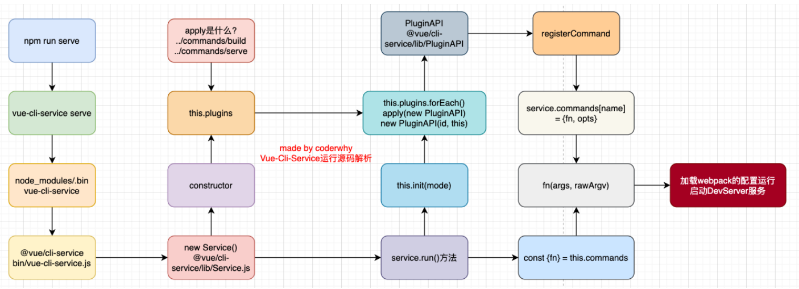
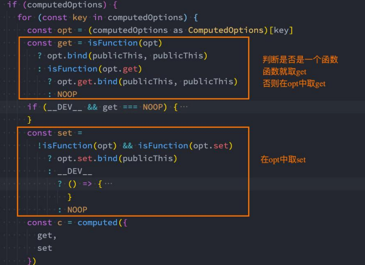
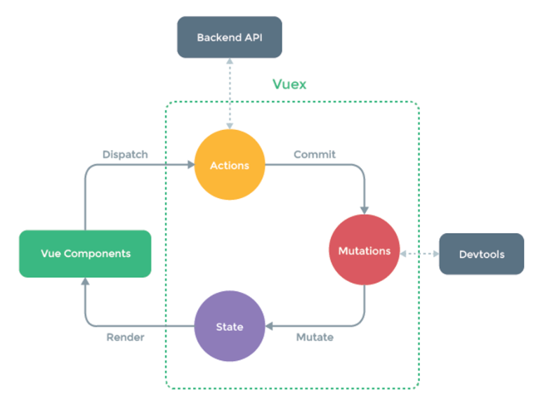

创建项目

* 方式一：Vue CLI：vue create app-name

* 方式二：npm init vue@latest
  * 1.安装一个本地工具：create-vue
  * 2.使用create-vue创建一个vue项目

Vue Cli运行原理




template -> createVNode -> VNode -> VDOM

* runtime-only
  * 代码中不可以有任何template
  * .vue文件中的template已经由vue-template-compiler渲染成render函数了
    * **webpack中的vue-loader已经完成了template -> createVNode 过程**
* runtime-compiler
  * 由Vue中源码的代码进行处理template


methods中如果使用箭头函数，根据this查找规则，找到script作用域中的this----window

* 事实上Vue的源码当中就是对methods中的所有函数进行了遍历，并且通过**bind**绑定了this


### 指令

v-bind直接绑定一个对象

* 对象的所有属性都会绑定到元素上

v-on可通过$event传递事件

* 修饰符  .stop/.prevent/......

v-for: (item, index) in 数组/(value, key, index) in 对象

* key的作用：主要用在Vue的虚拟DOM算法，在新旧nodes对比时辨识VNodes
  * 如果不使用key，Vue会使用一种最大限度减少动态元素并且尽可能的尝试就地修改/复用相同类型元素的算法
    * 使用 patchUnkeyedChildren方法
  * 使用key时，它会基于key的变化重新排列元素顺序，并且会移除/销毁key不存在的元素
    * 使用 patchKeyedChildren方法
    * 1.头部开始遍历，遇到相同节点继续，不同就跳出循环
    * 2.头部开始遍历，遇到相同节点继续，不同就跳出循环
    * 3.新节点更多，就添加新节点/旧节点更多，就移除旧节点
    * 4.中间不知道排列的位置序列则根据key建立索引图。最大限度使用旧节点

v-memo绑定any[]

* 传入一个固定长度的依赖值数组进行比较。如果数组里的每个值都与最后一次的渲染相同，那么整个子树的更新将被跳过

* ```html
  <div v-memo="[valueA, valueB]">
    ......
  </div>
  ```

* 如果 valueA和 valueB 都保持不变，这个 \<div> 及其子项的所有更新都将被跳过。实际上，甚至虚拟 DOM 的 vnode 创建也将被跳过，因为缓存的子树副本可以被重新使用


### v-model

本质原理：

* v-bind绑定value属性的值

   v-on绑定input事件监听到函数中，函数会获取最新的值赋值到绑定的属性中

* 实际更复杂

修饰符

* .lazy/.number/.trim

#### 组件的v-model

两者是等价的

```vue
<!-- App.vue -->
<template>
	<my-input v-model="appCounter" />
	<my-input :model-value="appCounter" @update:model-value="appCounter = $event"></my-input>
</template>
<!-- my-input.vue
	props接收'modelValue'
	emits发射'update:modelValue'
-->
```

**绑定多个v-model**

```vue
<!-- App.vue -->
<template>
	<!-- 起别名 -->
	<my-input v-model:counter="appCounter"></my-input>
</template>
<!-- my-input.vue
	props接收'counter'
	emits发射'update:counter'
-->
```


### 组件通信

defineExpose 编译器宏来显式指定在 \<script setup> 组件中要暴露出去的 property

#### 父子组件

* 父组件传递给子组件
  * defineprops({})
    * 非props的attribute

      * 没有定义对应的prop或者emits时，常见的class，id，style
      * 当组件有单个根节点，**该属性会默认添加到子组件的根组件上**
      * 不希望组件的根元素继承attribute，可以在组件中设置禁用：inheritAttrs: false
        * 访问：$attrs.xxx
      * 组件有多个根节点，手动指定 v-bind="$attrs"
* 子组件发射事件给父组件
  * defineEmits([])
* Provide(name, value)/Inject(name)

#### 非父子组件

* 事件总线
  * mitt/tiny-emitter/hy-event-store
  * 使用事件总线后会让事件变得无法把控。(不知道都在哪里进行了监听)

#### 插槽

* 父级模板里的所有内容都是在父级作用域中编译的
* 子模板里的所有内容都是在子作用域中编译的

##### 作用域插槽

父组件通过插槽拿到子组件传入的值

```vue
<!-- TabControl.vue -->
<template>
	<slot :ti="titles">
    <span>{{ titles }}</span>
  </slot>
</template>
<!-- App.vue -->
<template>
	<tab-controle :titles=["衣服", "裤子", "鞋子"]>
    <template #default="props">
      <button>{{ props.ti }}</button>
		</template>
  </tab-controle>
</template>
```


### 动态组件

\<component :is="">\</component>

### 异步组件

组件分包：对于一些不需要立即使用的组件，我们可以单独对它们进行拆分，拆分成一些小的代码块chunk.js、这些chunk.js会在需要时从服务器加载下来，并且运行代码，显示对应的内容

通过异步的方式来进行加载组件: defineAsyncComponent()--接受两种类型的参数：

* 类型一：工厂函数，该工厂函数需要返回一个Promise对象
* 类型二：接受一个对象类型，对异步函数进行配置

```vue
<script setup>
  import { defineAsyncComponent } from 'vue'
//  const AsyncHome = defineAsyncComponent(() => import('./AsyncHome.vue'))
  const AsyncHome = defineAsyncComponent({
    loder: () => import('./AsyncHome.vue'),
    // 记载过程中显示的组件
    LoadingComponent: Loading,
    delay: 2000
  })
</script>
```


### nexttick

  将回调推迟到下一个DOM更新周期之后执行。在更改了一些数据以等待DOM更新后立即使用它
    需求：点击一个按钮后，会修改在h2中的message
    message被修改后，获取h2的最新高度
      1.updated周期中获取（其他数据更新也会执行操作）
      2.nextTick(callback)

  原理：将callback加入到微任务队列的最后(等到watch、组件的更新，生命周期等微任务执行完后再执行)(放入到了Promise的then当中)

  好处:
  ```js
    const increment = () => {
      for(let i = 0; i < 100; i++) {
        counter.value++
      }
    }
  ```
  假如有watch(counter,() => {})...时 监听的函数并不会执行一百次。真正的更新并不是同步更新，而是加入微任务队列中。当先把这次的宏任务做完时，再去执行微任务


### 自定义指令

* 自定义局部指令：组件中通过 directives 选项，只能在当前组件中使用
* 自定义全局指令：app的 directive 方法，可以在任意组件中被使用


### Teleport


### 异步组件

Suspense


### Vue插件

* 对象类型：一个对象，但是必须包含一个 install 的函数，该函数会在安装插件时执行
* 函数类型：一个function，这个函数会在安装插件时自动执行

完成的功能没有限制，例如:

* 添加全局方法或者 property，通过把它们添加到 config.globalProperties 上实现
* 添加全局资源：指令/过滤器/过渡等
* 通过全局 mixin 来添加一些组件选项
* 一个库，提供自己的 API，同时提供上面提到的一个或多个功能


### h函数

({String | Object | Function}tag, {Object}props, {String | Array | Object}children)

* tag：一个HTML标签名/一个组件/一个异步组件/一个函数式组件
* props：与attribut、prop和事件相对应的对象
* children：子VNodes，使用h()构建/或使用字符串获取'文本VNode'/或有插槽的对象

如果希望使用jsx

* 安装Babel支持Vue的jsx插件

  * npm install @vue/babel-plugin-jsx -D

  * Vite环境，需要安装插件：

    npm install @vitejs/plugin-vue-jsx -D

* 在babel.config.js配置文件中配置插件

  * ```js
    module.exports = {
      presets: [
        '@vue/cli-plugin-babel/preset'
      ],
      plugins: [
        "@vue/babel-plugin-jsx"
      ]
    }
    ```

  * 


### 动画

```vue
<template>
	<transition name='fade'></transition>
</template>

<style scoped>
  .fade-enter-from,
  .fade-leave-to {
    opacity: 0
  }
  
  .fade-enter-to,
  .fade-leave-from {
    opacity: 1
  }
  
  .fade-enter-active,
  .fade-leave-active {
    transition: opacity 1s ease
  }
</style>
```


## setup

不能使用this

* 在setup被调用之前，data、computed、methods等都没有被解析
  * this并没有指向当前组件实例
* 1.调用 createComponentInstance 创建组件实例
* 2.调用 setupComponent 初始化component内部的操作
* 3.调用 setupStatefulComponent 初始化有状态的组件
  * 在 setupStatefulComponent 取出了 setup 函数
* 4.通过callWithErrorHandling 的函数执行 setup
  * 组件的instance肯定是在执行 setup 函数之前就创建出来的


### ref/reactive

* ref定义简单类型的数据(也可以定义复杂)
  * 在template中使用ref，vue会自动解包，在函数内部使用，要通过.value的形式
* reactive定义复杂类型的数据
  * 必须传入一个数组或者对象类型----data选项，也是在内部交给了reactive函数将其编程响应式对象的
  * 

判断reactive的API

* isProxy：检查对象是否是由 reactive 或 readonly创建的 proxy
* isReactive：检查对象是否是由 reactive创建的响应式代理
  * 该代理是 readonly 创建的，但包裹了由 reactive 创建的另一个代理，它也会返回 true
* isReadonly：检查对象是否是由 readonly 创建的只读代理
* toRaw：返回 reactive 或 readonly 代理的原始对象（不建议保留对原始对象的持久引用。请谨慎使用）
* shallowReactive：创建一个响应式代理，它跟踪其自身 property 的响应性，但不执行嵌套对象的深层响应式转换 (深层还是原生对象)。
* shallowReadonly：创建一个 proxy，使其自身的 property 为只读，但不执行嵌套对象的深度只读转换（深层还是可读、可写的）。

ref的其他API

* unref：获取一个ref引用中的value
  *  val = isRef(val) ? val.value : val 的语法糖函数
* isRef
* shallowRef： 创建一个浅层的ref对象
* triggerRef：手动触发和 shallowRef 相关联的副作用

```js
const info = shallowRef({name: 'myref'})

function changeInfo() {
  // 这个修改不是响应式的
  info.value.name = 'coder'
  // 手动触发
  triggerRef(info)
}
```


toRefs/storeToRefs


readonly会返回原始对象的只读代理：只是一个proxy的set方法被劫持，并且不能对其进行修改


### computed

返回一个ref对象

```js
// 方式一：接收一个getter函数，并为 getter 函数返回的值，返回一个不变的 ref 对象
const fullName = computed(() => {
  return firstName.value + ' ' + lastName.value
})
// 方式二：接收一个具有 get 和 set 的对象，返回一个可读写ref 对象
const fullName = computed(() => {
  get: () => {
    return firstName.value + ' ' + lastName.value
  },
  set: (newValue) => {
    const names = newValue.split(' ')
    firstName.value =  names[0]
    lastName.value = names[1]
  }
})
```


computed源码如何对setter和getter处理呢

* 只是做了一个逻辑判断而已




### watch/watchEffect

* watch：需要手动指定侦听的数据源,并且执行其回调函数
  * 默认情况下它是惰性的，只有当被侦听的源发生变化时才会执行回调
* watchEffect：用于自动收集响应式数据的依赖。当侦听到某些响应式数据变化时，我们希望执行某些操作，可以使用watchEffect
  * 1.watchEffect传入的函数会被立即执行一次，并且在执行的过程中会收集依赖
  * 2.只有收集的依赖发生变化时，watchEffect传入的函数才会再次执行


### Router

* 后端路由

  后端处理url和页面关系。

  ​	**①后端渲染(服务端渲染)**

  把url给服务器，然后用正则对url进行匹配和解析，通过jsp(java server page)：html+css+java 渲染。              java代码：从数据库中读取数据，并将它动态放在页面中。完成后直接传给客户端，`不用单独加载js和css。`利于SEO优化

* 前端路由

  ​	**②前后端分离：**后端只提供API来返回数据。前端用js将数据渲染到页面。

  ​		浏览器通过url到`静态资源服务器`拿到html+css+js。由浏览器执行js代码后，**通过Ajax**到`提供API接口的服务器`请求到数据，再执行其他js代码将请求到的数据渲染到网页中。

  ​	**③SPA(Single-Page Application)单页富应用：整个网页只有一个html页面**

  ​		在前后端分离的基础上加了一层**前端路由**

  ​		一次性请求了所有资源，根据url决定渲染哪一部分资源

  `核心：改变URL，不刷新页面`


路由懒加载

对分包命名

```js
component: () => import(/* webpackChunkName: "home-chunk" */ '../pages/Home.vue')
```

提高首屏的渲染效率


NotFound

```js
{
  path: '/:pathMatch(.*)',
  component: () => import('@/views/not-found/NotFound.vue')
}
```

如果后面再加*.  即 '/:pathMatch(.\*)\*'

* 它们的区别在于解析的时候，是否解析 /
* 例如路径/user/hahaha/123
  * ["user", "hahaha", "123"]
  * /user/hahaha/123


可以通过query的方式来传递参数


动态添加路由

* router.addRouter(RouteRecordRaw)
* router.addRouter(name, RouteRecordRaw)   为route添加一个children路由
* 删除路由的三种方法
  * 添加一个name相同的路由(就是替换了上一个路由)
  * 通过removeRoute方法，传入路由的名称name
  * 通过addRoute方法的返回值回调


router.hasRoute()：检查路由是否存在。

router.getRoutes()：获取一个包含所有路由记录的数组。


路由导航守卫

* 导航被触发。
* 在失活的组件里调用 beforeRouteLeave 守卫。
* 调用全局的 beforeEach 守卫。
* 在重用的组件里调用 beforeRouteUpdate 守卫(2.2+)。 
* 在路由配置里调用 beforeEnter。 
* 解析异步路由组件。
* 在被激活的组件里调用 beforeRouteEnter。 
* 调用全局的 beforeResolve 守卫(2.5+)。 
* 导航被确认。
* 调用全局的 afterEach 钩子。
* 触发 DOM 更新。
* 调用 beforeRouteEnter 守卫中传给 next 的回调函数，创建好的组件实例会作为回调函数的参数传入


### vuex



### pinia

可以使用store 上的 $reset() 方法将状态重置到其初始值

通过将其 $state 属性设置为新对象来替换 Store 的整个状态


