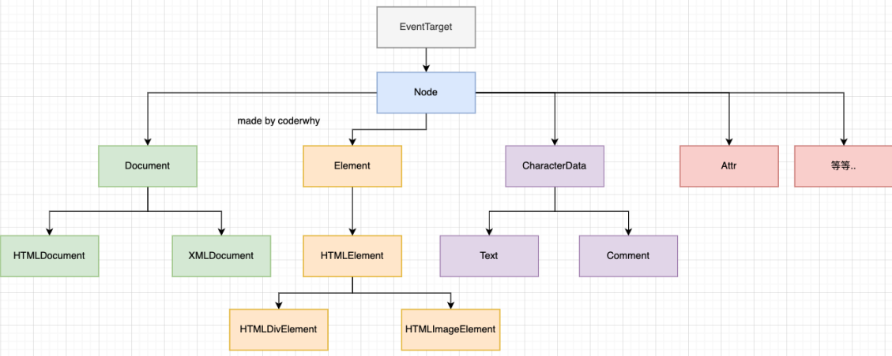

浏览器内核

* Gecko(壁虎) 早期被Netscape和Firefox浏览器使用
* Trident(三叉戟) 微软开发
* Webkit  苹果基于KHTML开发、开源的
* Blink 是Webkit的一个分支，目前应用于Google、Edge


JS引擎

* SpiderMonkey 第一款JavaScript引擎
* Chakra  微软开发
* JavaScriptCore  Webkit中的JavaScript引擎，Apple公司开发
* V8


8种数据类型

Object为引用数据类型，其他七种为原始数据类型

* Number
  * isNaN 不是数字返回true，是数字返回false
* String
* Boolean
  * 包含0的字符串"0"是true
* Undefined
* Null
* BigInt
* Symbol
* Object
  * {}仍会在堆内存中创建对象(布尔类型为true)   null指向0X0


原始类型能调用属性和方法

​	对其封装了对应的包装类型(js引擎)

- 根据原始值，创建一个原始类型对应的包装类型对象
- 调用对应的属性或方法，返回一个新的值
- 创建的包装类对象被销毁
- 通常JavaScript引擎会进行很多优化，它可以跳过创建包装类的过程在内部直接完成属性的获取或者方法的调用


typeof操作符

​	object表示值为对象或null


==和=\==的区别(day19，day20)

* ==运算符，在类型不相同的情况下，会先将运算元转成Number类型的值再进行比较
  * 空字符串和false转换后都为数字0
  * null比较特殊(应该是被当成一个对象和原生类型进行比较)
  * null == undefined(true)
  * if Type(x) is either String or Number and Type(y) is Object
    * return the result of the comparison x == **ToPrimitive(y)** [原始类型](https://262.ecma-international.org/5.1/#sec-9.1)
* ===运算符，在类型不相同情况下，直接返回false


arguments

  是一个对象Object


函数声明和函数表达式

* 语法不同
  * 函数声明：在主代码流中声明为单独的语句的函数
  * 函数表达式：在一个表达式中或另一个语法结构中创建的函数
* JavaScript创建函数的时机不同
  * 函数表达式在代码执行到达时被创建，并且仅从那一刻起可用
  * 函数声明被定义之前可以被调用


栈内存和堆内存

* 原始类型占据的空间是在栈内存中分配的
* 对象类型占据的空间是在堆内存中分配的


工厂方法创建的对象在打印时，对象类型都是Object类型


new操作符

* 函数调用new操作符
  * 在内存中创建一个新的对象(空对象)
  * 这个对象内部的[[prototype]]属性会被赋值为该构造函数的prototype属性
  * 构造函数内部的this，会指向创建出来的新对象
  * 执行函数的内部代码(函数体代码)
  * 如果构造函数没有返回非空对象，则返回创建出来的新对象


push/pop方法运行比unshift/shift速度快


数组的find


## DOM

DOM的继承关系图



区分节点和元素

* 节点(Node)包括注释，文本


**innerHTML和textContent的区别：**

- 使用 innerHTML，我们将其“作为 HTML”插入，带有所有 HTML 标签。
- 使用 textContent，我们将其“作为文本”插入，所有符号（symbol）均按字面意义处理


元素的大小、滚动

* clientWidth: contentWidth + padding(不包含滚动条)
* clientHeight: contentHeight + padding
* offsetWidth: 元素完整的宽度
* offsetHeight: 元素完整的高度
* offsetLeft: 距离父元素的x
* offsetTop: 距离父元素的y
* scrollHeight: 整个可滚动的区域高度
* scrollTop: 滚动部分的高度


事件冒泡和事件捕获

​	方法监听：eventTarget.addEventListener(type,listener[,useCapture])，同一事件可以注册多个监听器

​	useCapture = true，捕获阶段执行，默认false，冒泡阶段执行


 鼠标事件

* mouseover、mouseout支持冒泡
* mouseenter、mouseleave不支持冒泡


加载

* window的onload是等HTML所有资源加载完

* DOMContentLoaded是HTML 文档解析之后触发


## BOM

ECMAScript规范  全局对象 -> globalThis

* 对于浏览器 -> window
* 对于Node -> global


location

* href 整个URL
* protocol 当前协议
* host 主机地址   hostname (不带端口)
* port 端口
* pathname 路径
* search 查询字符串
* hash 哈希值

new URLSearchParams('string')


history


navigator对象表示用户代理的状态和标识等信息


## JSON

JavaScript Object Notation

JSON是一种可以在服务器和客户端之间传输的数据格式

其他传输格式

* XML：在早期网络传输中使用，目前已经很少使用
* Protobuf：目前越来越多使用protobuf


应用场景

* 网络传输JSON数据
* 项目的某些配置文件
* 非关系型数据库(NoSQL)将json作为存储格式


JSON顶层支持三种类型的值

* 简单值：Number，String(双引号)，Boolean，null
* 对象值：由key、value组成，key是字符串类型，并且必须添加双引号，值可以是简单值、对象值、数组值
* 数组值：数组的值可以是简单值、对象值、数组值


如果对象本身有toJSON方法，那么直接调用toJSON方法

```js
const obj = {
  name: "kobe",
  toJSON: function() {
    return "123"
  }
}
const item = JSON.stringify(obj) // "123"
```


