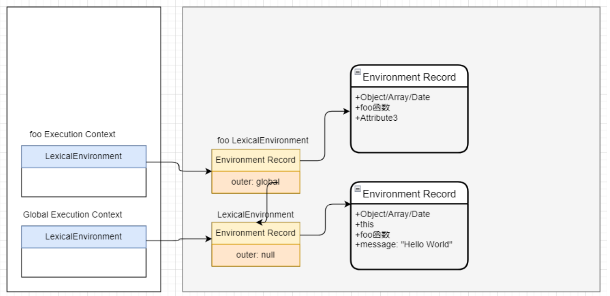

## 浏览器

输入URL后资源加载过程

* 域名经过DNS(domain name system)解析，转成对应的IP地址
* 根据IP地址找到服务器，服务器返回静态资源(html)
  * 遇到link元素css文件/script元素js文件，再去服务器中下载
* 解析HTML生成Dom Tree
  * **下载和解析CSS不会阻塞HTML的解析,但是会阻塞Render Tree的构建**
  * **遇到script元素时会停止构建，首先加载JS代码并执行，只有等到执行结束后，才会继续解析HTML**
* 有了Dom Tree和CSSOM Tree后，两个结合来构成Render Tree(display:none的元素不会在Render Tree中)
* 在渲染树上计算每个节点的几何体，布局(Layout)是确定渲染树中所有节点的宽高和位置信息
* 将每个节点绘制(Paint)到屏幕上，包括将元素的可见部分进行绘制


### 渲染页面的详细流程


更详细的过程


- **link元素不会阻塞DOM Tree的构建过程，但是会阻塞Render Tree的构建过程**
- **Render Tree和DOM Tree并不是一一对应的关系**
  - 比如对于display为none的元素，压根不会出现在render tree中

在渲染树（Render Tree）上运行布局（Layout）以计算每个节点的几何体

- **渲染树不表示每个节点的尺寸、位置等信息**
- Layout：确定呈现树中所有节点的宽度、高度和位置信息

将每个节点绘制（Paint）到屏幕上

- Paint：将布局阶段计算的每个frame转为屏幕上实际的像素点；包括将元素的可见部分进行绘制，比如文本、颜色、边框、阴影、替换元素（比如img）


Content -- Match selectors -- Compute style -- Construct frams -- Layout -- Paint -- **Composite**


#### 回流

* 第一次后对节点的大小、位置修改重新计算都是**回流**
  * 第一次确定节点的大小和位置，称之为布局（layout）
* 引起回流的情况  **消耗性能**
  * DOM结构发生改变(添加新的节点或者移除节点)
  * 改变了布局(width/height/padding/font-size)
  * 窗口resize(修改窗口尺寸)
  * 调用getComputedStyle方法获取尺寸、位置信息

#### 重绘

* 第一次渲染之后的重新渲染称为**重绘**
  * 第一次渲染内容称之为绘制（paint）
* 引起重绘的情况
  * 修改背景色、文字颜色、边框颜色、样式等
* (回流一定会引起重绘)    **尽量避免回流的发生**
  * 修改样式尽量一次性修改
    * 通过cssText、class修改
  * 尽量避免频繁的操作DOM
    * 在一个DocumentFragment或者父元素中完成
  * 尽量避免使用getComputedStyle方法获取尺寸、位置信息
  * 对某些元素使用position的absolute或者fixed
    * 并不是不会引起回流，而是开销相对较小


#### Composite合成

浏览器的一种优化手段、绘制的过程，可以将布局后的元素绘制到多个合成图层中

* 默认情况 标准流 -> layout tree -> render layer

* 而一些特殊的属性，会创建一个新的合成层(CompositingLayer)，fixed -> render layer
并且新的图层可以利用GPU来加速绘制    因为**每个合成层都是单独渲染的**
  
* 生成新的合成层的情况

  * 3D transforms
  * video、canvas、iframe
  * opacity动画转换时
  * position：fixed
  * animation或transition设置了opacity、transform

* 分层提高性能是以**内存管理为代价**


#### script元素

事实上，浏览器在解析HTML的过程中，遇到了script元素是不能继续构建DOM树的

- 它会停止继续构建，首先下载js代码，并且执行js的脚本
- 只有等到js脚本执行结束后，才会继续解析HTML，构建DOM树

原因

- 因为js的作用之一就是操作DOM，并且可以修改DOM
- 如果我们等到DOM树构建完成并且渲染再执行js，会造成严重的回流和重绘，影响页面的性能； 
- 所以会在遇到script元素时，优先下载和执行js代码，再继续构建DOM树

两个属性

* defer
  * 告诉浏览器不要等待脚本下载，继续解析HTML，由浏览器去进行下载
  * 如果脚本提前先下载好了，会等待DOM Tree构建完成，在DOMContentLoaded事件之前执行defer中的代码
  * 某种角度上，defer可以提高性能，推荐放head元素中
* 多个带defer的脚本是可以保持正确的顺序执行的
  
* async
  * 让一个脚本完全独立
  * 不能保证在DOMContentLoaded之前或之后执行
  * async脚本不能保证顺序，它是独立下载、独立运行的


## JS执行原理

**浏览器内核是由两部分组成的，以webkit为例：**

- WebCore**：**负责HTML解析、布局、渲染等等相关的工作；
- JavaScriptCore**：**解析、执行JavaScript代码；

V8引擎


* parse模块，将JS代码转成AST
  
  * **如果函数没有被调用，是不会被转换成AST的**
* Ignition是一个解释器，将AST转成ByteCode
  * 同时收集TurboFan优化所需要的信息(比如函数参数的类型信息)
  * 如果函数只调用一次，Ignition会解释执行ByteCode

* TuboFan是一个编译器，可以将字节码编译为CPU可以直接执行的机器码

  * 如果一个函数被多次调用，就会被标记为**热点函数**，经过TurboFan转换成优化的机器码，提高执行性能
  * 机器码实际上也会被还原为ByteCode，因为如果后续执行函数过程中类型发生了变化，之前优化的机器码不能正确处理，就会**逆向转换成字节码**

  


* 在执行代码前，在堆内存中创建一个全局对象 GO(Global Object) (浏览器中--window)
* js引擎内部有一个执行上下文栈(Execution Context Stack,ECS)
  * 全局代码为了执行会构建一个GEC(Global Execution Context),会被放入ECS中执行
* 每一个执行上下文会关联一个VO(Variable Object)，变量和函数声明都会被添加到这个VO对象中
  * 在parser转成AST的过程中，会将全局定义的变量、函数等加入到GO中，但变量并不会赋值(变量的作用域提升)   **全局函数对象**会被提前创建好
    * 在执行全局代码时，VO就是GO
  * 在执行到一个函数时，会创建一个FEC(Functional Execution Context)并且压入ECS中
    * 函数的VO称为AO(Activation Object)
    * 这个AO对象会使用arguments作为初始化，初始值是传入的参数


#### 作用域和作用域链

 当进入到一个执行上下文时，执行上下文也会关联一个作用域链(Scope Chain)

* 作用域链是一个对象列表，用于变量标识符的求值

* **函数的作用域链在一个函数被创建时就被决定了** (定义的位置)

* ```js
  var message = "Global Message"
  function foo() {
    // [[scopes]] : GO
    console.log(message)
  }
  var obj = {
    name: "obj",
    bar: function() {
      var message = "bar message"
      foo()
    }
  }
  obj.bar()  // "Global Message"
  ```


## ES6

### 词法环境

**Lexical Environments** 

* Lexical Environment用于处理let、const声明的标识符      **不会进行作用域提升(被创建但不能访问)**

  *  **词法绑定被执行时才会进行赋值，let没有赋初始值时，默认是undefined**

  

* 一个词法环境是由环境记录(**Environment Record**)和一个外部词法环境(**Outer Lexical Environment**)组成

* 一个词法环境经常用于关联一个函数声明、代码块语句、try-catch语句，当它们的代码被执行时，词法环境被创建出来
  
  * 环境记录类似于VO，Outer类似于Scope Chain


### 变量环境

**Variable Environment**

* 用于处理var和function声明的标识符


### 新内存图示

