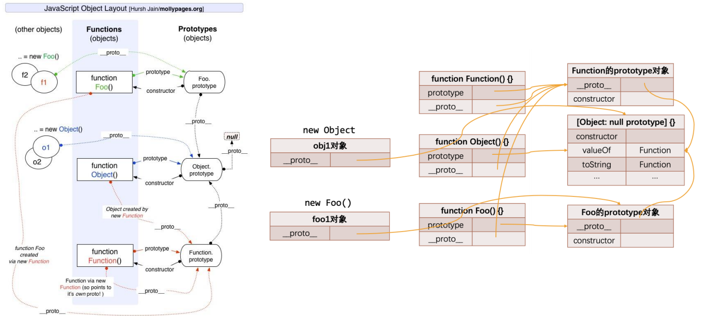
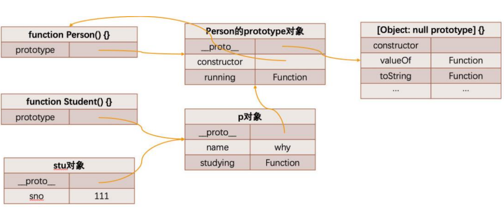

Object类是所有类的父类

Person.prototype.\_\_proto\_\_ === Object.prototype

Person.\_\_proto\_\_ === Function.prototype 

Function.prototype.\_\_proto\_\_ === Object.prototype

Object.\_\_proto\_\_ === Function.prototype 

Function.\_\_proto\_\_ === Function.prototype 

Object.prototype.\_\_proto\_\_ 为 null





### 对象原型(隐式)

**每个对象都有一个特殊的内置属性 [[prototype]]，这个特殊的对象可以指向另外一个对象	隐式原型**

* obj.\_\_proto\_\_(浏览器实现的)
* Object.getPrototypeOf(obj)          Object.setPrototypeOf(obj,prototype)
* 作用: 当我们通过[[get]]方式获取一个属性对应的value时，会优先在自己的对象中查找，如果没有找到会在原型**[[prototype]]**对象中查找


### 函数原型(显式)

**所有的函数都有一个prototype的属性（注意：不是__proto__）		显式原型**         

* foo.prototype (函数对象才有，指向原型对象)
  * 作用: 构建对象时，给对象设置隐式原型
  * new操作时    p.\_\_proto\_\_ = Person.prototype
  * 多个对象有共同值时，将它放到构造函数对象的显式原型(prototype),由构造函数创建出来的所有对象，都会共享这些属性
* Person.prototype.**constructor** === Person
  * 显式原型对象上的**constructor**指回到当前函数对象
* **箭头函数没有显式原型**


## ES5与继承

### 原型链--方法的继承

* 从一个对象上获取属性，没有获取到就会去它的原型上面获取
* 1.定义父类构造函数
* 2.父类原型上添加内容
* 3.定义子类构造函数
* 4.创建父类对象，并作为子类的原型对象
* 5.在子类原型对象上添加内容



弊端

- 直接打印对象是看不到这个属性的
- 这个属性会被多个对象共享，如果这个对象是一个引用类型，那么就会造成问题
- 不能给Person传递参数（让每个stu有自己的属性），因为这个对象是一次性创建的（没办法定制化）


### 借用构造函数--属性的继承

* 在子类构造函数的内部用apply()/call()调用父类构造函数

组合借用继承的问题

* 会调用两次父类构造函数
* 所有的子类实例对象会拥有两份父类的属性


### 寄生组合式继承

 ```js
function createObject(o) {
  function F() {}
  F.prototype = o
  return new F()
}
// 寄生式函数
function inherit(Subtype, Supertype) {
//  改变显式原型指向
	Subtype.prototype = createObject(Supertype.prototype) 
  Object.defineProperty(Subtype.prototype, "constrctor", {
    enumerable: flase,
    configurable: true,
    writable: true,
    value: Subtype
  })
//Subtype.prototype = Object.create(Supertype.prototype, {
//  constrctor: {enumerable: flase, configurable: true, writable: true, value: Subtype}
//}) 
  Object.setPrototypeOf(Subtype, Supertype)
}

function Person() {}

Person.prototype.running = function() {}
Person.prototype.eating = function() {}

function Student() {
  Person.call(this)
}
inherit(Student, Person)
Student.prototype.studying = function() {}
 ```


## ES6与继承

new关键字调用一个类时，会调用class中的constructor方法

* 不能直接Person() 
  * 会通过_classCallCheck(instance,Constructor)检查

```js
class Person {
  constructor() {}
  running() {}		// 相当于Person.prototype.running = function() {}
  static swimming() {
    this // 指向Person
  } //	相当于Person.swimming = function() {}
}
```

### 访问器方法的编写

```js
class Person {
  constructor(name) {
    this._name = name
  }
  set name(value) {
    this._name = value
  }
  get name() {
    return this._name
  }
}
let p1 = new Person("kobe", 18)
p1.name
```

### super

* 使用位置有三个：子类的构造函数、实例方法、静态方法
* 在子（派生）类的构造函数中使用this或者返回默认对象之前，必须先通过super调用父类的构造函数


## 补充

Object.create(...)会创建一个对象并把对象的[[Prototype]]关联到指定的对象

myObj.foo = 'hhh'
如果foo不是直接存在于myObj中，[[Prototype]]链会被遍历，类似[[Get]]操作。如果原型链上找不到foo，它会被直接添加到myObj上
如果foo存在于原型链上层，会出现以下情况

- 1.如果在[[Prototype]]链上层存在名为foo的普通访问属性并且没有被标记为只读(即writable为true)，那么就会在myObj中添加一个名为foo的新属性，它是屏蔽属性。
- 2.如果在[[Prototype]]链上层存在foo，但是它被标记为只读(writable:false)，那么无法修改已有属性或者在myObj上创建屏蔽属性。如果运行在严格模式下，代码会报错。否则，这条赋值语句会被忽略。
- 3.如果在[[Prototype]]链上层存在foo并且它是一个setter，那就一定会调用这个setter。foo不会被添加到myObj，也不会重新定义foo这个setter。


隐式屏蔽

```js
var aObj = {
  a: 2
}
var myObj = Object.create(aObj)
aObj.a // 2
myObj.a // 2
aObj.hasOwnProperty("a") // true
myObj.hasOwnProperty("a") // false

myObj.a++ // 发生了隐式屏蔽

aObj.a // 2
myObj.a // 3
myObj.hasOwnProperty("a") // true
```


函数不是构造函数，当且仅当使用new时，函数调用会变成“构造函数调用”
a并没有.constructor属性，所以它会委托[[Prototype]]链上的Foo.prototype。但是这个对象也没有(不过默认的Foo.prototype对象有这个属性)，所以它会继续委托，最终给链顶端的Object.prototype。这个对象有.constructor属性，指向内置的Object(...)函数
function Foo() {...}
Foo.prototype = { ... } // 创建一个新的原型对象

const a = new Foo()
a.constructor =\== Foo // false
a.constructor =\== Object // true


a instanceof Foo 在a的整条[[Prototype]]链中是否有Foo.prototype指向的对象。对象和函数之间的关系

