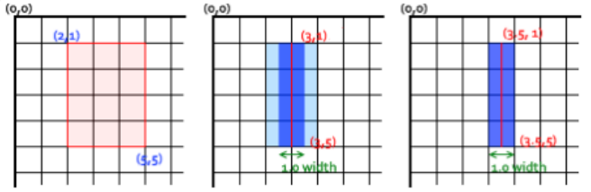

底层图形引擎： Skia、OpenGL

W3C提供： CSS3、Canvas、SVG、WebGL

- Canvas、SVG基于Skia、WebGL基于OpenGL

第三方可视化库：ZRender(轻量级2D)、Echarts、AntV、Highcharts、D3.js、Three.js、百度地图、高德地图等


## CSS3

 transform属性允许你旋转，缩放，倾斜或平移给定元素

用transform属性变换的元素会受transform-origin属性值的影响，该属性用于指定形变的原点

- 默认值为50% 50%，即该原点将会作为变换元素的中心点


3D透视 - perspective

定了观察者与 z=0 平面的距离，使具有三维位置变换的元素产生透视效果

透视的两种使用方式：

- 1.在父元素上定义 CSS 透视属性
- 2.如果它是子元素或单元素子元素，可以使用函数 perspective()


backface-visibility指定某个元素当背面朝向观察者时是否可见


### CSS3动画性能优化

**1.创建一个新的渲染层（减少回流）**

- 有明确的定位属性（relative、fixed、sticky、absolute）
- 透明度（opacity 小于 1）
- 有CSS transform属性（不为 none）
- 当前有对于 opacity、transform、fliter、backdrop-filter 应用动画
- backface-visibility 属性为 hidden
- ...

**2.创建合成层。合成层会开启GPU加速页面渲染，但不能滥用**

- 对opacity、transform、fliter、backdropfilter应用了animation或transition（需要是active的animation或者 transition）
- 有3D transform 函数：比如： translate3d、 translateZ、 scale3d 、 rotate3d ...
- will-change 设置为 opacity、transform、top、left、bottom、right，比如：will-change: opacity , transform;
  - 其中top、left等需要设置明确的定位属性，如relative等


## Canvas

 Canvas API 主要聚焦于 2D 图形。当然也可以使用\<canvas>元素对象的 WebGL API 来绘制 2D 和 3D 图形

优点：

- Canvas提供的功能更原始，适合像素处理，动态渲染和数据量大的绘制，如：图片编辑、热力图、炫光尾迹特效等。
- Canvas非常适合图像密集型的游戏开发，适合频繁重绘许多的对象。
- Canvas能够以 .png 或 .jpg 格式保存结果图像，适合对图片进行像素级的处理

缺点

- 在移动端可以能会因为Canvas数量多，而导致内存占用超出了手机的承受能力，导致浏览器崩溃。
- Canvas 绘图只能通过JavaScript脚本操作（all in js）。
- Canvas 是由一个个像素点构成的图形，放大会使图形变得颗粒状和像素化，导致模糊


 绘制步骤： save() ---- restore()

- 1.首先需要创建路径起始点（beginPath）
- 2.然后使用画图命令去画出路径( arc 、lineTo )
- 3.之后把路径闭合( closePath , 不是必须)
- 4.一旦路径生成，就能通过描边(stroke)或填充路径区域(fill)来渲染图形


### 线型

lineWidth

设置线条宽度的属性值必须为正数。默认值是 1.0px，不需单位。（ 零、负数、Infinity和NaN值将被忽略）

线宽是指给定路径的中心到两边的粗细。换句话说就是在路径的两边各绘制线宽的一半。

- 如果你想要绘制一条从 (3,1) 到 (3,5)，宽度是 1.0 的线条，你会得到像第二幅图一样的结果。
  - 路径的两边个各延伸半个像素填充并渲染出1像素的线条（深蓝色部分）
  - 两边剩下的半个像素又会以实际画笔颜色一半色调来填充（浅蓝部分）
  - 实际画出线条的区域为（浅蓝和深蓝的部分），填充色大于1像素了，这就是为何宽度为 1.0 的线经常并不准确的原因。
- 要解决这个问题，必须对路径精确的控制。1px的线条会在路径两边各延伸半像素，那么像第三幅图那样绘制从 (3.5 ,1) 到 (3.5, 

5) 的线条，其边缘正好落在像素边界，填充出来就是准确的宽为 1.0 的线条




### requestAnimationFrame

该方法需要传入一个回调函数作为参数，该回调函数会在浏览器下一次重绘之前执行

若想在浏览器下次重绘之前继续更新下一帧动画，那么在回调函数自身内必须再次调用 requestAnimationFrame()

通常每秒钟回调函数执行 60 次左右，也有可能会被降低


### 用例

#### 太阳系动画效果

```html
<!DOCTYPE html>
<html lang="en">

<head>
  <meta charset="UTF-8">
  <meta http-equiv="X-UA-Compatible" content="IE=edge">
  <meta name="viewport" content="width=device-width, initial-scale=1.0">
  <title>Document</title>
  <style>
    body {
      position: relative;
      margin: 0;
      padding: 0;
      background-image: url(./images/grid.png);
    }

    #tutorial2 {
      position: absolute;
      left: 0;
      top: 0;
      z-index: -1;
    }
  </style>
</head>

<body>
  <canvas id="tutorial" width="300" height="300">
    你的浏览器不兼容Canvas,请升级您的浏览器!
  </canvas>
  <canvas id="tutorial2" width="300" height="300">
    你的浏览器不兼容Canvas,请升级您的浏览器!
  </canvas>

  <script>
    window.onload = () => {
      const canvasEl = document.querySelector('#tutorial')
      const canvasEl2 = document.querySelector('#tutorial2')
      if (!canvasEl.getContext) return

      const ctx = canvasEl.getContext('2d') // 2d | webgl
      const ctx2 = canvasEl2.getContext('2d')

      const sun = new Image()
      const earth = new Image()
      const moon = new Image()
      sun.src = './images/canvas_sun.png'
      earth.src = './images/canvas_earth.png'
      moon.src = './images/canvas_moon.png'

      sun.onload = drawbgc
      requestAnimationFrame(draw)

      function draw () {
        ctx.clearRect(0, 0, 300, 300)
        ctx.save()
        drawEarth()
        ctx.restore()
        requestAnimationFrame(draw)
      }

      function drawbgc () {
        ctx2.save()
        ctx2.drawImage(sun, 0, 0) // 背景图
        ctx2.translate(150, 150)
        ctx2.strokeStyle = 'rgba(0, 153, 255, 0.4)'
        ctx2.beginPath() // 绘制轨道
        ctx2.arc(0, 0, 105, 0, Math.PI * 22)
        ctx2.stroke()
        ctx2.restore()
      }
      function drawEarth () {
        const time = new Date()
        const second = time.getSeconds()
        const milliseconds = time.getMilliseconds()
        ctx.save()
        ctx.translate(150, 150)
        // 地球旋转
        ctx.rotate(
          Math.PI * 2 / 60 * second +
          Math.PI * 2 / 60 / 1000 * milliseconds
        )
        ctx.translate(105, 0)
        ctx.drawImage(earth, -12, -12)

        drawMoon(second, milliseconds)
        ctx.restore()
      }
      function drawMoon (second, milliseconds) {
        ctx.save()
        // 月球旋转
        ctx.rotate(
          Math.PI * 2 / 10 * second +
          Math.PI * 2 / 10 / 1000 * milliseconds
        )
        ctx.translate(0, 28)
        ctx.drawImage(moon, -3.5, -3.5)
        ctx.restore()
      }
    }
  </script>
</body>

</html>
```


#### 时钟动画

```html
<!DOCTYPE html>
<html lang="en">
<head>
  <meta charset="UTF-8">
  <meta http-equiv="X-UA-Compatible" content="IE=edge">
  <meta name="viewport" content="width=device-width, initial-scale=1.0">
  <title>Document</title>
  <style>
    body {
      margin: 0;
      padding: 0;
      background-image: url(./images/grid.png);
    }
    .clock {
      position: relative;
      width: 300px;
      height: 300px;
      margin: 10px;
    }
    #tutorial2 {
      position: absolute;
      left: 0;
      top: 0;
      z-index: -1;
      background-color: #000;
      border-radius: 50px;
    }
  </style>
</head>

<body>

  <div class="clock">
    <canvas id="tutorial" width="300" height="300px">
      你的浏览器不兼容Canvas,请升级您的浏览器!
    </canvas>
    <canvas id="tutorial2" width="300" height="300px">
      你的浏览器不兼容Canvas,请升级您的浏览器!
    </canvas>
  </div>

  <script>
    window.onload = function () {
      const canvasEl = document.querySelector('#tutorial')
      const canvasEl2 = document.querySelector('#tutorial2')
      if (!canvasEl.getContext) return

      const ctx = canvasEl.getContext('2d')
      const ctx2 = canvasEl2.getContext('2d')

      drawbgc()
      requestAnimationFrame(draw)

      function draw () {
        ctx.clearRect(0, 0, 300, 300)
        ctx.save()

        // 5.绘制时针\分针\秒针
        const time = new Date()
        const hours = time.getHours()
        const minute = time.getMinutes()
        const second = time.getSeconds()
        ctx.save()
        ctx.translate(150, 150)
        ctx.rotate(
          Math.PI * 2 / 12 * hours +
          Math.PI * 2 / 12 / 60 * minute +
          Math.PI * 2 / 12 / 60 / 60 * second
        )
        ctx.lineWidth = 5
        ctx.lineCap = 'round'
        ctx.beginPath()
        ctx.moveTo(0, 0)
        ctx.lineTo(0, -50)
        ctx.stroke()
        ctx.restore()

        ctx.save()
        ctx.translate(150, 150)
        ctx.rotate(
          Math.PI * 2 / 60 * minute +
          Math.PI * 2 / 60 / 60 * second
        )
        ctx.lineWidth = 3
        ctx.lineCap = 'round'
        ctx.beginPath()
        ctx.moveTo(0, 0)
        ctx.lineTo(0, -70)
        ctx.stroke()
        ctx.restore()

        ctx.save()
        ctx.translate(150, 150)
        ctx.rotate(Math.PI * 2 / 60 * second)
        ctx.strokeStyle = 'red'
        ctx.lineWidth = 2
        ctx.lineCap = 'round'
        ctx.beginPath()
        ctx.moveTo(0, 0)
        ctx.lineTo(0, -80)
        ctx.stroke()
        ctx.restore()

        ctx.restore()
        requestAnimationFrame(draw)
      }
      function drawbgc () {
        // 1.绘制背景(白色圆)
        ctx2.save()
        ctx2.translate(150, 150)
        ctx2.fillStyle = 'white'
        ctx2.beginPath()
        ctx2.arc(0, 0, 130, 0, Math.PI * 2)
        ctx2.fill()
        ctx2.restore()

        // 2.绘制数字
        ctx2.save()
        ctx2.translate(150, 150)
        ctx2.font = "30px fangsong"
        ctx2.textBaseline = 'middle'
        ctx2.textAlign = 'center'
        const numbers = [3, 4, 5, 6, 7, 8, 9, 10, 11, 12, 1, 2]
        for (let i = 0; i < numbers.length; i++) {
          const x = Math.cos(Math.PI * 2 / 12 * i) * 100
          const y = Math.sin(Math.PI * 2 / 12 * i) * 100
          ctx2.fillText(numbers[i], x, y)
        }
        ctx2.restore()

        // 3.绘制时针/分针刻度
        ctx2.save()
        ctx2.translate(150, 150)
        for (let i = 0; i < 12; i++) {
          ctx2.rotate(Math.PI * 2 / 12)
          ctx2.lineWidth = 3
          ctx2.beginPath()
          ctx2.moveTo(0, -130)
          ctx2.lineTo(0, -122)
          ctx2.closePath()
          ctx2.stroke()
        }
        ctx2.restore()

        ctx2.save()
        ctx2.translate(150, 150)
        for (let i = 0; i < 60; i++) {
          ctx2.rotate(Math.PI * 2 / 60)
          ctx2.lineWidth = 1
          ctx2.beginPath()
          ctx2.moveTo(0, -130)
          ctx2.lineTo(0, -125)
          ctx2.closePath()
          ctx2.stroke()
        }
        ctx2.restore()

        // 4.绘制圆心
        ctx2.save()
        ctx2.translate(150, 150)
        ctx2.beginPath()
        ctx2.arc(0, 0, 8, 0, Math.PI * 2)
        ctx2.fill()
        ctx2.beginPath()
        ctx2.fillStyle = 'gray'
        ctx2.arc(0, 0, 5, 0, Math.PI * 2)
        ctx2.fill()
        ctx2.restore()
      }
    }
  </script>
</body>

</html>
```


## SVG


1.0版本

```html

```


2.0版本

```html

```


