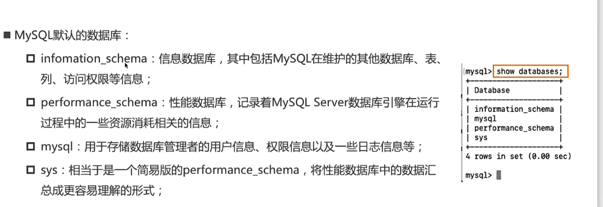

命令行登录数据库

mysql -u root -p

查看数据库

show databases;

SQL语句的分类

* DDL(Data Definition Language)：数据定义语言
  * 对数据库或表进行创建、删除、修改等操作
* DML(Data Manipulation Language)：数据操作语言
  * 对表进行添加、删除、修改等操作
* DQL(Data Query Language)：数据查询语言
  * 从数据库中查询记录
* DCL(Data Control Language)：数据控制语言
  * 对数据库、表格的权限进行相关访问控制操作

create table if not exists `users`(
	id INT PRIMARY KEY AUTO_INCREMENT,
    name VARCHAR(20) NOT NULL UNIQUE,
    password VARCHAR(50) NOT NULL,
    createAt TIMESTAMP DEFAULT CURRENT_TIMESTAMP,
    updataAt TIMESTAMP DEFAULT CURRENT_TIMESTAMP ON UPDATE CURRENT_TIMESTAMP
);

INSERT INTO users (name, password) VALUES (?, ?);

SELECT * FROM users WHERE name = ?;

CREATE TABLE IF NOT EXISTS `moment`(
	id INT PRIMARY KEY AUTO_INCREMENT,
	content VARCHAR(1000) NOT NULL,
	user_id INT NOT NULL,
  createAt TIMESTAMP DEFAULT CURRENT_TIMESTAMP,
  updataAt TIMESTAMP DEFAULT CURRENT_TIMESTAMP ON UPDATE CURRENT_TIMESTAMP,
	FOREIGN KEY(user_id) REFERENCES users(id)
)

INSERT INTO moment (content, user_id) VALUES (?, ?);

