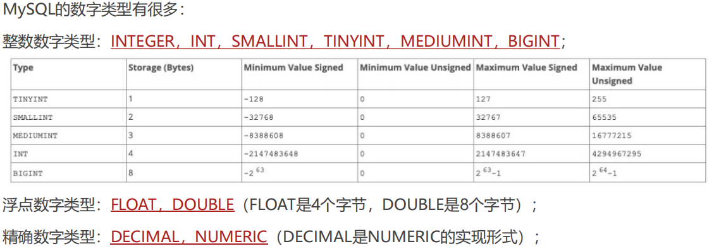
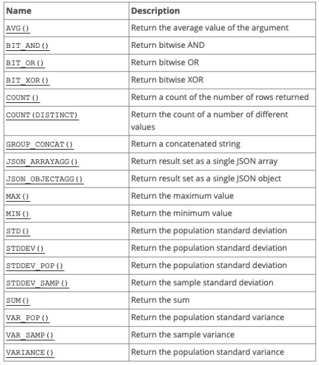
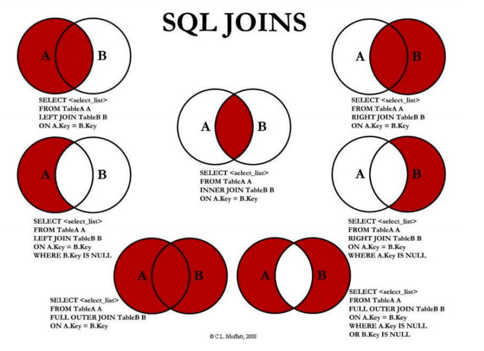

命令行登录数据库

mysql -uroot -pxxxxx

查看数据库

show databases;


## 数据库类型

**关系型数据库**：MySQL、Oracle、DB2、SQL Server、Postgre SQL等

- 关系型数据库通常会创建多个二维数据表；
- 数据表之间相互关联起来，形成一对一、一对多、多对多等关系
- 利用SQL语句在多张表中查询所需的数据

**非关系型数据库**：MongoDB、Redis、Memcached、HBse等

- Not only SQL，也简称为NoSQL
- 存储数据更加自由（甚至可以将一个复杂的json对象直接塞入到数据库中）
- NoSQL是基于Key-Value的对应关系，并且查询的过程中不需要经过SQL解析
  - 非关系型数据库不好细化操作，例如查询某个特定数据
  - 并且也会产生冗余数据，有关数据重复存储
- 非关系型数据库一般用于爬取数据


## 数据类型

https://dev.mysql.com/doc/refman/8.0/en/data-types.html

- 数字类型
  - 
- 日期类型
  - DATE类型用于具有日期部分但没有时间部分的值：
    - DATE以格式YYYY-MM-DD显示值 
    - 支持的范围是 '1000-01-01' 到 '9999-12-31'
  - DATETIME类型用于包含日期和时间部分的值：
    -  DATETIME以格式'YYYY-MM-DD hh:mm:ss'显示值
    - 支持的范围是1000-01-01 00:00:00到9999-12-31 23:59:59
  - TIMESTAMP数据类型被用于同时包含日期和时间部分的值：
    - TIMESTAMP以格式'YYYY-MM-DD hh:mm:ss'显示值
    - 但是它的范围是UTC的时间范围：'1970-01-01 00:00:01'到'2038-01-19 03:14:07
- 字符串类型
  - CHAR类型在创建表时为固定长度，长度可以是0到255之间的任何值
    - 在被查询时，会删除后面的空格
  - VARCHAR类型的值是可变长度的字符串，长度可以指定为0到65535之间的值
    - 在被查询时，不会删除后面的空格
  - BINARY和VARBINARY 类型用于存储二进制字符串，存储的是字节字符串
  - BLOB用于存储大的二进制类型；
  - TEXT用于存储大的字符串类型；

## 表约束

**PRIMARY KEY**

区分每一条记录的**唯一性**，必须有一个字段是永远**不会重复**，并且**不会为空**的，这个字段通常会将它设置为主键

- 主键是表中唯一的索引，并且必须是NOT NULL的，如果没有设置 NOT NULL，那么MySQL也会隐式的设置为NOT NULL
  - 主键也可以是多列索引，称之为联合主键

**FOREIGN KEY**

- RESTRICT（默认属性）：当更新或删除某个记录时，会检查该记录是否有关联的外键记录，有的话会报错的，不允许更新或删除
- NO ACTION：和RESTRICT是一致的，是在SQL标准中定义的
- CASCADE：当更新或删除某个记录时，会检查该记录是否有关联的外键记录
  - 更新：会更新对应的记录
  - 删除：关联的记录会被一起删除掉
- SET NULL：当更新或删除某个记录时，会检查该记录是否有关联的外键记录，有的话，将对应的值设置为NULL

```sql
-- 先删除某一列再重新添加并设置外键约束
SHOW CREATE TABLE `products`;
ALTER TABLE `products` DROP FOREIGN KEY products_ibfk_1;
ALTER TABLE `products` ADD FOREIGN KEY (brand_id) REFERENCES brand(id) 
	ON UPDATE CASCADE 
	ON DELETE CASCADE;
```


**UNIQUE**

某些字段在开发中希望是唯一的，不会重复的，比如手机号码、身份证号码等，这个字段可以使用UNIQUE来约束

- 使用UNIQUE约束的字段在表中必须是不同的
- UNIQUE 索引允许NULL包含的列具有多个值NULL

**NOT NULL**

**DEFAULT**

**AUTO_INCREMENT**


## 聚合函数




GROUP BY通常和聚合函数一起使用：表示先对数据进行分组，再对每一组数据，进行聚合函数的计算

**GROUP BY和HAVING**

- Group By查询到的结果添加一些约束，那么我们可以使用：HAVING

```sql
SELECT 
	brand, MAX(price) maxPrice, MIN(price) minPrice, ROUND(AVG(price),2) avgPrice, AVG(score) avgScore
FROM `products`
GROUP BY brand
HAVING avgScore > 7 AND avgPrice < 4000;
```


## SQL语句

Structed Query Language


SQL语句的分类

* DDL(Data Definition Language)：数据定义语言
  * 对数据库或表进行创建、删除、修改等操作
* DML(Data Manipulation Language)：数据操作语言（增删改）
  * 对表进行添加、删除、修改等操作
* **DQL**(Data Query Language)：数据查询语言
  * 从数据库中查询记录
* DCL(Data Control Language)：数据控制语言
  * 对数据库、表格的权限进行相关访问控制操作


### DDL

数据库

```sql
-- 1.查看当前所有的数据库
SHOW DATABASES;
-- 2.使用某一个数据库
USE text_db;
-- 3.查看目前正在使用的数据库
SELECT DATABASE();
-- 4.创建一个新的数据库
CREATE DATABASE IF NOT EXISTS test_db;
-- 5.删除某一个数据库
DROP DATABASE IF EXISTS test_db;
```

表

```sql
-- 1.查看当前数据库中有哪些表
SHOW TABLES;
-- 2.查看某一张表的表结构
DESC t_testtb;
-- 3.创建一张新的表
CREATE TABLE IF NOT EXISTS `users`(
	id INT PRIMARY KEY AUTO_INCREMENT,
	name VARCHAR(20) UNIQUE NOT NULL,
	level INT DEFAULT 0,
	telPhone VARCHAR(20) UNIQUE
);
-- 4.删除一张表
DROP TABLE IF EXISTS `users`;
-- 5.修改表结构
-- 5.1. 修改表名字
ALTER TABLE `users` RENAME TO `t_users`;
-- 5.2. 添加新的字段(field)
ALTER TABLE `t_users` ADD createTime TIMESTAMP;
ALTER TABLE `t_users` ADD updateTime TIMESTAMP;
-- 5.3. 修改字段的名称(field名称)
ALTER TABLE `t_users` CHANGE createTime createAt DATETIME;
-- 5.4. 删除某一个字段(field列)
ALTER TABLE `t_users` DROP createTime;
-- 5.5. 修改某一字段的类型(id int => bigint)
ALTER TABLE `t_users` MODIFY id BIGINT;
```


### DML

```sql
-- 1.新建商品表
CREATE TABLE IF NOT EXISTS `t_products`(
	id INT PRIMARY KEY AUTO_INCREMENT,
	title VARCHAR(20) UNIQUE NOT NULL,
	description VARCHAR(200) DEFAULT '',
	price DOUBLE DEFAULT 0,
	publishTime DATETIME
);
-- 2.DML语句: 插入数据
INSERT INTO `t_products` (title, description, price, publishTime) VALUES ('iPhone15', 'A芯片', 6888, '2023-09-10');
INSERT INTO `t_products` (title, description, price, publishTime) VALUES ('小米1', '好', 888, '2023-10-10');
INSERT INTO `t_products` (title, description, price, publishTime) VALUES ('华为P60', '麒麟芯片', 6666, '2023-06-06');

-- 3.DML语句: 删除数据
-- 3.1.删除表中所有的数据(慎重使用);
-- DELETE FROM `t_products`;
-- 3.2.根据条件, 比如id删除某一条
DELETE FROM `t_products` WHERE id = 4;

-- 4.DML语句: 修改数据
-- 4.1.修改表中的所有数据;
-- UPDATE `t_products` SET price = 8888;
-- 4.2. 根据条件修改某一条数据
-- UPDATE `t_products` SET price = 8888 WHERE id = 6;
UPDATE `t_products` SET price = 12998, title = '华为至尊版' WHERE id = 6;

-- 5.扩展: 
-- 当创建某一天数据时，使用当前时间记录
ALTER TABLE `t_products` ADD `createTime` TIMESTAMP DEFAULT CURRENT_TIMESTAMP;
-- 当修改某一条数据时, 使用最新的时间记录
ALTER TABLE `t_products` ADD `updateTime` TIMESTAMP DEFAULT CURRENT_TIMESTAMP ON UPDATE CURRENT_TIMESTAMP;
```


### DQL

```sql
SELECT select_expr [, select_expr]...
	[FROM table_references]
	[WHERE where_condition]
	[ORDER BY expr [ASC | DESC]]
	[LIMIT {[offset,] row_count | row_count OFFSET offset}]
	[GROUP BY expr]
	[HAVING where_condition]
```


```sql
CREATE TABLE IF NOT EXISTS `products` (
	id INT PRIMARY KEY AUTO_INCREMENT,
	brand VARCHAR(20),
	title VARCHAR(100) NOT NULL,
	price DOUBLE NOT NULL,
	score DECIMAL(2,1),
	voteCnt INT,
	url VARCHAR(100),
	pid INT
);
-- 1.基本查询
-- 查到字段之后, 给字段重命名(起一个别名, AS关键字可以省略)
SELECT id AS phoneId, brand phoneBrand, title, price FROM `products`;

-- 2.查询条件(逻辑运算符)
SELECT * FROM `products` WHERE brand = '华为' && price < 2000;
SELECT * FROM `products` WHERE brand = '华为' AND price < 2000;

SELECT * FROM `products` WHERE brand = '华为' || price > 5000;
SELECT * FROM `products` WHERE brand = '华为' OR price > 5000;

SELECT * FROM `products` WHERE price >= 1000 && price <= 2000;
SELECT * FROM `products` WHERE price BETWEEN 1000 AND 2000;

SELECT * FROM `products` WHERE brand = '小米' OR brand = '华为';
SELECT * FROM `products` WHERE brand IN ('小米', '华为');

-- 3.查询条件(模糊查询LIKE)
-- %表示匹配任意个的任意字符
-- _表示匹配一个任意字符；
-- 3.1.查询所有title以v开头的商品
SELECT * FROM `products` WHERE title LIKE 'v%';
-- 3.2.查询所有title带v的商品
SELECT * FROM `products` WHERE title LIKE '%v%';
-- 3.3.查询所有title带M, 并且M必须是第三个字符
SELECT * FROM `products` WHERE title LIKE '__M%'

-- 4.对结果进行排序(ORDER BY)
-- 4.1.按照评分的降序获取结果
SELECT * FROM `products` 
	WHERE price < 1000
	ORDER BY score DESC;
-- 4.2.按照评分的升序获取结果
SELECT * FROM `products` 
	WHERE price < 1000
	ORDER BY score ASC;

-- 5.对表进行分页查询
-- 5.1.默认不偏移(偏移0条数据)
SELECT * FROM `products` LIMIT 20;
-- 5.2.指定偏移多少条数据(size: 20, offset: 40)  -- 常用写法
SELECT * FROM `products` LIMIT 20 OFFSET 40;
-- 5.3.另外一种写法
SELECT * FROM `products` LIMIT 40, 20;
```


### DCL

```sql

```


## 多表

多对多一定产生一张新表





**左连接**

- 希望获取到的是左边所有的数据（以左表为主）

- ```sql
  SELECT * FROM `products` LEFT JOIN `brand` ON `products`.brand_id = `brand`.id;
  
  SELECT * FROM `products` LEFT JOIN `brand` ON `products`.brand_id = `brand`.id 
  	WHERE brand.id IS NULL;
  ```

- 

**右连接**

- 希望获取到的是右边所有的数据（以右表为主）

- ```sql
  SELECT * FROM `products` RIGHT JOIN `brand` ON `products`.brand_id = `brand`.id;
  
  SELECT * FROM `products` RIGHT JOIN `brand` ON `products`.brand_id = `brand`.id 
  	WHERE products.id IS NULL;
  ```

- 

**内连接**

- ```sql
  SELECT * FROM `products` INNER JOIN `brand` ON `products`.brand_id = `brand`.id;
  -- 发现它和下面写法是一样的效果
  SELECT * FROM `products`, `brand` WHERE `products`.brand_id = `brand`.id;
  ```

- 但是它们代表的含义并不相同：
  SQL语句一：内连接，代表的是在两张表连接时就会约束数据之间的关系，来决定之后查询的结果；

  SQL语句二：where条件，代表的是先计算出笛卡尔乘积，在笛卡尔乘积的数据基础之上进行where条件的帅选；

**全连接**

- SQL规范中全连接是使用FULL JOIN，但是MySQL中并没有对它的支持，需要使用 **UNION **来实现

- ```sql
  (SELECT * FROM `products` LEFT JOIN `brand` ON `products`.brand_id = `brand`.id)
  UNION
  (SELECT * FROM `products` RIGHT JOIN `brand` ON `products`.brand_id = `brand`.id);
  ```

- ```sql
  (SELECT * FROM `products` 
   LEFT JOIN `brand` 
   ON `products`.brand_id = `brand`.id 
   WHERE `brand`.id IS NULL)
  UNION
  (SELECT * FROM `products` 
   RIGHT JOIN `brand` 
   ON `products`.brand_id = `brand`.id 
   WHERE `products`.id IS NULL);
  ```

- 


练习

```sql
-- 1.多对多关系
-- 1.1. 创建学生表
CREATE TABLE IF NOT EXISTS `students`(
    id INT PRIMARY KEY AUTO_INCREMENT,
    name VARCHAR(20) NOT NULL,
    age INT
);
INSERT INTO `students` (name, age) VALUES('coder', 18);
INSERT INTO `students` (name, age) VALUES('tom', 22);
INSERT INTO `students` (name, age) VALUES('lilei', 25);
INSERT INTO `students` (name, age) VALUES('lucy', 16);
INSERT INTO `students` (name, age) VALUES('lily', 20);

-- 1.2. 创建课程表
CREATE TABLE IF NOT EXISTS `courses`(
    id INT PRIMARY KEY AUTO_INCREMENT,
    name VARCHAR(20) NOT NULL,
    price DOUBLE NOT NULL
);
INSERT INTO `courses` (name, price) VALUES ('英语', 100);
INSERT INTO `courses` (name, price) VALUES ('语文', 666);
INSERT INTO `courses` (name, price) VALUES ('数学', 888);
INSERT INTO `courses` (name, price) VALUES ('历史', 80);
INSERT INTO `courses` (name, price) VALUES ('物理', 100);

-- 1.3. 创建学生选择的课程关系表
CREATE TABLE IF NOT EXISTS `students_select_courses`(
	id INT PRIMARY KEY AUTO_INCREMENT,
	student_id INT NOT NULL,
	course_id INT NOT NULL,
	FOREIGN KEY (student_id) REFERENCES students(id) ON UPDATE CASCADE ON DELETE CASCADE,
	FOREIGN KEY (course_id) REFERENCES courses(id) ON UPDATE CASCADE ON DELETE CASCADE
);

-- 2.选择的过程
-- coder 选修了 英文和数学
INSERT INTO `students_select_courses` (student_id, course_id) VALUES (1, 1);
INSERT INTO `students_select_courses` (student_id, course_id) VALUES (1, 3);

-- lilei选修了 语文和数学和历史
INSERT INTO `students_select_courses` (student_id, course_id) VALUES (3, 2);
INSERT INTO `students_select_courses` (student_id, course_id) VALUES (3, 3);
INSERT INTO `students_select_courses` (student_id, course_id) VALUES (3, 4);
```


```sql
-- 3.查询数据
-- 3.1. 所有有选课学生的选课情况(内连接)
SELECT
	stu.name stuName, stu.age stuAge, cs.name csName, cs.price csPrice
FROM `students` stu
JOIN `students_select_courses` ssc ON stu.id = ssc.student_id
JOIN `courses` cs ON ssc.course_id = cs.id;

-- 3.2.所有的学生（不管有没有选课）的选课情况
SELECT
	stu.name stuName, stu.age stuAge, cs.name csName, cs.price csPrice
FROM `students` stu
LEFT JOIN `students_select_courses` ssc ON stu.id = ssc.student_id
LEFT JOIN `courses` cs ON ssc.course_id = cs.id;

-- 3.3.单个学生的选课情况(coder的选课情况)
SELECT
	stu.name stuName, stu.age stuAge, cs.name csName, cs.price csPrice
FROM `students` stu
LEFT JOIN `students_select_courses` ssc ON stu.id = ssc.student_id
LEFT JOIN `courses` cs ON ssc.course_id = cs.id
WHERE stu.name = 'coder';

-- 3.4.单个学生的选课情况(lily的选课情况)
SELECT
	stu.name stuName, stu.age stuAge, cs.name csName, cs.price csPrice
FROM `students` stu
LEFT JOIN `students_select_courses` ssc ON stu.id = ssc.student_id
LEFT JOIN `courses` cs ON ssc.course_id = cs.id
WHERE stu.name = 'lily';

-- 3.5.查看哪些学生没有选择课程
SELECT
	stu.name stuName, stu.age stuAge, cs.name csName, cs.price csPrice
FROM `students` stu
LEFT JOIN `students_select_courses` ssc ON stu.id = ssc.student_id
LEFT JOIN `courses` cs ON ssc.course_id = cs.id
WHERE cs.id IS NULL;

-- 3.6.查看哪些课程没有被选择
SELECT
	stu.name stuName, stu.age stuAge, cs.name csName, cs.price csPrice
FROM `students` stu
RIGHT JOIN `students_select_courses` ssc ON stu.id = ssc.student_id
RIGHT JOIN `courses` cs ON ssc.course_id = cs.id
WHERE stu.id IS NULL;
```

转成对象/数组

```sql
SELECT
	products.id id, products.title title, products.price price,
	JSON_OBJECT('id', brands.id, 'name', brands.name, 'website', brands.website) AS brand
FROM `products` LEFT JOIN `brands` ON products.brand_id = brands.id
WHERE price >5000;


SELECT
	stu.id id, stu.name name, stu.age age,
	JSON_ARRAYAGG(JSON_OBJECT('id',cs.id, 'name',cs.name, 'price',cs.price)) AS courses
FROM `students` stu
LEFT JOIN `students_select_courses` ssc ON stu.id = ssc.student_id
LEFT JOIN `courses` cs ON ssc.course_id = cs.id
WHERE cs.id IS NOT NULL
GROUP BY stu.id
```


