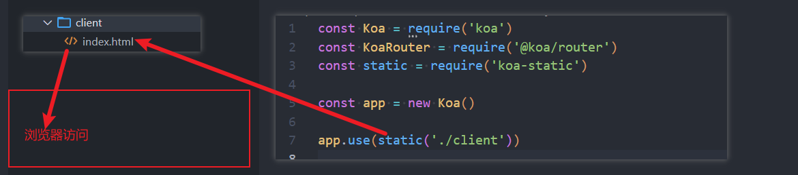

浏览器直接输入url请求数据并不会产生跨域

- 浏览器直接发起请求


## 同源策略

**同源策略**是一个重要的安全策略，它用于限制一个origin的文档或者它加载的脚本如何能与另一个源的资源进行交互。它能帮

助阻隔恶意文档，减少可能被攻击的媒介

- 如果两个 URL 的 protocol、port (en-US) (如果有指定的话) 和 host 都相同的话，则这两个 URL 是同源


- 早期的服务器端渲染的时候，是没有跨域的问题的
- 但是随着前后端的分离，目前前端开发的代码和服务器开发的API接口往往是分离的，甚至部署在不同的服务器上的
- 这个时候就会发现，访问**静态资源服务器**和**API接口服务器**很可能不是同一个服务器或者不是同一个端口。
- **浏览器**发现静态资源和API接口（XHR、Fetch）请求不是来自同一个地方时（同源策略），就产生了**跨域**


# 解决方案

## 方案一：静态资源和API服务器部署在同一个服务器中

koa-localhost:8000

index.html中的网络请求地址http://localhost:8000/xxx


浏览器通过localhost:8000打开index.html




## 方案二：CORS， 即是指跨域资源共享

Cross-Origin Resource Sharing跨域资源共享

- 一种基于http header的机制
- 该机制通过允许**服务器标识**除了它自己以外的其它源（域、协议和端口），使得**浏览器允许**这些 origin 访问加载自己的资源
  - 若未标识，浏览器自身会拦截其他origin的数据传递给请求响应


简单请求与非简单请求

同时满足以下条件的是简单请求，其他即为非简单请求

- 请求方法是以下是三种方法之一：HEAD/GET/POST
- HTTP 的头信息不超出以下几种字段：
  Accept
  Accept-Language
  Content-Language
  Last-Event-ID
  Content-Type：只限于三个值 application/x-www-form-urlencoded、multipart/form-data、text/plain


```js
const Koa = require('koa')

const app = new Koa()
app.use(async (ctx, next) => {
  // 1.允许简单请求开启CORS
  ctx.set("Access-Control-Allow-Origin", "*")
  // 2.非简单请求开启下面的设置
  ctx.set("Access-Control-Allow-Headers", "Accept, Accept-Encoding, Connection, Host, Origin, Referer, User-Agent, Accept-Language, Content-Length, Content-Type")
  ctx.set("Access-Control-Allow-Credentials", true) // cookie
  ctx.set("Access-Control-Allow-Methods", "PUT, POST, GET, DELETE, PATCH, OPTIONS")
  
  if (ctx.method === 'OPTIONS') {
    ctx.status = 204 // no content
  } else {
    await next()
  }
})
```


## 方案三：node代理服务器（webpack中就是它）--开发阶段

webpack-dev-server本质 => 开启服务器 (Node服务器) -----(changeOrigin: true)
proxy => http-proxy-middleware => Node服务器代理


```js
const express = require('express')
const { createProxyMiddleware } = require('http-proxy-middleware')

const app = express()

// 方案一：把页面部署到Node代理服务器
app.use(express.static('./client')) 

app.use('/api', createProxyMiddleware({
  target: "http://localhost:8000",
  pathRewrite: {
    '^/api': ''
  }
}))
// 请求http://localhost:8000/users/list

app.listen(9000, () => {
  console.log('express proxy服务器开启成功')
})
```


## 方案四：Nginx反向代理--部署阶段


nginx/conf/nginx.conf

```
server {
	listen			80;
	server_name	localhost;
	
	
	location / {
		#	root	 html;
		#	index  index.html index.htm;
		
		# 简单请求
		add_header Access-Control-Allow-Origin *;
		# 非简单请求
		# add_header xxxxx xxxx;
		# if ($request_method = "OPTIONS") {
		#		return 204;
		# }
		
		proxy_pass http://localhost:8000;
	}
	
	
}
```

访问80端口时候，自动代理到http://localhost:8000


- 请求默认访问的是80端口