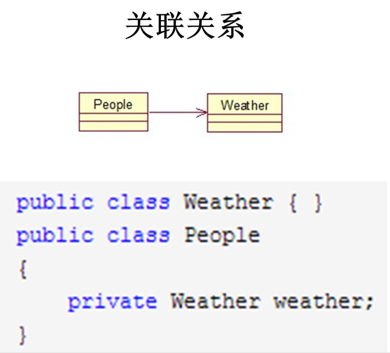
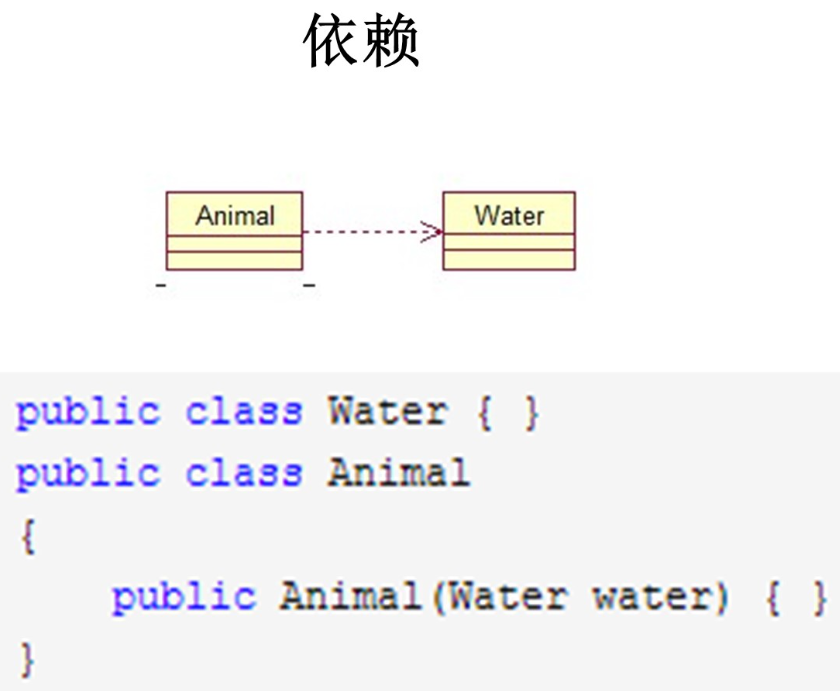
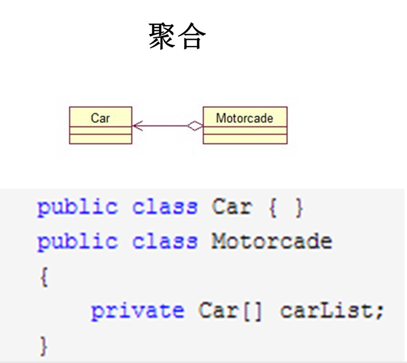
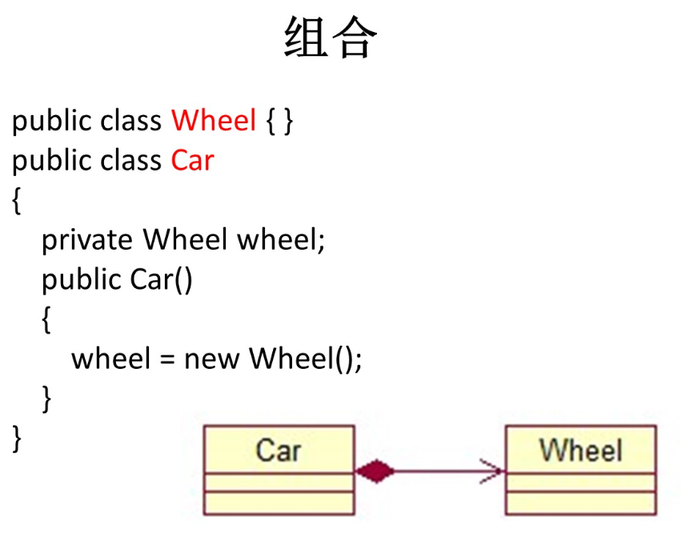
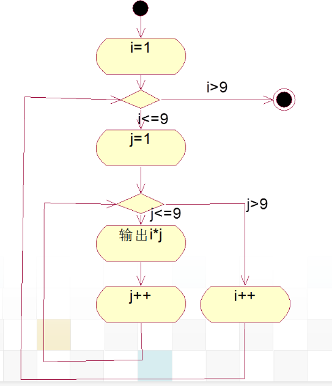

### 视图和图的关系

* 图包括了用来显示各种图形元素符号的实际图形，这些元素经过特定的排列组合阐明系统某个特定部分
  * 一个系统模型可以有多个不同类型的图。图是特定视图的一部分，某些图可以是多个不同视图组成部分
* 视图是对系统模型在某方面的投影，注重于系统的某个方面

### 扩展VS包含

<<extend>>扩展

- 箭头方向由扩展用例指向基本用例
  - 网上购物(基本用例)<-----<<extend>>----请求产品目录(扩展用例)
- 执行基本用例时，扩展用例可执行也可不执行
- 扩展用例只是部分片段组成，不是完整的独立用例，无法单独执行

<<include>>包含

- 箭头方向由基本用例指向被包含用例   
  - 取消订单(基本用例)-----<<include>>---->查询订单(被包含用例)
- 执行基本用例时，每次都必须调用被包含用例
- 被包含用例可以单独执行

### 各种视图以及它们间的关系

每个视图关心系统一个侧面，五个视图结合在一起反映系统的软件体系结构的全部内容

逻辑视图：描述用例视图中系统的功能需求。既描述系统静态结构也描述系统内部的动态协作关系--设计人员

实现视图：展示代码的组织和执行，描述系统模块间的关系--开发人员

进程视图：侧重系统运行特性，关注非功能性的需求--系统集成人员

部署视图：主要描述硬件配置，将软件部署到硬件上--系统工程师

用例视图：描述系统应具备的功能，从系统外部看到的的系统功能--用户

### 用例的组成（合不合理）

### 关系对应的代码形式

(关联、依赖、聚合、组合)

### 扩展机制

### 类图+**双向工程**

（代码与类图的转换）

### 代码->活动图

（双重for）

### 聚合与组合

聚合是一种特殊形式的关联。聚合表示类之间的整体与部分的关系。在需求描述中的“包含”、“组成”、“分为.....部分”等词汇都意味着存在聚合关系。组合关系的表示:用空心菱形+实线。
组合是一种特殊形式的聚合，组合关系中的整体与部分具有同样的生存周期。组合关系的表示:用实心菱形+实线。

聚合也称为“has-a”关系，组合也称为“contains-a”关系
聚合表示较弱的整体/部分关系，组合表示较强的整体/部分关系
聚合关系中，代表部分事物的对象可以属于多个聚合对象，具有共享性，而组合关系中，代表部分事物的对象不可以属于多个聚合对象，不具有共享性。
聚合关系中，部分可离开整体而单独存在、在组合关系中，部分和整体是相同的生命周期

### 交互图分为顺序图+通信图（协作图）。联系和区别

联系：二者均直观地规定了发送对象和接收对象的**责任**。二者均**支持所有的消息类型**。二者均是衡量耦合性的**工具**

区别

* 顺序图是按照时间顺序来描述对象的交互、通信图是围绕着对象和对象之间的链接来描述对象的交互
* 顺序图强调了消息发生的时间顺序，而通信图强调对象的组织结构，强调上下文相关。
* 顺序图中对象之间的链接是隐含的，通信图中对象之间的链接是显式的。
* 顺序图可以反映对象的创建/激活/撤消; 通信图不能。
* 通信图能反映动作路径, 消息必须有顺序号，时间顺序必须从顺序号获得;顺序图则没有。
* 两种图的语义是等价的，可以从一种形式的图转换成另一种形式的图，而不丢失任何信息。

### 状态，状态机的区别

状态：状态定义对象在其生命周期中的条件或状况。是指在对象生命周期中满足某些条件、执行某些活动或等待某些事件的一个条件和状况。

状态机：状态机用来表示一个对象在它的生命周期中响应事件所发生的状态变化以及对事件的响应，展示了状态与状态的转换。

状态机图：状态机图描述一个状态机，强调了从状态到状态的控制流。这种图的节点是状态(包括初始状态和终止状态)，关系是转换。状态机图常用来描述业务或软件系统中的对象在外部事件的作用下，对象的状态从一个状态到另一个状态的控制流。利用状态图可以精确地描述对象在生命周期内的行为特征。

### 组件（构件）图，部署图的联系区别

- 构件图描述了系统中软件构件以及它们的依赖关系、部署图描述了系统硬件组件之间的物理架构。
- 构件图从软件架构的角度来描述一个系统的主要功能。部署图从节点的角度去描述系统，用来显示系统中计算结点的拓朴结构和通信路径与结点上运行的软构件等。
- 构件图包含3种元素：构件、接口和依赖关系。部署图的组成元素包括节点、节点间的连接。
- 构件图显示**软件构件的组织以及构件之间的依赖关系**。部署图显示了系统的硬件，安装在硬件上的软件，以及用于连接异构机器之间的中间件。
- 构件图提供当前模型的**物理视图**。一个构件图可以表示一个系统全部或者部分的构件体系。部署图描述系统中的硬件节点及节点之间如何连接的图。一个系统只有一个部署图。
- 构件图中的构件可以在部署图的节点上进行部署。

### 组件、类的联系区别

联系

* 二者都有名称，都可以实现一组接口，拥有依赖、泛化和关联关系。它们都可以拥有实例，能被嵌套且可以参与交互。

区别

* 类表示对实体的抽象，而组件是对存在于计算机中物理部件的抽象。类不能部署而**组件可以部署**
* 类属于逻辑模块，而组件属于软件模块。两者是不同的抽象级别。甚至能将**组件当作一组类通过协作完成的**
* 类可以拥有操作和属性，而**组件仅有通过接口访问的操作**

