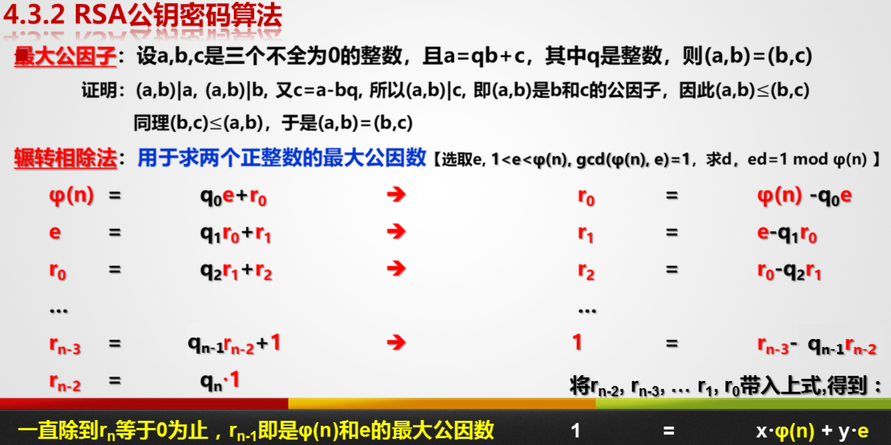

单选2X10、填空1X15、简答5X6(掌握的章节)、计算和设计(作业)

### 第三章

信息安全基本理念与原理

==**掌握**信息安全的基本概念和基本服务==

**数据定义**：数据是用来反映客观世界而记录下来的可以鉴别的物理符号，具有客观性和可鉴别性

**信息定义**：信息是有一定含义的数据，是加工处理后的数据，是对决策者有用的数据(香农--信息是用来消除随机不确定性的东西(熵表示信息量))

数据处理：数据->信息

2014年2月27日，中共网络安全和信息化领导小组成立

信息安全：为数据处理系统而采取的技术和管理的安全保护，保护计算机硬件、软件、数据不因偶然的或恶意的原因而遭到破坏、更改、显露

* 目标就是保证计算机系统正常运行。三要素CIA(Confidentiality 机密性、Integrity 完整性、Availability 可用性)

* **保密性**：确保信息在存储、使用、传输过程中不会泄露给非授权用户或实体
* **完整性**：确保信息在存储、使用、传输过程中不会被非授权用户篡改，同时还要防止授权用户对系统及信息进行不恰当篡改，保持信息内外表示的一致性(可分为数据完整性、身份可认证性)
* **可用性**：确保授权用户或实体对信息及资源的正常使用不会被异常拒绝，允许其可靠而及时访问信息资源
* 数据的真实性、不可抵赖性、强机密性、身份的匿名性、不可链接性

发展的大体方面

* 密码学：研究编制密码和破译密码的技术科学
* 物理安全：保证计算机信息系统保密性、完整性和可用性的基础。
  * 通过设备访问控制、边界保护、设备及网络资源管理等措施确保信息系统等保密性和完整性
  * 通过容错、故障恢复及系统灾难备份等措施保证信息系统的可用性
* 操作系统安全：计算机系统中自主访问控制、身份鉴别、数据完整性等11各方面满足相应安全技术要求
* 网络安全：网络系统的硬件、软件及其系统中的数据受到保护，不遭受破坏、更改和泄露，系统能连续可靠的运行
* 软件安全：数据库软件安全、Web应用软件安全、恶意软件安全防护
* 数据安全
  * 防止数据丢失，采取现代信息存储手段对数据进行主动防护----磁盘阵列、数据备份和恢复
  * 防止数据泄露，采用现代密码算法对数据进行主动防护----数据加密，数据完整性检查、双向强身份认证

==了解信息安全面临的主要威胁==

威胁类型：人为失误、信息截取、内部窃密和破坏、黑客攻击、技术缺陷、病毒

表现特征：窃听、重传、伪造、篡改、拒绝服务攻击、行为否认、非授权访问、传播病毒

社会工程学攻击方式：假托、调虎离山、钓鱼、下饵、等价交换、尾随

==了解信息安全体系结构，掌握相关概念和模型==

PDRR模型(保护 Protect、检查 Detect、反应 React、恢复 Restore)

安全服务五大类：鉴别服务、访问控制、数据完整性、数据保密性、抗抵赖性

安全机制：数据加密、数据签名、访问控制、数据完整性、鉴别交换、业务填充、路由控制、公证机制

### 第四章密码学

==了解密码学发展历史，掌握密码体制模型及概念、原则、分类、安全性分类及典型攻击==

起源于保密通信技术。

* 古典密码时期----手工阶段
  * 替代密码(棋盘密码、凯撒密码)。==作业==
  * 置换密码(栅栏密码)：只改变明文结构，不改变明文内容
* 近代密码时期(机械密码、二战密码战、恩尼格玛密码机)
  * Enigma轮转密码机：3-5道转子。5-10对字母中进入转子钱就会转变为另一个字母的信号，可能数：C^2^~26~C^2^~24~C^2^~22~C^2^~20~C^2^~18~/A^5^~5~
* 现代密码时期(“一次一密”密码、对称密码、非对称密码、哈希函数、密钥管理)
  * 1949年《保密系统的通信理论》标志着密码学作为一门科学的形成
  * 1976年Diffie和Hellman提出公钥密码体制思想。DES-1977、RSA-1978

密码体制的组成：明文空间M、密文空间C、密钥空间K(k~e~、k~d~)、加密算法E、解密算法D

* 对称密码体制：加密密钥k~e~和解密密钥k~d~相同、或者由其中一个很容易推算出另一个密钥(分组密码、序列密码)
  * 其局限性：密钥分配问题(安全信道的实现)、密钥管理问题、难以实现不可否认功能
* 非对称密码体制：如果在计算上有加密密钥k~e~不能推出解密密钥k~d~，因此可以将k~e~公开

密码体制设计原则

密码学的基本目的：**保障不安全信道上的通信安全**

* 保证数字信息机密性最有效方法----使用**密码算法进行加密**(对称、非对称)
* 保证消息完整性的有效方法是用**Hash函数**计算信息“指纹”
* 保证消息认证性的有效方法是密钥和Hash函数结合(即**MAC**)确定信息来源
* 保证消息认证信和不可抵赖性的有效方法是进行**数字签名**
* 利用密码机制和**密钥管理技术**可以有效控制信息

衡量密码体制安全性三种方法

* 计算安全性：指一种密码系统最有效的攻击算法至少是指数时间的，又称实际保密性
* 可证明安全性：如果密码体制的安全性可以归结为某个数学困难问题，则称其是可证明安全的(RSA->大整数分解难题、Elgamal->有限域上离散对数求解难题)
* 无条件安全性(完善保密性)：假设存在一个具有无限攻击能力的攻击者，密码体制无法被这样的攻击者攻破(”一次一密“密码)

设计应该遵守以下原则

* 密码算法强度高
* 密码体制的安全性不应依赖于加密算法的保密性，而应取决于可随时改变的密钥(柯克霍夫原则)
* 密钥空间足够大
* 易于实现又便于使用

密码体制常见的攻击形式：穷举攻击、统计分析攻击、数学分析攻击

攻击和解密的相似之处：设法将密文还原成明文

常见的密码分析攻击

* 唯密文攻击：只知道密文c
* 已知明文攻击：直到部分明文m-密文c对
* 选择明文攻击：知道任意明文m-密文c对(通过E加密)
* 选择密文攻击：知道任意密文c-明文m对(通过D解密)

==掌握分组密码设计的一般原理；了解DES算法(重点)==

内容：将明文消息编码后的序列**划分**成固定大小的组，每组明文**分别在密钥的控制下**变长等长密文序列

* 扩散：让密文中的每一位受明文和密钥中许多位的影响(置换需要多轮迭代并结合替换才能产生扩散效果)
* 混淆：将密文与明文、密钥之间的统计关系变得尽可能复杂。使用复杂的非线性替代变化
* 乘积密码：扩散和混淆两种基本密码操作的组合变换

==掌握序列密码的基本原理；线性反馈寄存器；非线性序列的生成方法(重点)==

序列密码处理的明文长度为1比特。若把分组密码增加少量的记忆模块及形成了一种序列密码

原理：序列密码是将明文划分成字符(如单个字母)，或其编码的基本单元(如0，1数字)；字符分别与密钥序列作用进行加密，解密时以同步产生的同样的密钥序列实现。----加密不同文件/消息时，永远不要重复使用密钥序列

序列密码的安全强度主要依赖于**密钥序列的随机性**；序列密码体制的**关键**：好的密钥序列生产器**产生随机的密钥序列**

密钥序列产生器的内部可分为两部分---- 驱动子部分(常用一个或多个LFSR实现)--非线性组合子部分(非线性组合函数F实现)

* **驱动部分LFSR**：产生控制生成器的状态序列，并控制生成器的周期和统计特性；

  * 反馈移位寄存器FSR由n位寄存器和反馈函数F(不一定是线性函数)组成

    线性反馈移位寄存器LFSR	==作业==

    * 一类特殊的FSR，其反馈函数是**线性函数**
    * 实现简单、速度快、有较成熟理论-----密码流生成器最重要部件之一
    * 一个n阶的LFSR的输出周期为2^n^-1 的 **充要条件**是其特征多相似p（x）是本原多项式

* **非线性组合部分F**：对驱动部分的各个输出序列进行非线性组合，控制和提高产生器输出序列的统计特性、线性复杂度和不可预测下

  * Geffe发生器：两个LFSR作为复合器的输入，第三个LFSR控制复合器的输出。
    * **b= (a~1~∧a~2~)⊕(a~1~∧a~3~) = (a~1~∧a~2~)⊕(a~1~∧a~3~)⊕a~3~**
    * 发生器周期是三个LFSR周期的最小公倍数，能实现序列周期的极大化

密钥序列生成器的基本要求：

* 种子密钥K的**长度足够大**，128位以上
* 密钥序列生成器生成的密钥序列{k~i~}**具有极大周期**
* 密钥序列{k~i~}具有**均匀的n元分布**
* 密钥序列{k~i~}提取出相关种子密钥K的信息在**计算上不可行**
* 种子密钥K任一位改变都要引起密钥序列{k~i~}
* **终极目的**：密钥序列{k~i~}不可预测，根据密文及对应明文的部分信息不能确定整个密钥序列

==掌握哈希函数的概念，结构及应用，了解典型的哈希算法，掌握消息验证码概念，了解基于DES和Hash的消息认证吗(重点)==

Hash函数：将任意长度的输入经过变换后得到**固定长度的输出**---输出也称为消息摘要、数据指纹

* 可以看作是一种**单向密码**体制。明文-->密文的不可逆映射
* 消息摘要Hash能够用于完成消息的认证功能、消息认证MAC是保证信息完整性的重要措施
  * 在消息认证MAC和数字签名SIG等领域应用广泛
* h=H(M)具有4个重要特性：
  * H可以用于任意长度的消息M
  * H产生的哈希值h是固定长度的
  * 对于任意给定的消息M，容易计算H(M)的值
  * 单向性(抗原像性)：对于给定的h，找到M值计算上是不可行的
  * 抗弱碰撞性(抗第二原像性)：对于给定的消息M~1~，要发现另一个消息M~2~，满足H~1~=H~2~是不可行的
  * 抗强碰撞性：找任意一对不同的消息M~1~、M~2~使得H~1~=H~2~在计算上不可行

Hash函数的设计主要分两类：

* 基于加密体制实现的，如使用对称分组密码算法的CBC模式产生Hash值
* 直接构造复杂的非线性关系实现单向性

消息认证的主要目的：验证信息来源的真实性和验证消息的完整性

**消息认证码**(Message Authentication Codes)：它利用消息和双方共享的密钥k通过认证函数生成一个固定长度的短数据块，并将该数据块附在消息后

* MAC与Hash函数类似，都具有单向性
* 它还包括一个双方共享的密钥。不同的密钥会产生不同的Hash函数，这样就能验证消息没有经过篡改的同时验证发送者的身份
* 生成消息认证码的主要方法包括 基于加密函数的认证码和基于Hash的认证码

MAC算法的消息在发送过程中是明文形式，只提供认证性，为提供保密性可在生成MAC后进行一次加密，而且加密密钥需被收发双方共享

* 与加密算法类似，但是MAC不必是可逆的

==掌握公开密钥密码系统的特点及原理，掌握RSA公钥密码算法，了解数字签名的特点和原理(重点)==

RSA既能用于加密，又能用于数字签名；其基础是数论的**欧拉定理**，它的**安全性依赖**于大整数的因子分解的困难性

* 欧拉函数y(n)：小于等于n的正整数种，与n互质的数的个数

* 欧拉定理：若a、n互质，则a^y(n)^=1(mod n)

* ==作业==、结合辗转相除法

  

数字签名：主要用于对消息数字进行签名，防止消息的冒名伪造或篡改，也可用于通信双方的身份鉴别

- 特点：身份认证、数据完整性、不可否认性、匿名性

基于两条基本假设：私钥是安全的、产生数字签名唯一途径是使用私钥

==理解并掌握密码管理的层次结构，掌握密钥建立、协商的方法，了解PKI技术(重点)==

**密钥的保密性**是决定整个密码体制安全性的因素，密钥的管理技术直接决定了密码的应用水平

会话密钥建立方法----按照是否需要第三方可信机构划分

* 无中心的密钥建立：用户直接将密钥传送给对方。实现前提是存在一种可交换的对称密码算法EA(EB(m))=EB(EA(m))
* 基于可信第三方的密钥建立:如果用户和可信第三方建立了一个共享密钥，那可以在第三方帮助下，在任意两个互不认识的用户间建立一个共享密钥

公钥密码技术与对称密钥技术最大区别就是通信双方不需要事先通过共享的安全信道协商密钥

公钥基础设施PKI(Public Key Infrastructure)：认证中心CA、注册机构RA、证书数据库、密钥管理系统、证书撤销管理系统、PKI应用接口系统、最终用户

### 第五章

==了解操作系统安全发展历史==

1972年J.P.Anderson提出参照监视器(Reference Monitor，**RM**-可视作TCB软件部分)和**安全内核**思想

- RM负责对系统资源的访问控制，以安全内核的形式实现：**以主体所获得的引用权限**为基准，验证运行中得程序的所有引用
- RM包含：引用监视器接口、授权模块、安全策略

20世纪80年代，美国国防部公布了历史上第一个**计算机安全评价准则TCSEC**，提出**可信计算基TCB**的概念

- TCB是计算机系统内保护装置的总体，包括：硬件、固件、软件和负责执行安全策略的组合体
  - 主板上插一个硬件模块-可信密码模块TCM，由TCM提供基础的密码和可信服务----TCB的硬件组成部分

==掌握操作系统安全的安全策略和模型(重点)==

安全策略：有关管理、保护和发布敏感信息的**法律、规定和实施细则**

- 进行安全操作系统的设计和开发时，也要**围绕**一个给定的安全策略进行
- 安全策略由一整套严密的规则组成，这些确定授权访问的规则是决定访问控制的基础

军事安全策略：公开、受限制、秘密、机密、绝密

商业安全策略：公共的、专有的、内部的

中国墙安全策略：一个用户至多访问同一冲突类中某一个公司的信息

- 三个抽象等级：用户、公司群体、冲突类
- 注重机密性和完整性

安全模型：对安全策略所表达的安全需求的简单、抽象和无歧义的**描述**，为安全策略和其实现提供了一种框架

安全模型的特点

- 精确的、无歧义的
- 简易和抽象的，容易理解
- 一般性的：只涉及安全性质，不过度牵扯其他功能
- 它是安全策略的明显表现

安全模型分类

- **形式化的安全模型**：设计开发高级别安全系统的**前提**
- 非形式化的安全模型：修改一个现有操作系统以改进性能，**只能达到中等**安全级别

BLP机密性安全模型 Bell-Lapadula

- 适用于军事策略的安全模型：**主体**--能够发起行为的实体、**客体**--被动的主体行为承担者

- 是一个状态机模型

- 保障信息机密性策略：低级别的主体**可以写**高级别客体的信息(不保障信息完整性)

  低级别的主体**不能读**高级别客体的信息(保密)

- BLP模型目标：详细说明计算机多级操作规则。

  - 简单安全特性规则：主体只能向下读客体
  - 特性规则：主体只能向上写客体

Biba完整性安全模型

- 第一个完整性安全模型。也是基于主体、客体以及它们的级别

- 与BLP模型完全相反的模型

- 不足：完整标签确定的困难性、有效保护数据一致性方面不充分、仅在VAX，Multics少数系统中实现

- 保障信息完整性策略：低级别的主体**可以读**高级别客体的信息(不保密)

  低级别的主体**不能写**高级别客体的信息(保障信息完整性)

RBAC安全模型

- 提供一种强制访问控制机制
- 通过相应角色赋予不同用户相应权限

==掌握操作系统的访问控制机制(重点)==

自主访问控制DAC：最常用的一类访问控制机制，由客体所有者**决定**一个用户是否有权访问一些特定客体的**一种访问约束机制**

- 基于矩阵的行或列表达访问控制信息
- 基于行的自主访问控制机制：在每个主体上附加一个该主体可访问的客体明细表
- 基于列的自主访问控制机制：在每个客体上附加一个该客体可访问的主体明细表
  - **访问控制表必须简化**
  - owner的三位反映此客体的拥有者对它的访问权限
  - group的三位反映owner同组用户对此客体的访问权限
  - other的三位反映其他用户对此客体的访问权限
  - 缺点：客体的拥有者不能精确控制某个用户对其客体的访问权限

强制访问控制MAC：系统中每个进程、文件、IPC客体都**被赋予**相应安全属性，这些属性是**不能改变**的，由管理部门或操作系统**自动**地按照严格规则设置。

- 适用于政府部门、军事和金融等领域
- **安全级**由两方面内容构成：保密级别、范畴集(实际上常常是空的)
- 能**防止特洛伊木马**
- 多级安全规则与BLP模型

MAC与DAC**重要区别**：不能像访问控制表那样由客体所有者修改安全属性(不灵活)

基于角色的访问控制：访问许可权**分配**给角色，用户通过**不同角色**获得访问许可权

- 角色访问主体和受控对象之间的一座桥梁、由**系统管理员**定义
- 面向企业安全策略的一种有效访问控制方式
- 与DCA的区别：用户与客体无直接联系。用户不能自主将访问权限给别的用户
- 与MAC的区别：MAC是基于多级安全需求的，RBAC是基于角色的

==了解操作系统的测评方法与准则==

操作系统漏洞：I/O处理、访问策略的二义性、不完全检查、通用性

测评方法

- 形式化验证：最精确、工作量大。全覆盖
  - 可以验证机密性、完整性、可用性
- 非形式化确认：安全需求检查、设计及代码检查、模块及系统测试
- 入侵测试

1983年TCSEC(Trusted Computer System Evaluation Criteria)：四类7个安全级别- A(验证设计保护类)、B(强制保护类)、C(自主保护类)、D

CC标准是目前最全面的信息技术安全评估标准

### 第六章

物理访问控制-防人防物

生物识别技术-鉴别人

- 错误拒绝率FRR--与相似度门限阈值呈正相关
- 错误接受率FAR--与相似度门限阈值呈负相关
- 交叉错误率(CER) FRR=FAR：**衡量设备准确率的主要指标**

涉及国家机密的计算机信息系统**必须实行物理隔离**--内部网不直接或间接地连接公共网

### 第七章网络安全

==了解网络所面临的安全威胁==

网络安全威胁分类:人为的无意失误、人为的恶意攻击、系统漏洞

网络本身的威胁:

- 协议的缺陷
- 网站漏洞
- 拒绝服务(破坏网络服务可用性)
  - Smurf攻击、大量虚假请求、SYN洪水攻击
- 分布式拒绝服务(破坏网络服务可用性)
- 来自活动或移动代码的威胁

网络中信息的威胁:偷听、窃取、假冒、欺骗、机密性(误传、暴露)、完整性

==了解防止网络攻击的控制措施==

- 数据加密
- 虚拟专有网VPN

==掌握防火墙体系结构、类型、能力和限制,掌握防火墙基本工作原理(重点)==

==了解入侵监测系统的功能和类型==

==掌握VPN的类型和协议(重点)==

==了解移动通信网络安全和无线局域网安全==

