40简答 20论述 20计算 20客观

数据的采集与存储

* 多媒体技术概论
* 多媒体硬件环境

数据的处理与压缩

* 数字声音与语音编码
* 数据压缩理论
* 计算机图像、视频编码方法

数据的传输

* 多媒体通信与网络
* 超文本和web系统

综合应用实例

* 智能视频监控、基于内容的检索、多模态数据分析

### 一

文件格式

* 音频

  * WAV 波形文件/原理简单，文件大，多用于存储简短的声音片段。由文件头和文件数据块组成

  * MIDI(Music Instrument Digital Interface) 存储的不是声音信号，是音符，控制参数等指令

  * MP3 压缩音频文件，压缩率高达10:1,12:1

* 图像

  * BMP(bitmap,不压缩，图像文件大) Windows and OS/s Bitmaps
  * JPG
  * PCD (Kodak PhotoCD)
  * PSD (PhotoShop Document)
  * TIF(Tag Image File format) 格式复杂，**占用存储空间大**，大小是JPEG图像的10倍。(论文)
  * PNG(Portable Network Graphics)  支持使用24位彩色、采用无损压缩算法
  * JPEG 16:1非常好 48:1较好

* 图形：用**参数**描述各种图源位置，形状等。描述对象可任意缩放不会**失真**

  * Quartus、Visio

  * 3DMAX：商标设计、标识制作、模型绘制

  * Auto CAD：三维动画渲染和制作软件

* 动画

  * GIF：将多幅**图像**保存为一个文件。最多支持256色(图像深度8)
  * 交错显示(下载时，以较粗分辨率显示)
  * Flash：矢量动画，利用图形的抽象运动特征记录变化画面

* 视频

  * MPEG

  * AVI

  * MOV (Apple)

  * DAT (VCD MPEG-1)

图像和图形的区别，适用场合 GIF

* 图像是位图(Bitmap),它所包含的信息是用像素来度量的。像素是组成一幅图像的最小单元。对图像的描述与分辨率和色彩的颜色种数有关，分辨率与色彩位数越高，占用存储空间就越大，图像越清晰。图像是可以直接通过照相、扫描、摄像得到，也可以通过绘制得到。
  * 位图：由图中每个像素的数据组成（颜色、亮度、属性）

* 图形是矢量图(Vector Drawn)，它是根据几何特性来绘制的。图形任意放大或者缩小后，清晰依旧。图形是人们根据客观事物制作生成的，它不是客观存在的。
  * 矢量图：每个矢量是一个图形实体，具有颜色、形状、轮廓、大小、位置等属性。矢量属性可以调整

* 适用场合
  * 图像：**表现含有大量细节**(如**明暗变化、场景复杂、轮廓色彩丰富**)的对象，如：照片、绘图等
  * 图形：几何图形、工程图纸、CAD、3D造型软件等

媒体的类型

* 感觉媒体：直接作用于人的感官
* `表示媒体`：各种编码(中间手段)，为了加工、处理和传输感觉媒体而**人为构造出来的**
* 显示媒体：感觉媒体与用于传输的电信号之间转换的类媒体，即感觉媒体与计算机的界面
* 存储媒体：保存表示媒体的**介质**
* 传输媒体：将媒体传送到另一处的**物理载体**

多媒体的特点 多维化，网络化....**交互性**

利用**计算机技术**对多种信息进行综合处理、建立**逻辑关系，集成**为一个具有**交互性**的系统

* 多维化：媒体信息的多样化
* 集成性：媒体种类一体化
  * 将各种不同的媒体信息有机地进行**同步组合**
  * 把不同媒体设备集成在一起，形成**多媒体系统**
* 交互性：多媒体技术的**最关键特征**
* 数字化：媒体以数字形式存在
* 实时性

### 二

多媒体数据的获取（模拟数据-> 数字）保证信息不损伤

奈奎斯特采样定理 熟悉+理解思路内容    时域->频域

要想抽样后能够不失真地还原出原信号，则抽样频率必须大于两倍信号谱的最高频率

* 常用音频采样频率8kHz, 11.025kHz(AM), 22.05kHz(FM), 44.1kHz(CD), 48kHz(DVD)

A/D转换器的输出为12位二进制数，最大输入模拟信号为10V，则其分辨率=10V / 2^12^=2.44mV

* 双积分-最慢、几百毫秒，逐次逼近-较快、几十微妙，并行比较-最快，几十纳秒
* 转换误差：常用最低有效位的倍数表示

### 三

多媒体应用难题：海量数据的存储、处理和传输

压缩目的：减少存储量，降低实时传输量

为什么能压缩 。视频i帧b帧p帧。。。。时间，空间

各种媒体数据内部存在冗余(相关性).   有效采用各种压缩算法的基本依据----**数据冗余类型**

* 空间冗余：相邻区域图像灰度或颜色等特性基本相同
* 时间冗余：人眼视觉暂留、相邻帧间或相邻音域间是渐变的或局部相同的
* 熵冗余：编码符号序列中的码字冗余，称信息熵冗余
* 其他冗余：结构冗余(纹理)，知识冗余(人脸)

有损（压缩率更高，起主要作用），无损压缩（三个方法）

无损压缩 短码字-概率大、长码字-概率小

* 行程编码   序列-> 行程编码
  *  应用场合，适用于**二值**图像压缩(传真编码)、在JPEG编码中，用于处理**DCT交流系数**
  * 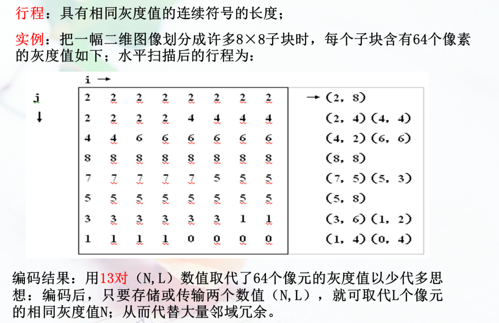

* 哈夫曼
  * 适用场合：非均匀概率分布的信源编码(均匀概率的信源会产生定长码)
  * 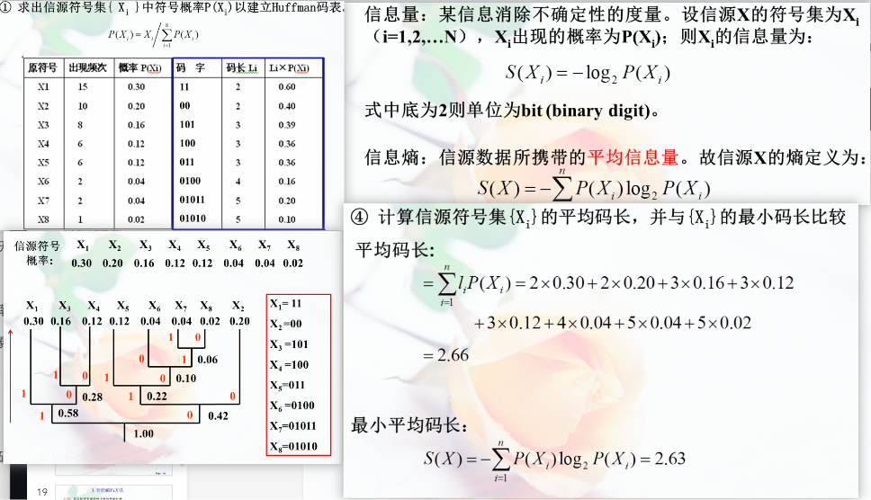

* 算术编码  算术编码转换
  * 适用场合：数据概率分布均匀。基本思想：基于递归概率区间划分的二进制编码
  * 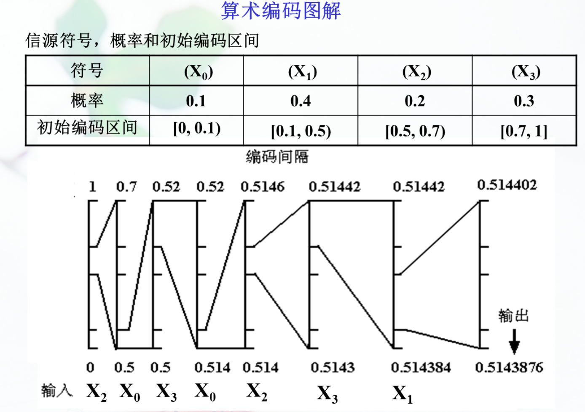

信息量计算，平均信息量=熵=最小平均码长，平均码长。理想值（无限的接近）

### 四

非均匀量化，什么方法，解决什么问题。  APCM(改变量化阶)，DPCM（样本间的差编码）

声音质量的评价：带宽、信噪比、主观质量度量

增量调制(DM)：斜率过载、粒状噪声

采样定理的基本内容----香农定理：在一定条件下，用离散的序列可以完全代表一个连续函数

非均匀量化：大的输入信号采用大的**量化间隔**，小的输入信号采用小的量化间隔。满足精度要求的同时用较少的位数来表示

自适应脉冲编码调制(APCM)：根据输入信号幅度大小动态**改变量化阶大小**

* 前向自适应：根据**未量化的样本值**的均方根值来估算输入信号的电平来确定量化阶的大小，并对电平进行编码作为信息传送到接收端
* 后向自适应：从**量化器刚输出的过去样本**中提取量化阶信息

差分脉冲编码调制(DPCM)：利用**样本间存在的时间冗余度**进行编码的一种数据压缩技术。

* 思想：根据**过去的样本去估算下一个样本**信号的幅度大小(预测值)，然后对**实际信号值和预测值之差进行量化编码**，从而减少每个样本信号的位数
* 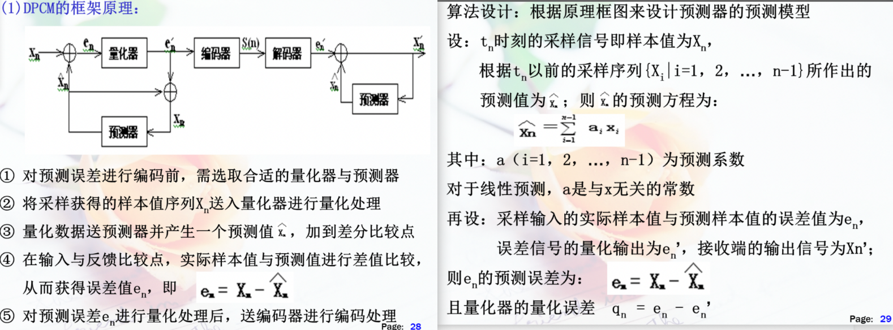
* DPCM和PCM的不同：PCM直接对采样信号进行量化编码，而DPCM是对实际信号值与预测值之差进行量化编码，存储或传送的是差值而不是幅度绝对值

DPCM应用场景--块之间的直流成分

ADPCM

* 利用自适应思想**改变量化阶**大小
* 使用过去的样本值**估算**下一个输入样本的预测值

子带编码(SBC)

基本思想：频带分成若干连续子带，每个子带用**单独的编码方式**，在接收端将每个子带单独译码然后**组合**还原

线性预测编码(LPC)

基本思想：声音是惰性腔体，不可能发生突变，因而话音信号具有**短时间内的相关性**。通过分析话音波形来产生**声道参数**，对声音波形的编码就转化为对这些参数的编码，使声音数据量大大减少。**属于参数编码**过程：线性预测器是使用过去的p个样本来预测现时刻的采样值，预测值可以用过去p个样本值的线性组合表示

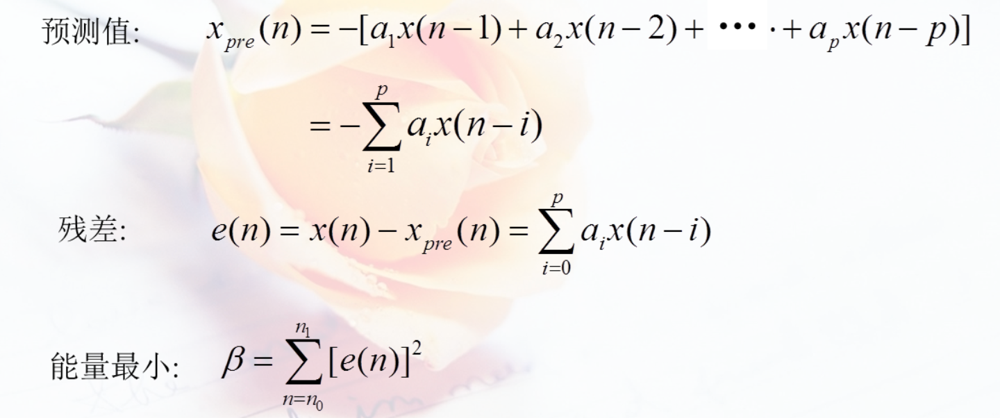

### 五

可见光波长350nm～750nm

锥状细胞强光下工作、柱状细胞弱光下工作

各个颜色空间的计算，应用场景

* RGB：显示器信号
  * 构成一个三维的RGB矢量空间。420nm-蓝、534nm-绿、564nm-红
  * 红绿->黄、 蓝绿->青、 蓝红->品红
* HSI：人眼识别
  * Hue(色调)  Saturation(饱和度) Intensity(亮度)
  * 色度(色彩)：色调和饱和度，表示颜色类别和深浅程度
  * 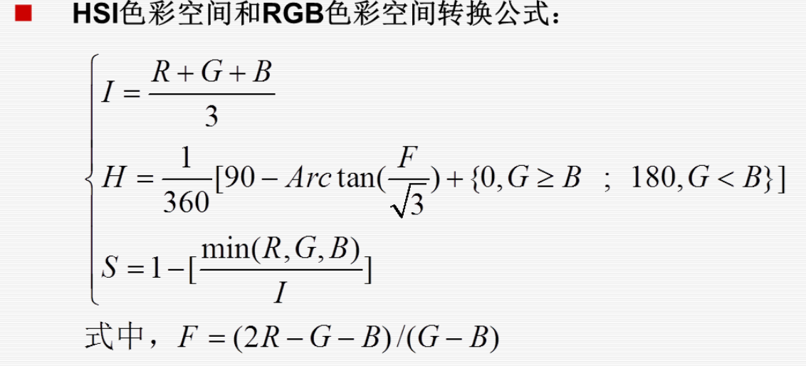
* YUV：电视信号。YCbCr适用于数字电视
  * 为兼容黑白和彩色电视信号，亮度Y和色度U、V分离
  * 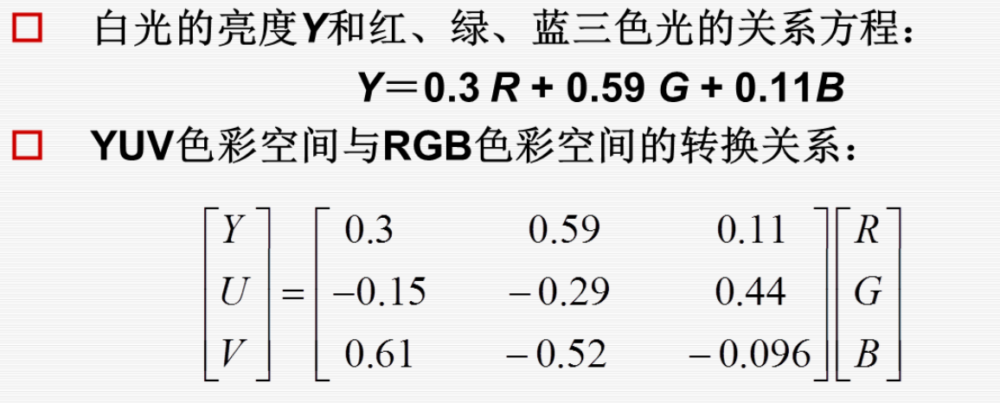
  * 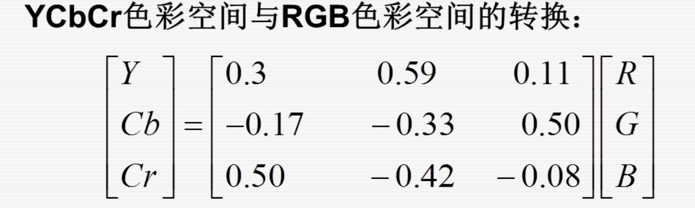
* CMY：彩色印刷
  * Cyan(青色) Magenta(品红) Yellow(黄)
    * CMYK:增加了黑色(blacK)
  * 未归一化 C=255-R M=255-G Y=255-B
  * 归一化 C=1-R M=1-G Y=1-B
    * 方程表明青色颜料的表面反射光不含红色、品红不反射绿色、黄不反射蓝色
  * 打印机为什么不用RGB？ 
    * RGB是加色模式，是基于光的叠加的、CMY是减色模式

数字图像

* 分辨率：每个像素的颜色、亮度等信息按照矩阵的形式紧密排列构成
  * 图像分辨率：每英寸长度像素点的数量
  * 显示器分辨率：屏幕中横向与纵向上显示的点数（1024*768）
  * 位图显示：图中一个像素对于显示器中一个像素
* 图像深度：表示每个像素的**二进制数字位数**--图像深度3，则可显示8(2^3^)色
* 显示器与颜色：显示数据容量=水平分辨率*垂直分辨率\*显示深度
* 真彩色、伪彩色
  * 真彩色：RGB都用8位二进制表示，真彩色图像适配器
  * 伪彩色：像素的颜色不是RGB直接确定，而是根据像素到彩色表查找

JPEG编码

- 算法：连续色调、多级灰度，**静态图像的压缩编码方法**
- 应用场景：静态图像压缩、图像序列的**帧内压缩**

JPEG算法步骤

* 压缩前准备：颜色空间转换成YCbCr(实现亮度和颜色的分离，人感受亮度和颜色的敏感度不一样，分别使用不同的方法处理)
* 正向离散余弦变换(FDCT,Forward Discrete Cosine Transform)
  * 把每个单独的**图像分量**分成8X8的图像块，块作为离散余弦变换的输入。**通过DCT，把能量集中在少数几个系数上**(空间域->频率域)
* 量化（颜色可以粗糙一点、亮度更精细）这是损失最主要的环节
  * 处理**频率系数**。目的是**减小非0系数的幅度以及增加0值系数的数目**
  * 按照系数所在的**位置**和每种**分量的值**进行**矩阵点除**
  * **失帧主因：量化是多到一的过程**
* Z字形扫描
  * 8*8的矩阵 --> 1\*64的矢量。频率低的系数放在矢量的顶部
  * 增加连续的0系数的个数
* 利用DPCM对直流系数(DC)编码
  * DC有两个特点：数值比较大；相邻DC系数变化不大
* 利用行程长度(run-length encoding,RLE)对交流系数(AC)进行编码
  * AC的特点是包含有许多连续的0系数
* 熵编码
  * 进一步压缩数据。 Huffman编码和自适应二进制算术编码
  * DC码和AC行程码 ->中间符号序列、给符号赋以**变长码字**

**一幅图像压缩流程** 切块，RGB颜色空间转换YCBCR（实现亮度和颜色的分离，人感受亮度和颜色的敏感度不一样，分别使用不同的方法处理） 空间域->频率域。量化（颜色可以粗糙一点、亮度更精细）这是损失最主要的环节。   熵编码

DCT基编码/解码器

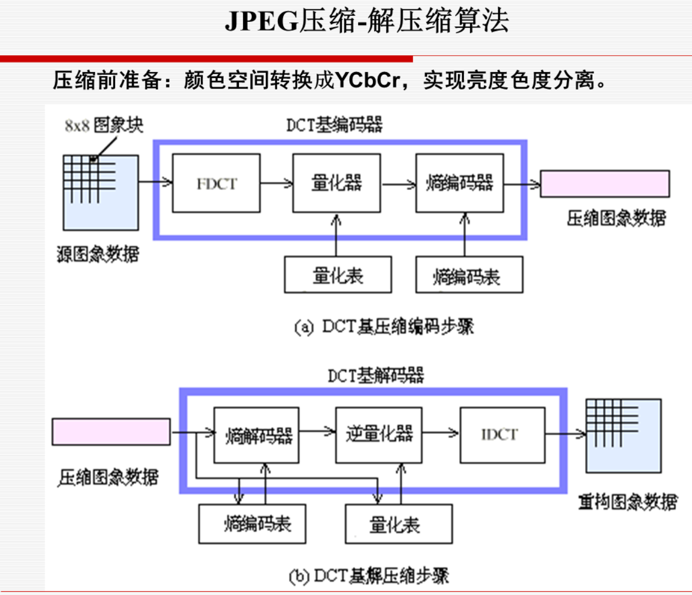

JPEG标准的可选操作

基于DCT的有损压缩-不分层的编码----顺序编码、累进编码

顺序方式：每个图像分量的编码**一次扫描**完成

累进方式：图像分量编码要经过**多次扫描**完成 ，第一次只进行一次粗糙图像的扫描压缩，重建一帧质量较低的可识别图像，随后在进行精细的压缩，只传递增加的信息

---缓冲区：在量化器的输入与熵编码的输入之间，增加一个缓冲区足以存储量化后的DCT系数，对DCT系数多次扫描，分批编码	(累进两种方法的基本原理)

* 频谱选择法：只对64个DCT量化系数中**某些频带的系数**进行编码、传送，随后对其它频带编码、传送。直到全部系数传送完毕。如，可分组(0,1,2),(3,4,5)...
  * 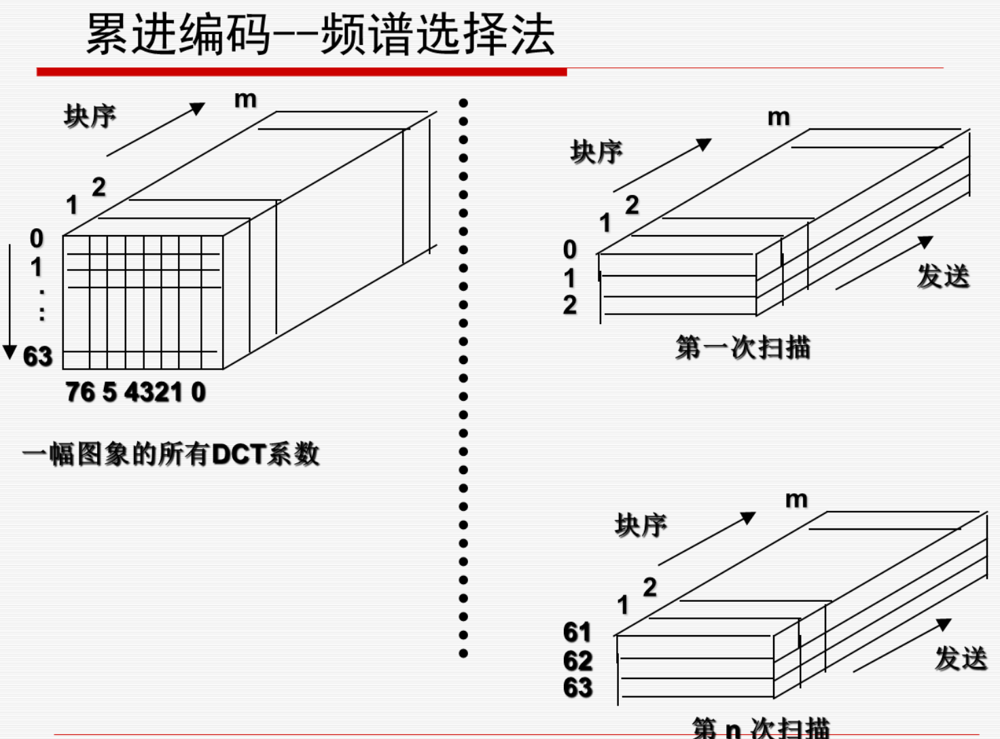

* 按位逼近法：沿着**DCT量化系数有效位方向分段**累进编码。如，对每个系数可分段位7\6\5\4位...0位；首先对最高的4位进行编码、传输，然后对其余段位进行编码和传输
  * 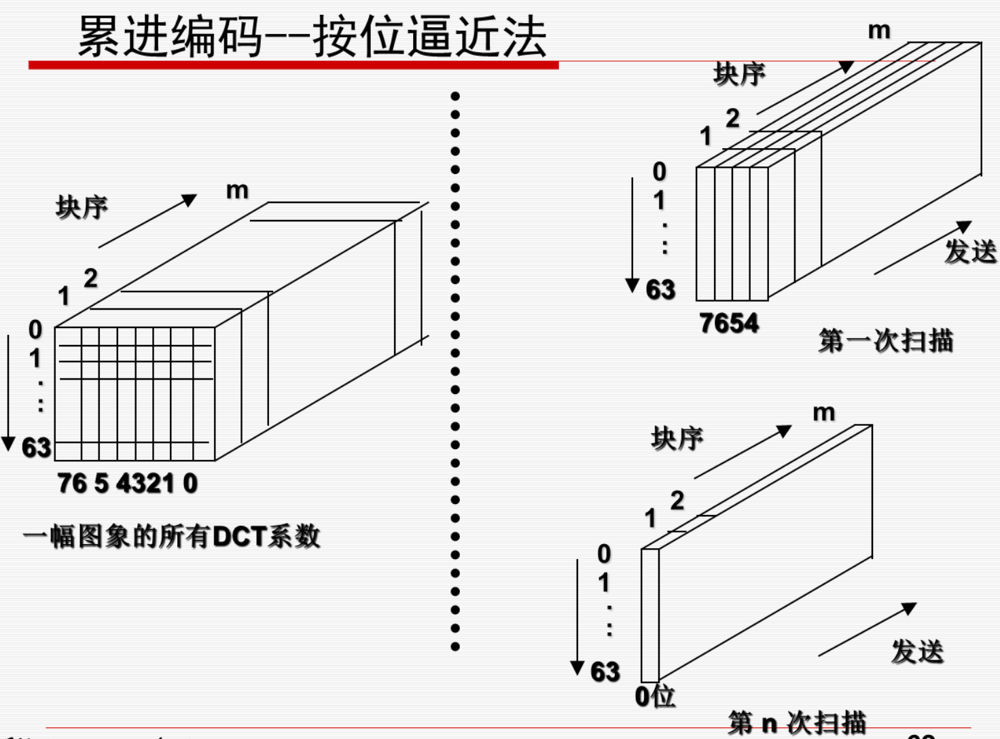

基于DCT的有损压缩-分层的编码

分层原理：把原始图像的分辨率分成多层次进行编码，以2的倍数降低分辨率

分层操作过程

* 1把原始图像分辨率降低
* 2采用编码方式编码
* 3对低分辨率图像解码，重构图像。 --插值滤波器，提高图像水平和垂直分辨率
* 4分辨率升高的图像作为预测值，把它与原始图像的差值进行编码
* 5重复3和4直到图像达到完整的分辨率编码

### 六

图像子采样：对亮度和色度信号分别采用不同的采样频率进行采样。YCbCr格式4:4:4  **4:2:0**  (4:2:2,4:1:1)  计算

帧内压缩，帧间。

* 帧内图像数据压缩：采用基于**DCT**的压缩，用于减少每帧图像内部的空间冗余度，算法与JPEG算法大致相同，相当于**静态图像压缩**
* 帧间图像数据压缩：采用16\*16宏块**运动补偿**技术，消除帧序列的时间冗余度(帧间的空间冗余度)

视频压缩的三种图像类型   I（静态图片，JPEG思路）、P、B

* I帧:帧内图(Intra pictures):随机存取的位置，压缩比不大
  * (空间域压缩)只存在帧内编码，无帧间运动估计，不用参考其它帧，具有**同步**作用。亮度编码(16x16,8x8,4x4)，色度编码(8x8)
  * 三个阶段：DCT；变换系数量化(量化、Z字扫描、游程编码)--压缩大部分冗余；熵编码
  * 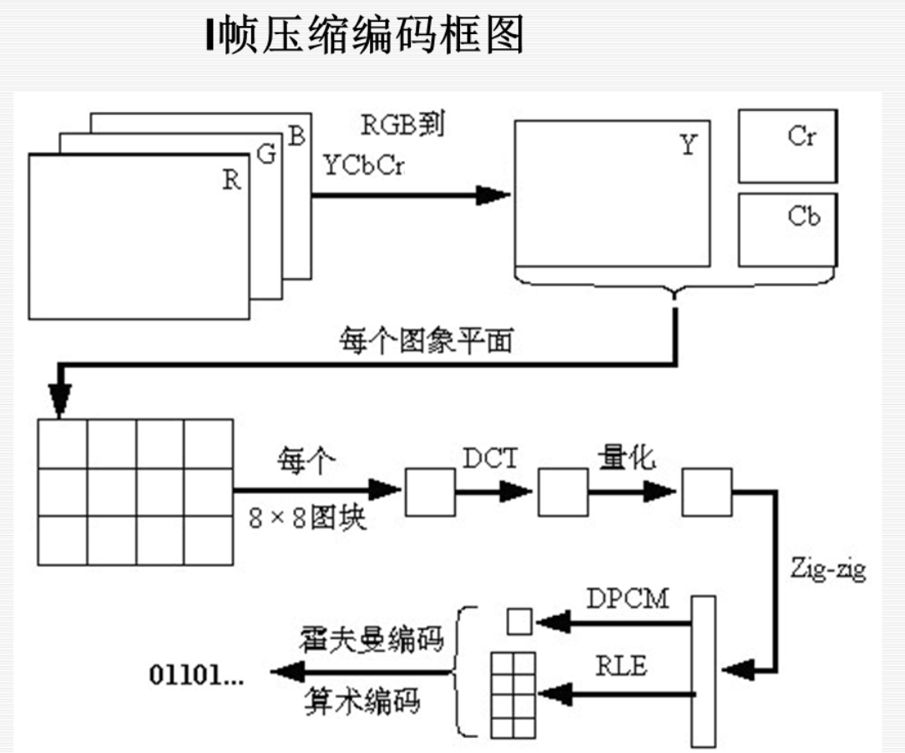
* P帧:预测帧(Predicted pictures):用先前帧I或P参考预测
  * 先求两个宏块中对应像素值之差，对**差值**进行**彩色空间转换**，然后子采样得到Y，Cb，Cr分量值，仿照JPEG算法对差值编码，计算出的运动矢量也要进行霍夫曼编码
  * 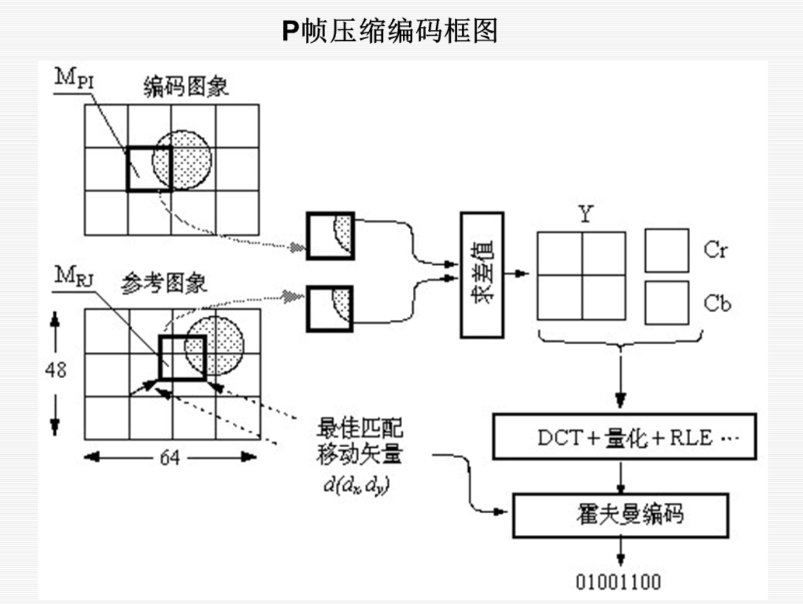
* B帧:插补帧即双向预测(Bidrectional Prediction Pictures):压缩效果显著，预测时需要先前与后续的信息，B不能作其他帧的预测参考帧
  * 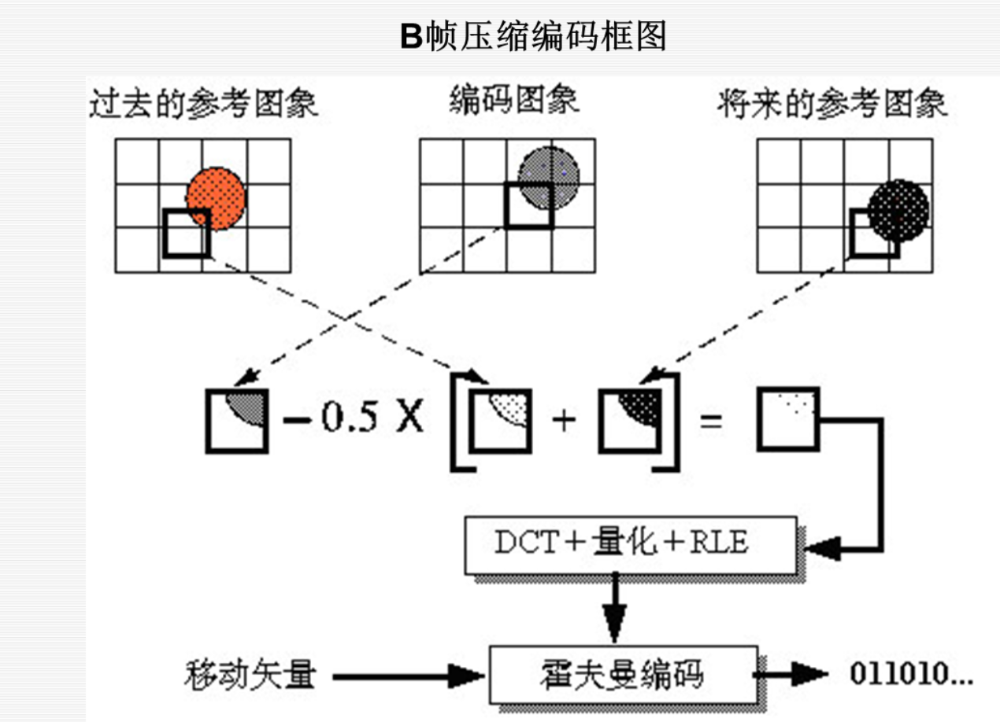

**运动补偿技术原理**(减少时域冗余)

* 通过参考帧的局部图像来**预测、补偿**当前的局部图像，是减少帧序列冗余(时域)最有效方法。(采用16*16宏块的运动补偿)
* 算法：宏块为预测单元，**当前宏块是参考宏块的移位**。每个宏块计算出一个二维**运动矢量**(运动方向和幅度)，利用它和先前的图像可预测当前图像。**预测误差16\*16**，要编码、传送，供解码段恢复图像
* P帧一个参考、B帧两个参考

### 七

QoS服务质量指标

* 吞吐量需求：网络吞吐量是指有效的网络带宽。物理链路的传输速率 减去 传输开销，反映网络最大极限容量
* 延时：对于端 - 端延时，一般要求小于250ms(150ms)
* 延时抖动
  * 比较大的存储 ->解决抖动

* 差错率：反应网络传输的可靠性。位差错率、帧差错率、分组差错率
  * 控制差错方法1⃣️ARQ，差错率高不适用，时间不可控2⃣️FEC，增加监督数据(CRC)
* 服务可用性(平均无故障率)

实现QoS两种方法

- 由RSVP提供的**保证型服务**；保证型服务具有**面向连接**的特性，并通过QoS协商、接纳控制、保留带宽和实时调度等机制来实现
- 在区分服务(DiffServ,DS)中定义的**区分型服务**。具有**无连接**的特性，主要通过缓冲管理和优先级调度机制来实现，无需进行QoS协商和保留带宽等控制

多媒体通信网络

* 概念：多媒体网络是计算机网络。能够传输声音、图像、视频的数据网络。多媒体通信更强调带宽、同步、延时等

* 各自特点，分几层
* 不同层协议，特点。TCP、UDP（更强调使用UDP）、HTTP（post，get）

OSI参考模型 应用-表示-对话-传输-网络-数据链路-物理

TCP/IP模型

* 应用层
* 传输层：进程到进程
  * TCP和UDP是**操作系统内核**实现的。传输层以下协议用Socket实现，**Socket**本身不是协议，而是对TCP/IP协议的封装，通过Socket开发者才能使用TCP/IP协议
  * TCP标题长度20字节、UDP标题长度8字节
  * 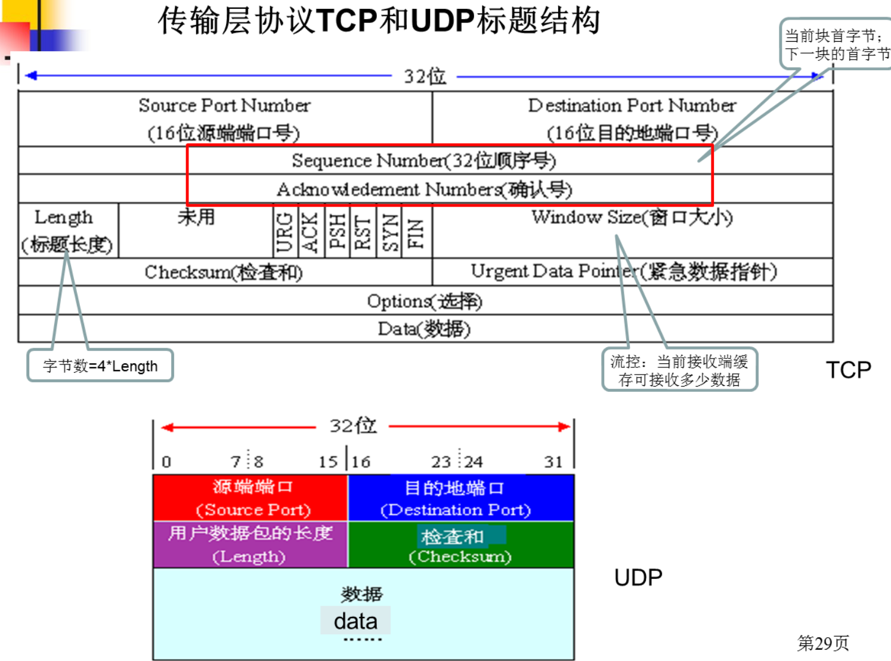
  * 多媒体应用通常使用UDP协议
* 网络层：主机间通信，选择路由和交换节点，IP网络地址转为MAC地址(**ARP协议**)
  * 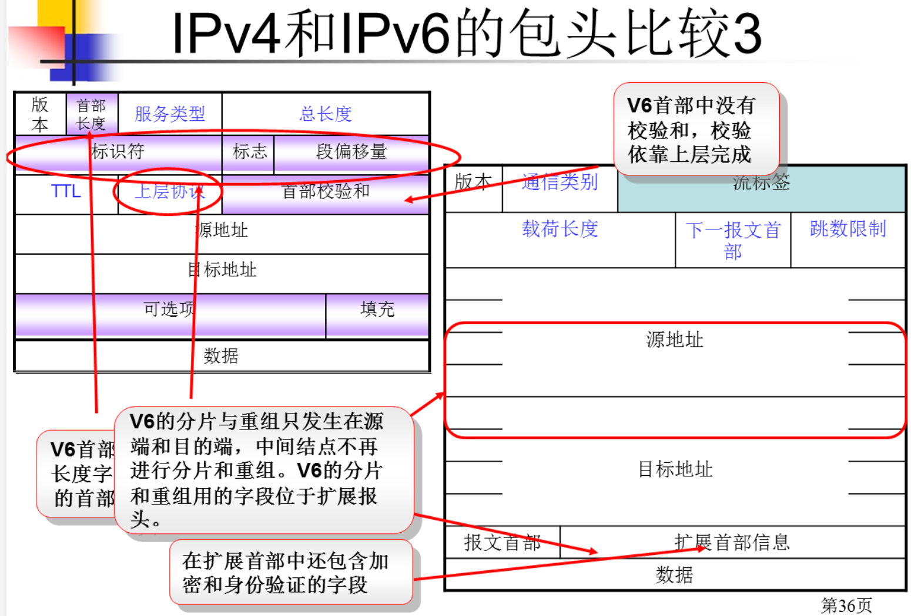
  * IPv6首部的**通信类别**和**流标识**字段提供了Qos支持机制

* 数据链路层：节点间传送帧。包括数据、地址、差错、同步等控制信息
* 物理层：节点之间比特流的透明传输

应用层(RTP，RTCP，RTSP)，传输层(RSVP)各自功能，处于什么层次，各协议间的配合

* 实时传输协议RTP(Real-time Transport Protocol)
  * 应用于**流媒体通信**。为实时应用提供**端到端**的运输，但不提供任何服务质量的保证
  * 数据块--压缩编码-->RTP--RTP分组-->**UDP**-->IP
  * RTP是一个协议框架，不对数据块做处理，只是向应用层**提供一些附加的信息**(时间戳，序号..)

  
  
* 实时控制协议RTCP(RTP Control Protocol)    与RTP配合使用
  * 为应用程序提供**会话质量或者广播性能的信息**，一般控制在会话带宽的**5%内**
  * 封装发送端/接收端的**统计报表(信息包数目、丢失的信息包数目、信息包的抖动)**
    * 发送端根据反馈信息修改传输速率、接收端可以判断问题是哪里的、网络管理员可以评估网络用于多目标广播的性能
  * 每个参与者**周期性地发送**RTCP控制信息包
    * 发送端和接收端用**多播**方式进行报告
    * 特定应用分组APP使应用程序能够定义**新的分组类型**
    * 源点描述分组SDES给出**会话参加者**的描述
    * 结束分组BYE--**关闭**一个数据流
  * RTP数据发向偶数UDP端口，RTCP数据发向偶数+1UDP端口
  
  
  
* 实时流媒体播放协议RTSP(Real-time Streaming Protocol)  描述了与RTP间的交互操作
  * **RTSP控制RTP会话的协议**。

    用户在播放从因特网实时数据时能进行控制(12种操作)
  
  * 参考了HTTP/1.1协议。RTSP传送的是多媒体数据
  
    * 用来控制具有实时性的数据传输，但它**本身并不传输数据**，而是依赖于下层传输协议的服务
  
  * 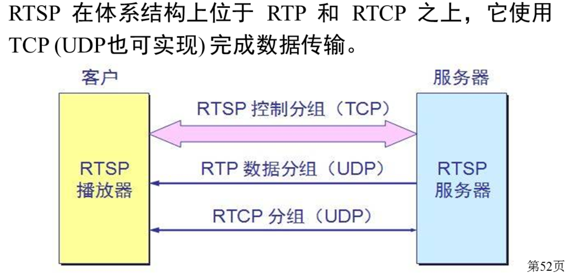
  
    
  
* 资源保留设置协议RSVP(Resource Reservation Protocol)
  * 当前因特网主要是为IP数据包提供服务，而对吞吐率和时延不提供任何保证。
  * RSVP允许应用程序为它们的**数据流保留带宽**。在**接收端、发送端、路由器中都必须要支持RSVP协议**
  * 原理：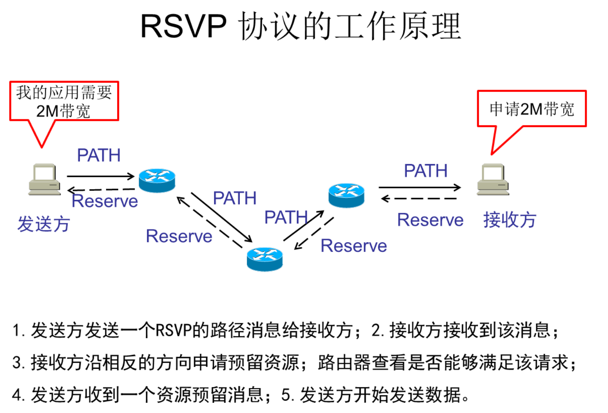
  * 协议特点：RSVP标准没有指定网络如何为数据流保留资源，一旦提出要求，实际是由**路由器**来为数据流保留带宽
    * RSVP是**传输层**的协议
    * RSVP是**信令**协议
    * RSVP是**接收端启动**的协议

区分服务DiffServ

* 在网络边界将数据流按QoS要求进行简单分类，不同的类别中内部节点的转发中实现不同的转发特性

DS优点：

* 系统资源要求低：路由器无需维护每个连接信息
* 网络设备处理简单：优先级归类合并
* 没有附加的标签：采用IP包中的ToS字段进行优先级标示

### 八

传统文本->顺序，线性。     超文本->网状，节点是信息块

* 文本最显著的特点是**线性的和顺序的**
* 超文本采用**非线性的网状结构**来组织**块状信息**，不仅提供了知识和信息，也包含了信息间的逻辑关系：**信息的分析、推理、整合**
  * 概念：超文本是一种**信息管理技术**，以**节点**作为基本单位，节点实际是一个**信息块**。它可以是字符文本集合，也可是屏幕中的一块显示区。在信息组织方面，则是用**链**把节点构成**网状结构**(非线性结构)。链表示不同节点间信息的联系

理解三个概念，解决什么问题

* 多模态：模态是指事物发生或存在的方式，多模态是指两个或两个以上模态的各种形式的组合。不同模态是从**不同角度**描述同一事物，更全面观察和分析事物。(建立模型，实现模态间信息的融合、交流、转换)
  * 各模块信息互补，预测更准
  
  
  
* 检索:根据用户需求，从信息集合中(数据库、网络...)检索出与用户需求相关的信息子集。
  * 基于文本的检索(Text-Based Retrieval)
    * 传统都是对文本的检索---标注媒体内容或属性--关键字相似度
    * 原理简单、技术成熟。无法表达多媒体的**丰富内容；效率**低下；**人工**标注费时费力
  * 基于内容的检索(Content-Based Retrieval)
    * 原理：为每幅图提取特征并进行量化，表示成向量空间；将用户的查询转化成向量；并与已有的向量空间进行**相似度匹配**计算
    * 基于内容的图像检索：图像特征从各个方面描述了图像的内在**语义**，根据特征的**相似度**实现对图像的检索
      * 过程：特征提取(颜色、纹理、形状、空间关系---**CBIR基础**)--特征分析--特征匹配
      * **颜色是描述一幅图像最简单有效的特征**，颜色直方图是一个K维特征向量不关心颜色所处空间位置，描述的是不同颜色**所占比例**。颜色矩、颜色相关图(不同颜色对之间的空间相关性)
      * 纹理特征---颜色或灰度按一定规律变化或分布形成的图案，具有一定重复性、均匀性、方向性
      * 形状特征---先对图像进行分割
    * 基于内容的视频检索：在大量视频数据中找到**视频片段**
      * **帧**是一幅图像，组成视频的最小单位；**镜头**由一系列连续帧组成；**场景**由一些语义相关的镜头组成；**片段**由一系列相关的场景组成，表达一个完整事件
      * 过程：**镜头检测**(分开不同的镜头)----**提取关键帧**(去除大量冗余)----使用基于内容的图像检索技术
    * 基于内容的音频检索：利用语音识别与处理技术检索音频信息
      * 逐词逐句地转换为文字----对语义做出正确的理解与回应

* 基于内容的视频监控
  * 强调对于内容的理解
  * 概念：由机器自动分析视频图像源，从中识别并提取有用的关键信息，并自动控制机器进行相应动作

echo $HISTFILE

echo > ~/.zsh_history
