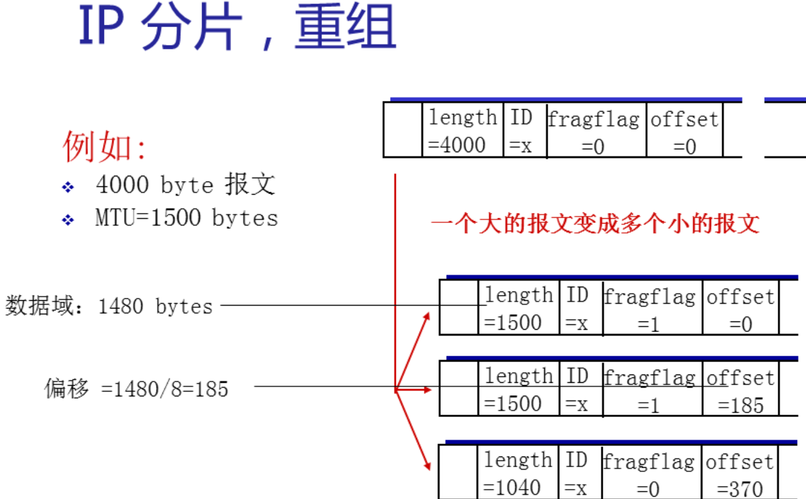

10个选择题 10分

https://www.sssam.com/9136.html

## 第一章

CDMA(Code Division Multiple Access)。码分多址

ISP(Internet Service Provide) 因特网服务提供商

10BaseT网卡采用曼彻斯特编码

奈氏准则:码元传输速率上限C=2Wlog~2~N    W为带宽

信噪比dB = 10log~10~(S/N)

CDMA

- 任何一个码片向量和该码片向量自己的规格化内积都是1

电路交换：在端系统间通信会话期间，预留了端系统间沿路径通信所需要的资源

分组交换与电路交换对比

- 电路交换不考虑需求，而预先分配了传输链路的使用
  - 已分配但并不需要的链路时间未被利用
- 分组交换按需分配链路使用。链路传输能力在所有需要在链路上传输分组的用户之间被共享

传输时延：将所有分组的比特推向链路所需要的时间

传播时延：一个比特从一台路由器传播到另一台路由器所需要的时间

## 第二章 应用层

SMTP(Simple Mail Transfer Protocol)

POP3(Post Office Protocol-Version3)

IMAP(Internet Mail Access Protocol)

进程间通信利用套接字Socket发送和接收消息实现

- 标识符：IP地址+端口号

### CS体系结构

clients

- 主动向远程服务器发起通信
- 客户程序必须知道服务器程序的地址
- 间歇性接入网络
- 不会与其他客户机直接通信

server

- 一直在线，接受客户通信请求不需要知道客户程序的地址
- 固定IP地址

### P2P体系结构

- 没有永远在线的服务器
- 任意端系统直接通信
- 对等方之间请求服务
- 对等方间歇连接并更改IP地址
- **自扩展性**

### 文件分发

- 文件被划分为等长度的块chunk
- torrent洪流：交换同一文件的文件块的节点组
- tracker追踪器：保存在torrent中各节点的IP地址和端口等信息

F大小的文件从一台服务器分发到N个对等方、服务器带宽u~s~、u~T~是上传速率之和

CS

- 从服务端考虑：必须按顺序发送N个文件副本，T=NF/u~s~
- 客户端：下载速度最慢的主机速率位d~min~，T=F/d~min~
- T~cs~ =  max{NF/u~s~，F/d~min~}

P2P

- 初始服务器分发的最少时间不可能小于 F/u~s~
- 下载文件分发的最少时间不可能小于 F/d~min~
- 上载文件分发的最少时间不可能小于NF/u~T~
- T~P2P~ = max{F/u~s~，F/d~min~，NF/(u~s~+u~T~)}

### 应用层协议

HTTP 80端口  

- HTTP1.0
  - 非持续连接HTTP：每个TCP连接最多发送**一个对象**，然后关闭连接
    - 每个对象需要两个RTT时间
- HTTP1.1
  - 持续连接HTTP：单个TCP连接可以传输多个对象
    - 非流水线方式：客户在收到前一个响应后才能发出下一个请求，比上面两个RTT时间节省了建立TCP连接所需的一个RTT时间。服务器在发送完一个对象后其TCP连接处于空闲状态
    - 流水线方式：客户机在遇到被引用对象时立即发送请求，对于所有被引用对象，**只有一个RTT**
- HTTP2：对象分为帧，帧交错传输
  - 多个HTTP请求复用一个TCP连接，发生丢包时，一个TCP连接中的所有HTTP请求都必须等待这个被丢了的包重传回来
  - HTTP1.1的管道传输会发生队首阻塞，HTTP2的丢包也会阻塞所有HTTP请求
- HTTP3：下层的TCP协议改为了UDP
  - 基于UDP的QUIC协议，实现类似TCP的可靠传输
- HTTPS建立一个连接要花费6次交互(建立3次握手+TLS的3次握手)
  - QUIC直接把6次交互合并成了3次交互
- 
- Cookie Sessino JWT
- Web缓存(代理服务器)：既充当客户端又充当服务器

FTP

SMTP/POP3/IMAP

E-mail三个组成部分：

- 邮件客户端
- 邮件服务端
- SMTP协议 端口25
  - 基于TCP在客户机和服务器之间传递email，采用持续连接
  - email消息只包含**7位的ASCII码**
  - 一般不使用中间邮件传输服务器，**直接传输**
  - 与HTTP对比
    - HTTP-拉式(pull)，每个对象封装在独立的响应消息中    SMTP-推式(push)，多个对象由多个部分构成的消息中发送
    - 都是基于ASCII码
- user(A)--**SMTP**-->sender's mail server--**SMTP**-->receiver's mail server--**POP/IMAP**-->user(B)
  - SMTP：交付/存储至接收方服务器
  - POP(Post Office Protocol)：认证/授权和下载
    - POP3是无状态的，下载并删除/保存模式
  - IMAP(Internet Mail Access Protocol)：更多功能，包括对服务器存储的消息的操作
    - 所有消息统一留在服务器上，用户利用文件夹组织消息
  - HTTP

DNS 运行在UDP之上，端口53

域名解析系统(Domain Name System)-分布式数据库

- 根域名服务器-顶级域名(TLD)服务器-权限域名服务器
- 主机进行DNS查询时，查询被发送到本地域名服务器
- 迭代查询
  - 本地域名服务器依次访问根/顶级/权限域名服务器
- 递归查询
- 缓存在一段时间(TTL)后消失

video streaming systems

- DASH(Dynamic,Adaptive Streaming over Http)多媒体流化服务
- 服务端：将视频文件分割成多个块，每块独立存储、告示文件(mainfest file)-提供不同块的URL
- 客户端：先获取告示文件、周期性测量带宽、查询告示文件，一个时刻请求一个块、根据带宽请求不同码率的编码块

CDNs(Content Distribution Networks)

- 在CDN节点中存储内容的多个拷贝
- 用户从CDN中请求内容、重定向到最近的拷贝
- 内容注入->用户请求调度->内容分发->内容服务
- 关键技术：依靠**内容ID**定位内容、负载均衡

## 第三章 传输层

ARQ(Automatic Repeat reQuest)  自动重传协议

MSS(Maximum Segment Size) 最大报文长度

运输协议能够提供的服务受制于底层网络层协议的服务模型.如果网络层协议无法为主机之间发送的运输层报文提供时延或带宽保证,运输层协议也就无法为进程之间发送的应用程序报文提供时延或带宽保证

运输层的接收端-多路分用、发送端-多路复用

- 每个TCP报文段都有20字节的首部开销,UDP仅有8字节的开销

#### rdt 停等协议

不可靠信道特性决定了可靠数据传输rdt(reliable data transfer)的复杂性

- rdt_send()由上层应用调用，将数据交给rdt以发送给接收方、udt_send()由rdt调用，在不可靠的信道上发送数据给接收方
- rdt_rcv()数据包到达接收方式调用、deliver_data()被rdt调用，向上层应用交付数据

rdt1.0

- 假设底层信道完全可信
- 

rdt2.0--停等协议

- 肯定确认ACK，否定确认NAK、当内容有误时进行重传 ARQ(差错检测、接收方反馈、重传)
- 
- 如果ACK/NAK发生错误，发送方重新传送当前pkt（给pkt增加序号）、接收者丢弃重复的pkt

rdt2.1

- 处理混乱的ACK/NAK
- 发送方FSM
- 
- 接收方FSM
- 

rdt2.2

- 无NAK消息
- 

rdt3.0 比特交替协议

- 定时器
- 发送方FSM
- 
- 接收方FSM同2.2一样

#### 流水线协议

##### GBN

- 回退N步，滑动窗口协议
- 发送方在管道中最多有N个未确认的数据包、接收方只发送**累计确认**（接收方没有缓存）。
  - 如果分组k已接受并交付，则所有序号**比k小的分组**也已经交付
- **超时**的话，发送方会重传已发送但还**未被确认过的所有分组**。

##### SR

- 接收方**单独确认**所有正确收到的分组.失序的分组将被缓存到所有序号更小分组皆被收到为止
- 发送方只重传没收到ACK的分组(每个分组具有一个定时器)
- 窗口长度必须小于等于序号空间大小的一半

### TCP

TCP(TLS提供加密)：可靠，按序交付服务、流量控制、拥塞控制

在一个发送方中未被确认的数据量不会超过min{rwnd,cwnd}

- TCP在网络层IP协议提供的不可靠的服务基础上实现可靠的数据传输
  - 流水线机制(设置窗口大小进行拥塞控制和流量控制)、累计确认、重传计时器
- 
  - TCP套接字由一个四元组(源IP地址,源端口号,目的IP地址,目的端口号)标识:两个具有不同源IP地址或源端口号的到达TCP报文段将被重定向到两个不同的套接字

- 一个报文段的**序号**(32比特)：该报文段首字节的字节流编号。TCP隐式地对数据流中每一个字节编号
- **确认号**：期望收到的下一个字节的序号（**累计确认**）
  - 该序号之前的所有字节已被正确接收
- 三次握手: 客户端首先发送一个特殊的TCP报文段(SYN=1)
  - 第三步的时候连接已经建立,所以SYN比特置为0
  - SYN洪范攻击

- 
- 四次挥手
  - 客户端服务器各自关闭自己的连接端(发送**FIN位为1**的TCP段)
  - 用ACK回复收到的FIN(ACK可以和自己的FIN相结合)
  - 可同时处理FIN交换  

- 

#### 快重传

一旦受到3个相同冗余ACK，TCP就执行快速重传

#### 流量控制

它是一个速度匹配服务

发送方维护一个接收窗口(rwnd)长度--该接收方还有多少可用的缓存空间

#### 拥塞控制

AIMD(Addtive Increase,Multiplicative Decrease)-加性增，乘性减

因为IP网络的拥塞而被遏制

TCP报文段的丢失被认为是网络拥塞的迹象-拥塞窗口(cwnd)

- 慢启动:cwnd的值以1个MSS开始并且每当传输的报文段首次确认就增加一个MSS(指数增长)
  - 由超时引起的丢包时,发送方将cwnd设置为1,并将ssthresh设置为cwnd/2

- 拥塞避免:每个RTT只将cwnd的值加一个MSS
  - 超时引起的丢包与慢启动处理一样
  - 收到3个冗余ACK引起的丢包时,发送方将cwnd的值变为N/2+3(计及已收到的3个冗余的ACK要加上3个MSS)

快速恢复

- TCP Tahoe无论发生什么丢包,无条件将cwnd置为1,进入慢启动状态
- TCP Reno综合了快速恢复

### UDP

 UDP：不可靠，无序交付服务、尽力而为、不保证延迟，带宽

- 
  - UDP套接字由一个二元组标识(目的IP地址,目的端口号):即使源IP地址/源端口号不同,但是两个UDP报文段具有相同的目的IP地址和目的端口号,那么这两个报文段将通过相同的目的套接字定位到相同的目的进程

- 

## 第四章 网络层-数据平面

MTU(Maximum Transmission Unit) 最大传送单元

CIDR(Classless Interdomain Routing) 无类别域间路由选择

DHCP(Dynamic Host Configuration) 动态主机配置协议

NAT(Network Address Translation) 网络地址转换

A类 1-126 B类 128-191 C类 192-223 D类 224-248

交换机:基于链路层帧中的字段值做出转发决定

路由器:基于网络层数据报中的首部字段值做出转发决定

当有大量TCP流(N条)流过一条链路时,缓存所需要的数量B=RTT·C(链路容量)/根号N

#### IPv4格式

- 数据报理论最大长度2^16^=65535字节
- 协议为6表明数据部分交给TCP,17表明交给UDP
- 
- 

### DHCP

客户-服务器协议

- DHCP服务器发现:客户在UDP分组中向端口67发送DHCP发现报文(广播目的地址:255.255.255.255。源IP地址0.0.0.0)
- DHCP服务器提供:服务器向客户响应(使用IP广播地址255.255.255.255)
- DHCP请求:客户从一个或多个服务器提供中选择一个,并发送请求报文
- DHCP ACK

建隧道:IPv6数据报放到一个IPv4数据报的数据字段中

## 第五章 网络层-控制平面

SDN(Software-Defined Networking) -软件定义网络

OSPF(Open Shortest Path First) 开放最短路优先

RIP(Routing Information Protocol) 路由信息协议

BGP(Broder Gateway Protocol) 边界网关协议

传统转发仅仅基于分组的目的地址

### 路由选择算法

#### 集中式路由选择算法-LS

完整的、全局性的网络知识计算出从源到目的地之间的最低开销路径(以所有节点之间的连通性及所有链路的开销为输入)

链路状态LS(Link State)算法   Dijkstra

- 
-  

#### 分散式路由选择算法-DV

以迭代、分布式的方式计算出最低开销路径(没有节点拥有关于所有网络链路状态开销的完整信息) 每个节点仅有与其直接相连链路的开销知识

距离向量DV(Distance Vector)算法

- 

### OSPF

不使用UDP而是直接用IP数据报传送

- 采用LS算法(链路状态分组分法、每个节点上有拓扑图、Dijkstra)
- 路由器**洪泛**OSPF链路信息到整个AS中的其他所有路由器(IP协议直接承载OSPF信息)
  - 只有当链路状态变化时才使用洪泛法发送信息
- IS-IS路由选择协议基本和OSPF一样

### BGP

eBGP(外部BGP:跨越两个AS的BGP)。iBGP(内部BGP)

AS间路由选择协议BGP。AS内部路由选择协议OSPF

### RIP使用UDP,OSPF使用IP,而BGP使用TCP。这样做有何优点?为什么RIP周期性地和临站交换路由信息而BGP却不这样做?

RIP只和邻站交换信息,使用UDP无可靠保障,但开销小,可以满足RIP要求;

OSPF使用可靠的洪泛法,直接使用IP,灵活、开销小.OSPF构成的数据报很短的好处:不必将长的数据报切片

BGP需要交换整个路由表和更新信息,TCP提供可靠交付以减少带宽消耗。

RIP使用不保证可靠交付的UDP,因此必须不断地(周期性地)和邻站交换信息才能使路由信息及时得到更新。但BGP使用保证可靠交付的TCP因此不需要这样做。

## 第六章 链路层

NIC(Network Interface Card)-网络接口卡

MAC(Mutiple Access Control protocol)-多路访问控制协议

链路层地址称呼：LAN地址/MAC地址/物理地址

ARP(Address Resolution Protocol)-地址解析协议

## 第七章 无线与移动网络

一、信道划分协议

二、随机接入协议

三、轮流协议

​	轮询协议、令牌传递协议

路由器隔离冲突域+广播域、交换机隔离冲突域