### 结构化分析

Structured Analysis

数据流图DFD---功能域

- 例题一: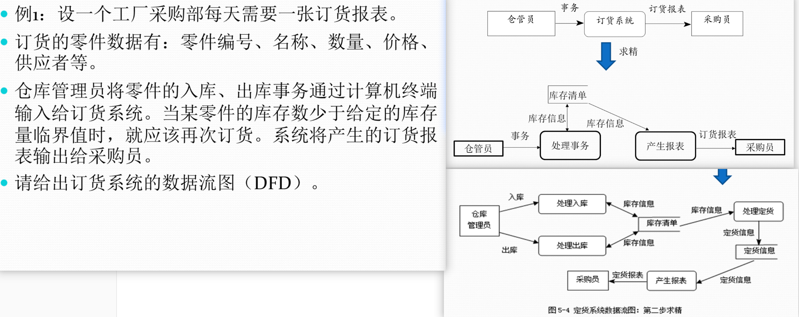
- 例题二:
- 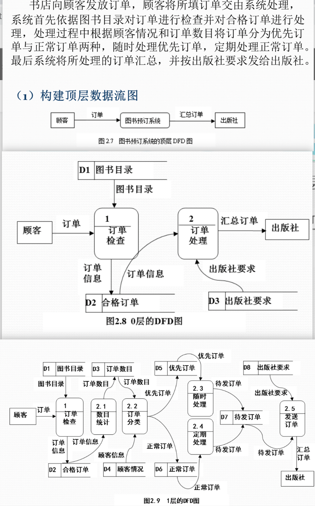
- 例题三：
- 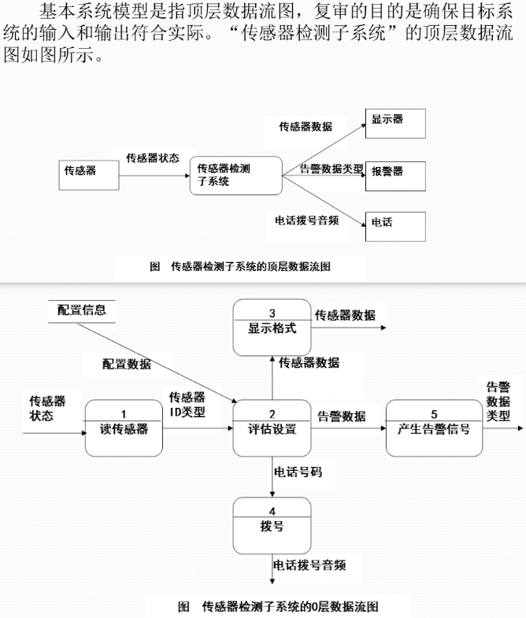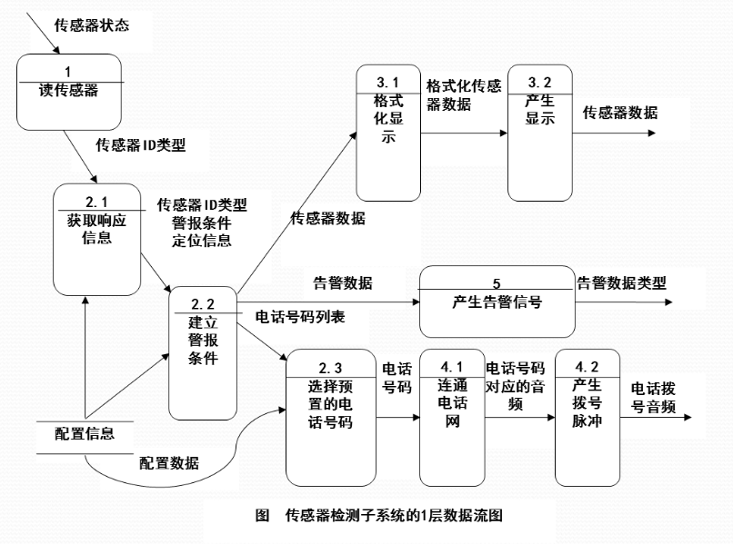

实体关系图ER---信息域

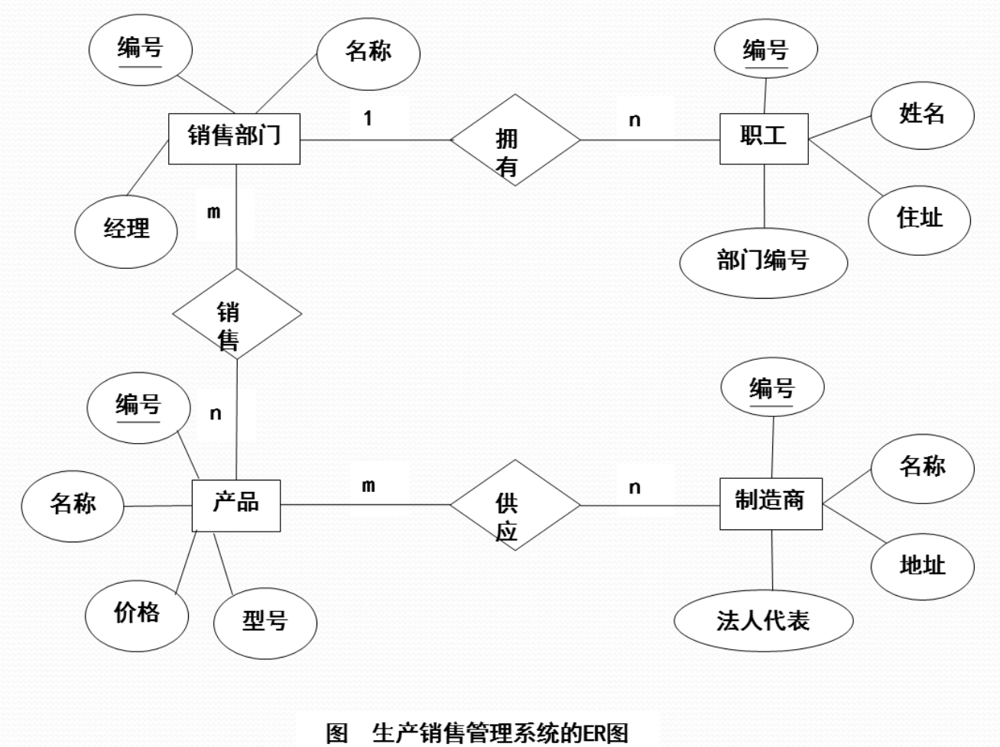

状态转换图STD---行为域

软件结构形态特征准则

- 深度、宽度、扇出、扇入

#### 流程图

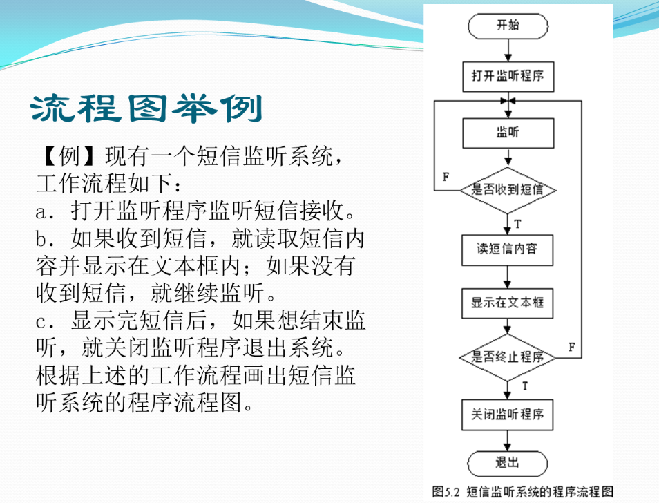

#### 盒图

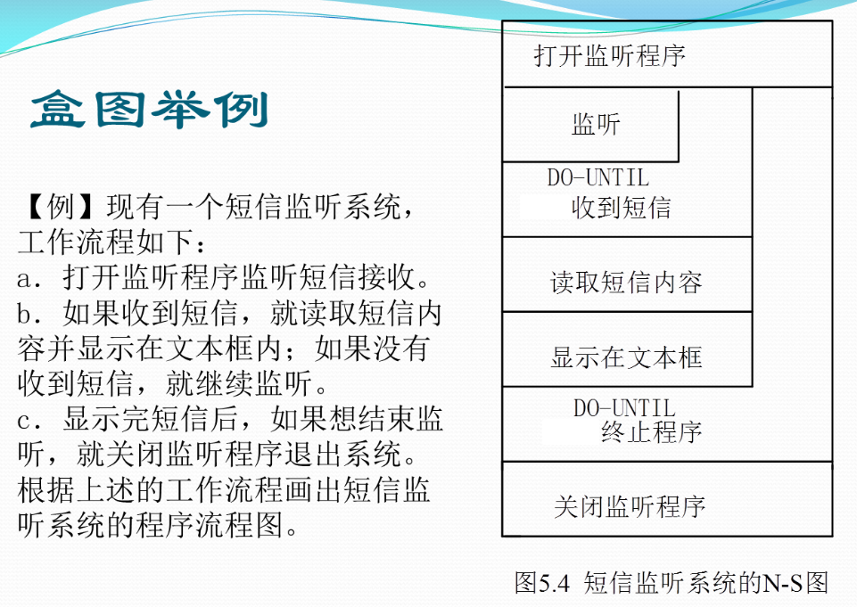

#### PAD图

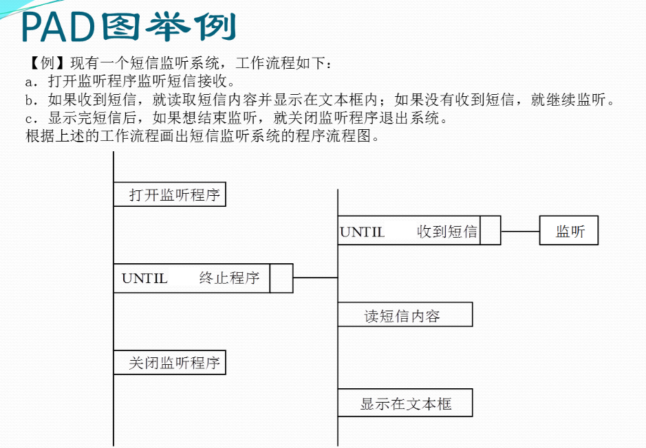

### CRC卡片

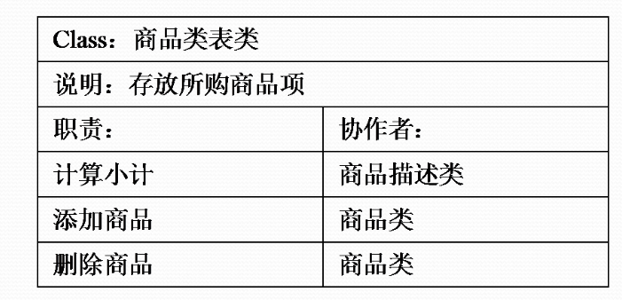

（1）画出银行取款过程的 DFD 图。问题描述为：储户用存折取款，首先填写取款单，根据“ 账卡”中的信息检验取款单与存折，如有问题，将问题反馈给储户，否则，登录“储户存款数据库”，修改相应数据，并更新“账卡”，同时发出付款通知，出纳向储户付款。

（2）如果银行储户在ATM上取款，同样需要身份认证及授权等处理过程，请画出ATM系统协作图。

### DFD图

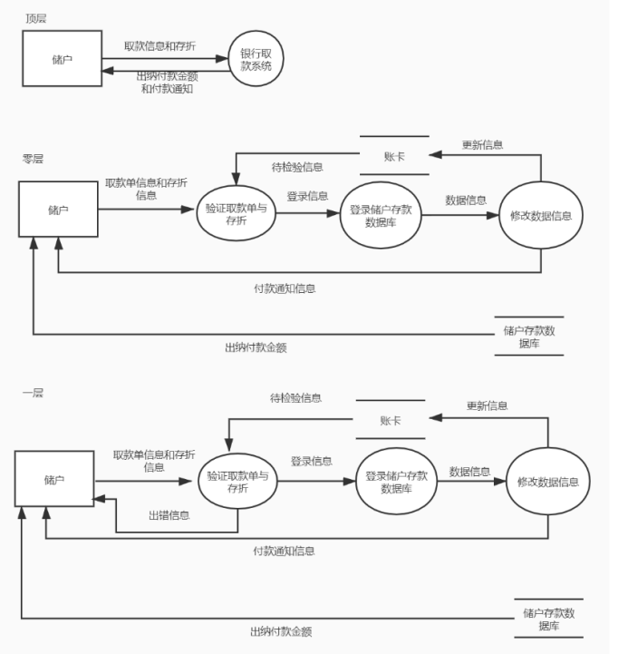

### 协作图

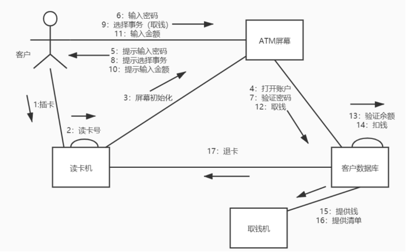

通常洗衣机包括一个注水的进水管，一个装衣物的洗涤缸和一个排水管，洗衣过程是浸泡、洗涤、漂洗、脱水，依次按如下顺序执行：

（1）通过进水管向洗涤缸注水。（2）洗涤缸保持5分钟静止状态。（3）水注满，停止注水。（4）洗涤缸往返旋转15分钟。（5）通过排水管排掉洗涤后的污水。（6）重新开始注水。（7）洗涤缸继续往返旋转洗涤。（8）停止向洗衣机中注水。（9）通过排水管排掉漂洗衣物的水。（10）洗涤缸加快速度单方向旋转5分钟。（11）洗涤缸停止旋转，洗衣过程结束。

如果以UML描述洗衣机的工作过程，请画出以洗衣机作为对象的状态图及洗衣机执行的顺序图。

### 状态图

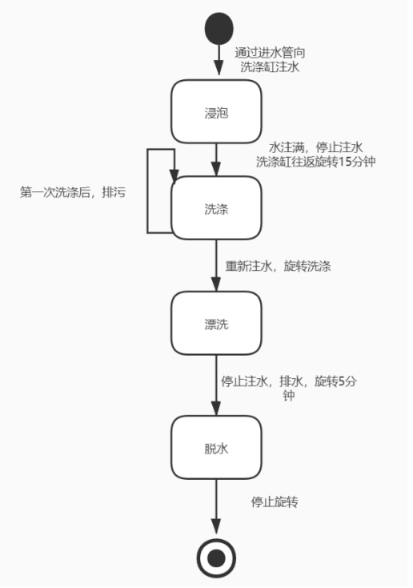

### 顺序图

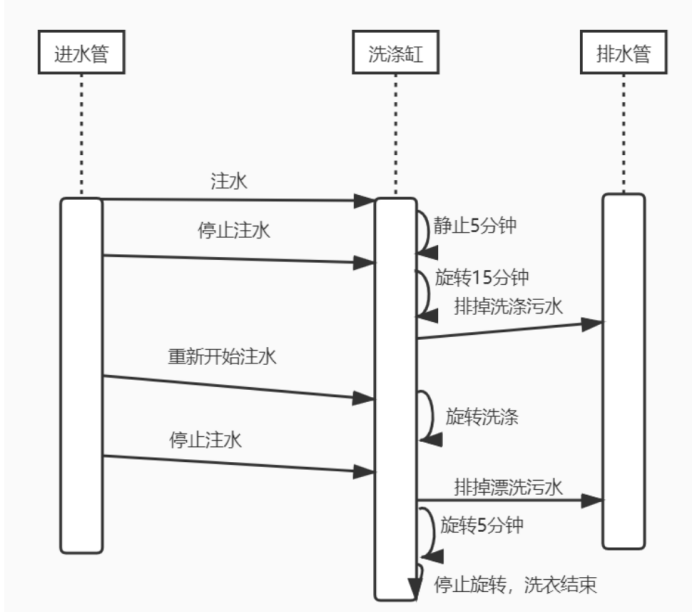

### 测试

#### 黑盒测试

##### 等价类划分法

- 有效等价类:各种正确的输入数据

- 无效等价类:各种错误的输入数据

- 等价类划分例题:假设出生年月限定在1980年1月-2000年12月,并且由6位数字字符组成.输入有效数据时,则提示输入有效

  - 划分等价类并编号: 

    - 出生年月的类型及长度的有效等价类:(1)6位数字字符、 无效等价类:(2)非数字字符,(3)少于6位数字字符,(4)多于6位数字字符
    - 年份范围的有效等价类:(5)1980-2000之间  无效等价类(6)小于1980(7)大于2000
    - 月份范围的有效等价类:(8)在01-12之间  无效等价类(9)小于01,(10)大于12

  - 设计测试用例,覆盖所有有效等价类

    - 测试数据:199511、期望结果:输入有效、覆盖有效等价类:(1)(5)(8)

  - 覆盖所有无效等价类

    - | 测试数据 | 期望结果 | 覆盖无效等价类 |
      | :------: | -------- | -------------- |
      |  19962a  | 输入无效 | 2              |
      |  19961   |          | 3              |
      | 1996111  |          | 4              |
      |  134501  |          | 6              |
      |  205005  |          | 7              |
      |  200000  |          | 9              |
      |  200013  |          | 10             |

##### 边界值划分法

- 设计测试用例包含全部边界值的方法.通常作为对等价来划分法的补充

- | 输入等价类           | 测试用例         | 测试数据 | 期望结果 | 选取理由         |
  | -------------------- | ---------------- | -------- | -------- | ---------------- |
  | 出生年月的类型及长度 | 5个数字字符      | 20005    | 输入无效 | 比有效长度少1    |
  |                      | 7个              | 2000112  | 输入无效 | 比有效长度多 1   |
  |                      | 有1个非数字字符  | 2000.5   | 输入无效 | 1个非法字符      |
  |                      | 全部为非数字字符 | May---   | 输入无效 | 6个              |
  |                      | 6个数字字符      | 200005   | 输入有效 | 类型和长度均有效 |

- | 输入等价类 | 测试用例             | 测试数据 | 期望结果 | 选取理由         |
  | ---------- | -------------------- | -------- | -------- | ---------------- |
  | 日期范围   | 有效范围边界选取数据 | 198001   | 输入有效 | 最小日期         |
  |            |                      | 200012   | 输入有效 | 最大日期         |
  |            |                      | 197912   | 输入无效 | 刚好小于最小日期 |
  |            |                      | 200101   | 输入无效 | 刚好大于最大日期 |
  |            |                      | 199900   | 输入无效 | 刚好小于最小月份 |
  |            |                      | 199913   | 输入无效 | 刚好大于最大月份 |

错误推测法

##### 因果图法

- 关系符号
- 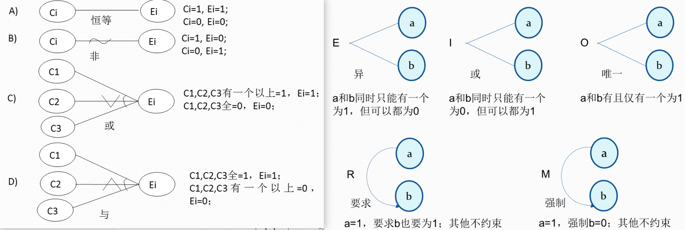
- 例题: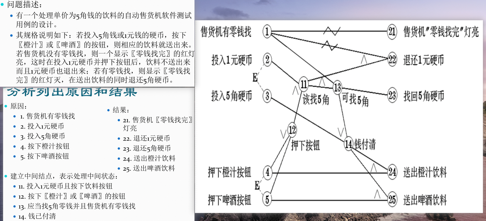

#### 白盒测试

##### 逻辑覆盖法 

- 语句覆盖:程序中每个语句至少都能执行一次
- 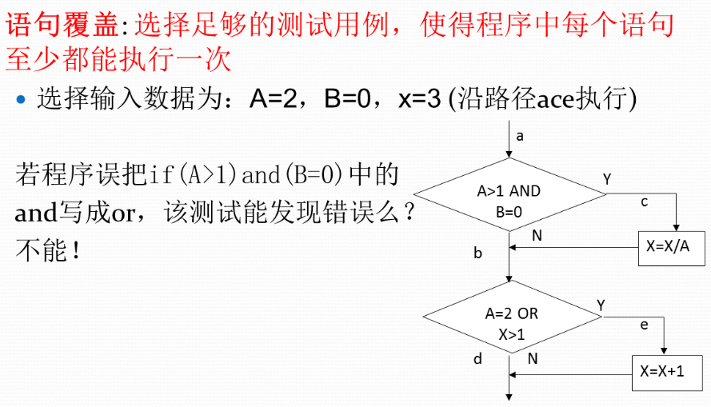
- 判定覆盖:程序中每个判定至少获得一次“真”值和“假”值,即程序中每一条分支至少通过一次
- 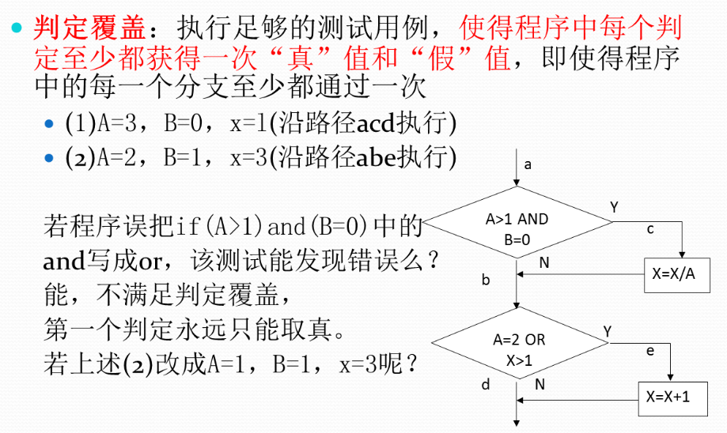
- 条件覆盖:判定中每个条件获得各种可能的结果
- 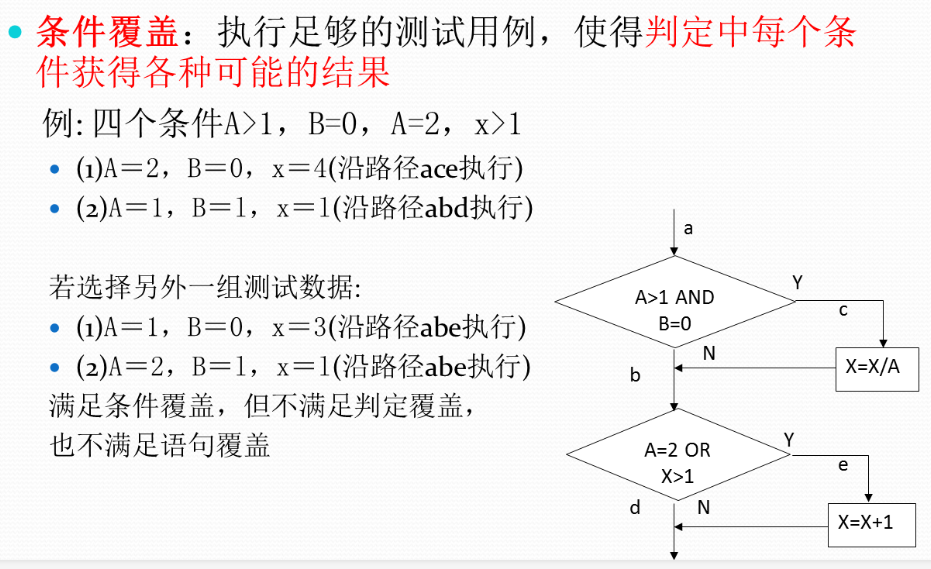
- 判定/条件覆盖:满足判定覆盖和条件覆盖的要求
- 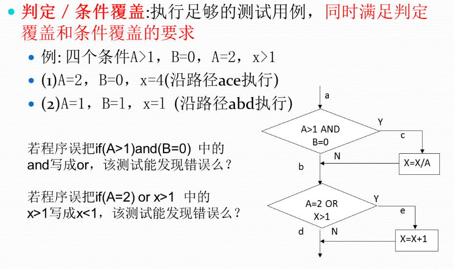
- 条件组合覆盖:每个判定中条件的各种可能组合都至少执行一次
- 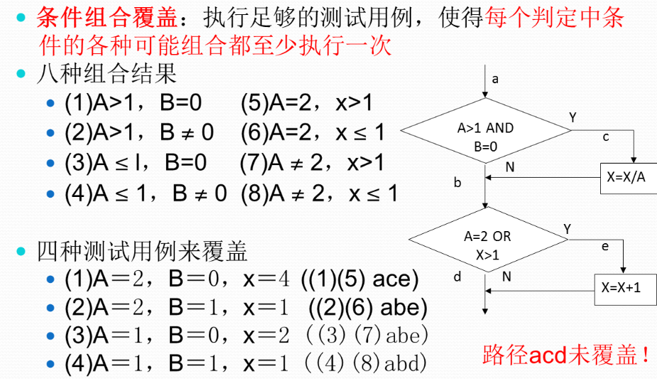

##### 基本路径覆盖法

- 环形复杂性三种方法
  - V(G)=程序图G的区域数
  - V(G)=程序图边数-节点数+2
  - V(G)=程序图判定节点数+1

循环路径测试法

### 项目估算

UFP：

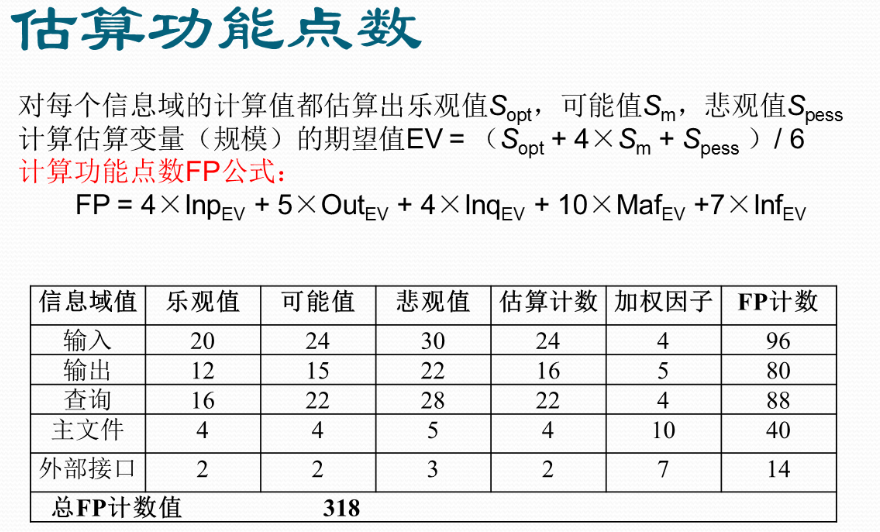

TCF=0.65+0.01×DI

FP=UFP×TCF

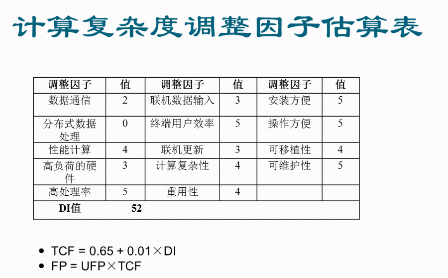

